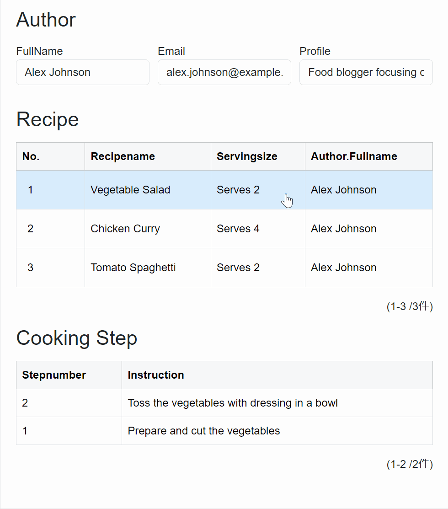

# ダブルリストサンプル

## 実現する効果
RecipeとCooking Step　2つのリストがあります。

Recipeの項目を選択しますと、選択されたRecipeのCookingリストが表示されます。



## 0. サンプル環境
このサンプルを実行するには以下の環境が必要です：
- Codeer.LowCode.Blazor DesignerのGettingStartedテンプレートでデザイナプロジェクトを作成されている
- RecipeとCooking Stepのモジュールが存在する

## 1. [デザイナ](../designer/designer.md)フィールドプロパティ設定
### Recipe Listの設定


### Cooking Step Listの設定


## 2. [Script](../overview/script.md)を追加
### モジュール全体のスクリプト


```csharp
void DetailLayoutDesign_OnBeforeInitialization()
{
　//Recipeリストの項目をクリックするときのみ、Cooking Listをロードしますので、
  //Layout初期化前にCooking Listのデータローディングを禁止します。
　ListCookingStep.AllowLoad = false;
}
```

### Recipe リストのスクリプト
1. デザイナでRecipeリストをクリックします
2. 右側の**プロパティパネル** → **OnSelectedIndexChanged**項目でOnSelectedIndexChangedイベントを作成します
3. Script編集Windowで以下のコードを追加します
```csharp
void ListRecipe_OnSelectedIndexChanged()
{
    //Cooking Listのデータローディングを再開します
    ListCookingStep.AllowLoad = true;
    
    //CookingStepモジュールで検索条件を設定します
    var searcher = new ModuleSearcher<CookingStep>();
    var selectedRecipeId = ListRecipe.Rows[ListRecipe.SelectedIndex].Id.Value;
    //Recipeリストで選択されたRecipeIdがCookingStepのRecipeIdと一致するCookingStepのみを検索
    searcher.AddEquals(steps=>steps.Recipeid.Value, selectedRecipeId);
    
    //検索条件を適用してCooking Listをリロードします
    ListCookingStep.SetAdditionalCondition(searcher);
    ListCookingStep.Reload();
}
```

## 参考情報： 関連するページ
- [デザイナ](../designer/designer.md)
- [Module](../module/module.md)
- [Field](../fields/field.md)
- [Script](../overview/script.md)