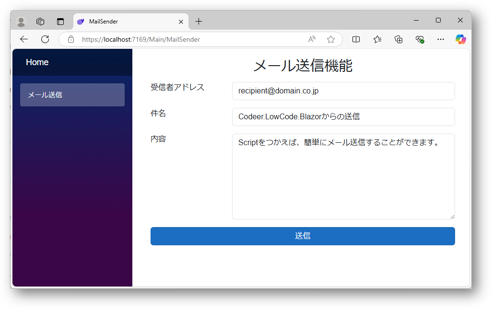
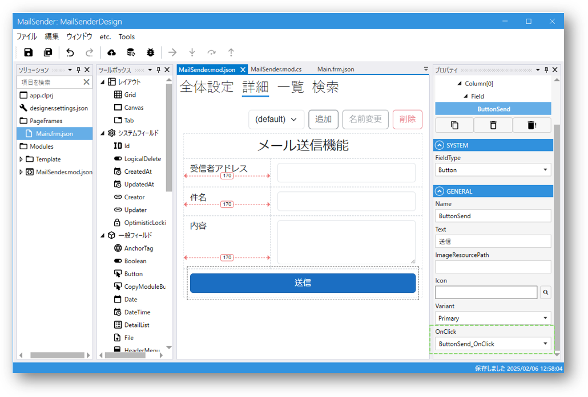

# Scriptからメールを送信する
Scriptを使えば、簡単にメールを送信することができます。

以下の例をもってメール送信方法を説明します。

## 完成イメージ



## ステップ

### 1. Codeer.LowCode.Blazor Visual Studioテンプレートで作成されたプロジェクトを開き、Serverプロジェクトのなかから、以下のファイルを開きます：
`appsettings.Development.json`(開発環境)、あるいは`appsettings.json`(運用環境)

下記の設定を記入します：
```
  "MailSettings": {
    "Host": "SMTPサーバーアドレス",
    "Port": "ポート番号",
    "SenderMailAddress": "送信者メールアドレス",
    "Password": "パスワード",
    "SSL": "trueあるいはfalse"
  }
```
> IIS等のWebサーバーへデプロイされるときは、環境変数等をお使いの場合、上記の設定を反映させてください。

### 2. Designerプロジェクトで送信用のモジュールを作成し、以下のようにフィールドを配置します：



### 3. 送信ボタンのプロパティパネルからOnClickイベントを作成し、スクリプトに以下のコードを追加します：
```C#
void ButtonSend_OnClick()
{
  var recipient = TextRecipient.Value;
  var subject = TextSubject.Value;
  var content = TextContent.Value;
  
  var result = MailService.SendEmail(recipient, subject, content);
  if(result) MessageBox.Show("送信しました。");
  else MessageBox.Show("送信できませんでした。");
}
```

## 関連情報
- [Module](../module/module.md)
- [Script](../overview/Script.md)
