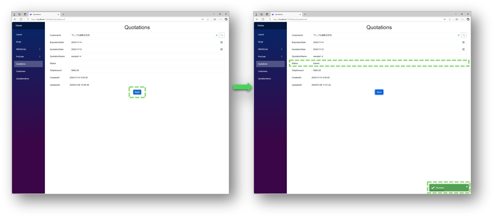
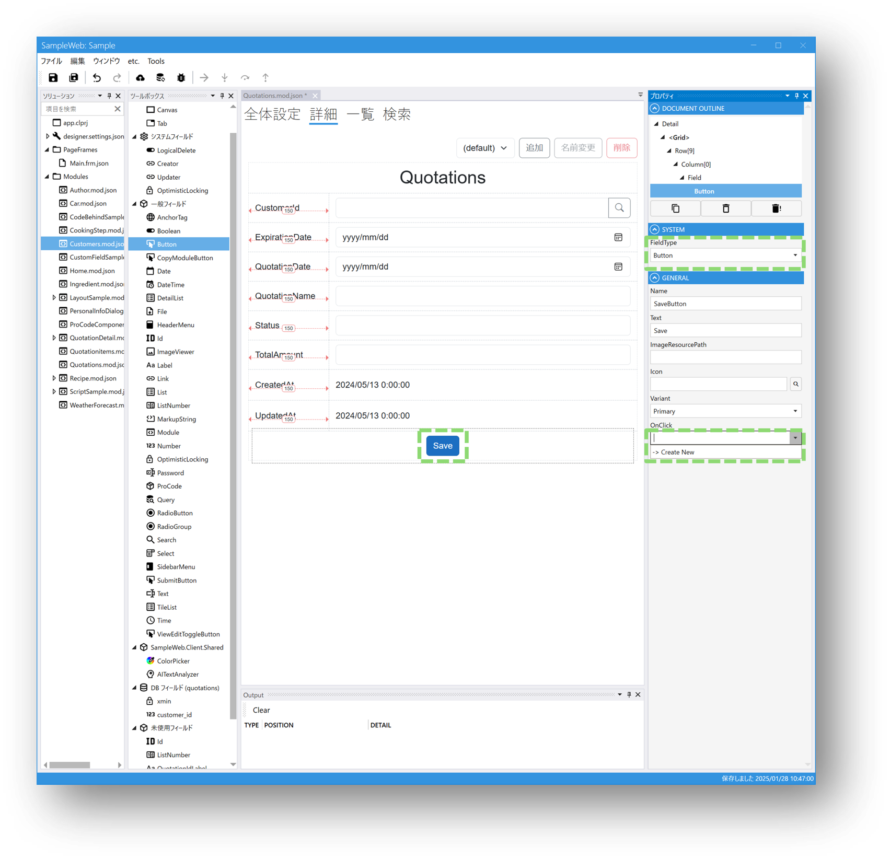

# Submit時に処理を追加する
## 完成イメージ



## 設定ステップ
※モジュールはサンプル用に作成しています。

### 1. DesignerでButtonフィールドを設定します。
### 2. ButtonフィールドのGENERALパネルで、OnClickイベントのスクリプトを新規作成します。



### 3. スクリプトを記載します。
※以下はスクリプトの例です。

```csharp
void SaveButton_OnClick()
{
    //Statusに何も入力していない場合、「Saved」を格納する
    if(Status.Value == "" || Status.Value == null)
    {
        Status.Value = "Saved";
    }
    
    if (Submit())
    {
        //正常にSubmitが完了した場合
        Toaster.Success("Success");
    }
    else
    {
        Toaster.Error("Error");
    }
}
```