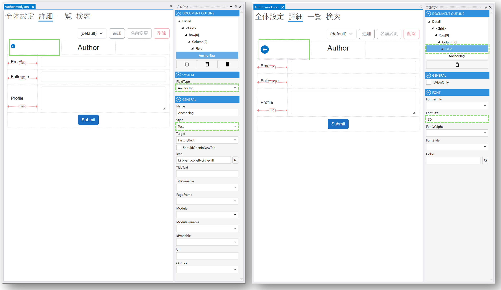

# AnchorTagのサイズを調整する
## 完成イメージ

## 設定ステップ

### 1. Designerで設定するAnchorTag Fieldを選択します

### 2. GeneralパネルでStyleをTextに設定します

### 3. Document OutlineパネルでAnchorTagの親であるFieldを選択して、Fontパネルの**FontSize**プロパティを任意の値で設定します

## 参考情報： 関連するページ
- [デザイナ](../designer/designer.md)
- [Module](../module/module.md)
- [Field](../fields/field.md)
