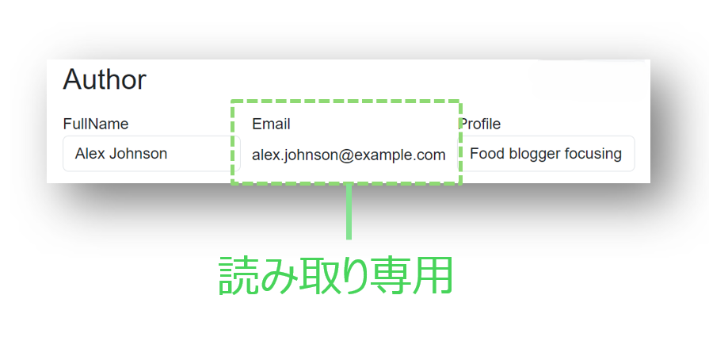
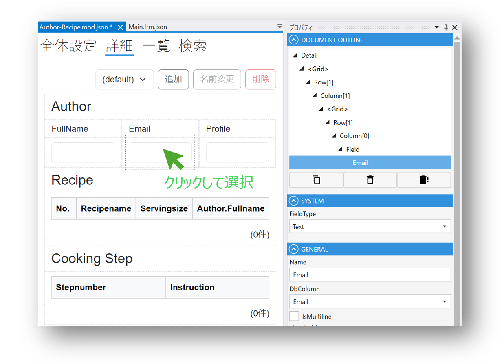
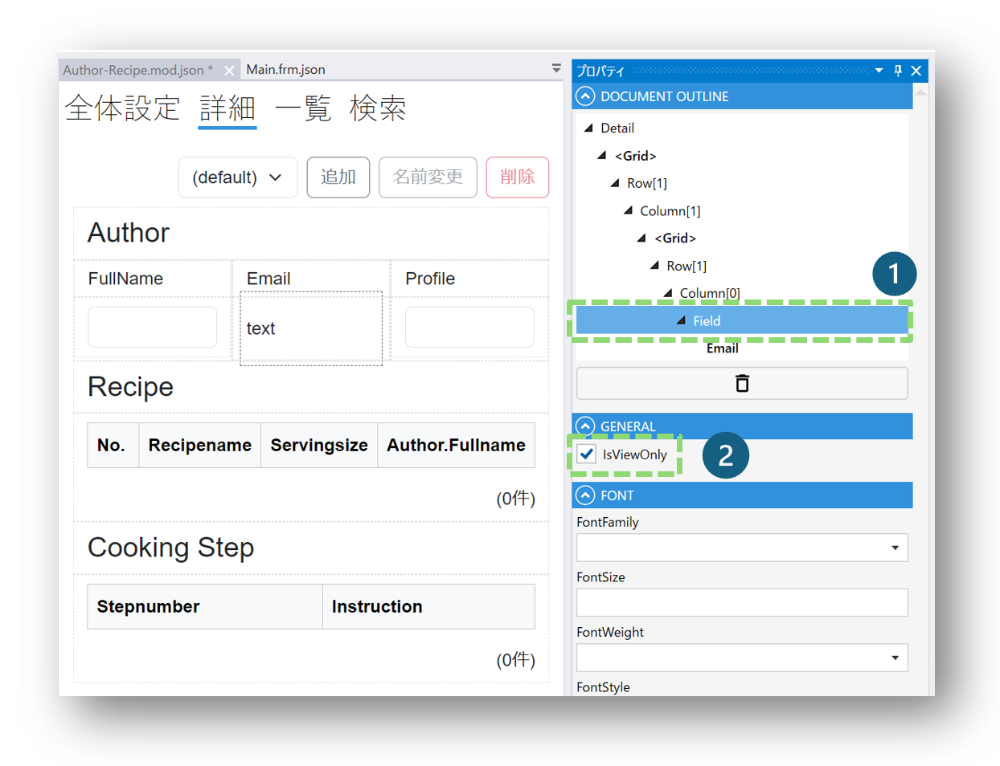

# Tips: Text Fieldを読み取り専用にする
## 完成イメージ

## 設定ステップ

### 1. Designerで設定するText Fieldを選択します

### 2. Document OutlineパネルでTextの親であるFieldを選択して、Fieldの**IsViewOnly**プロパティをチェックします

## 関連情報
- [Module](../module/module.md)
- [Document OutlineとPropertyパネル](module/DocumentOutline.md)
- [Field](fields/field.md)

