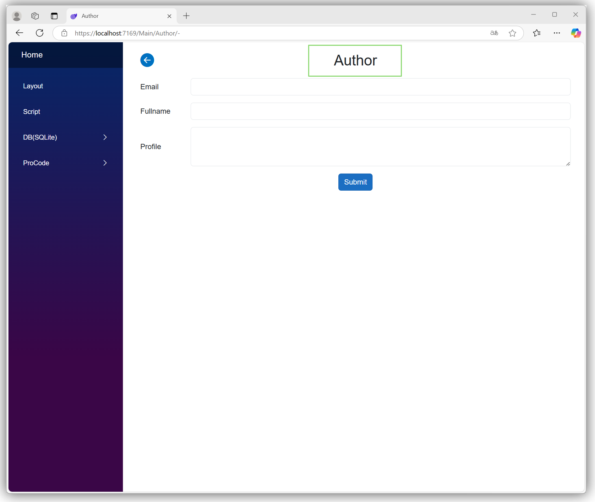
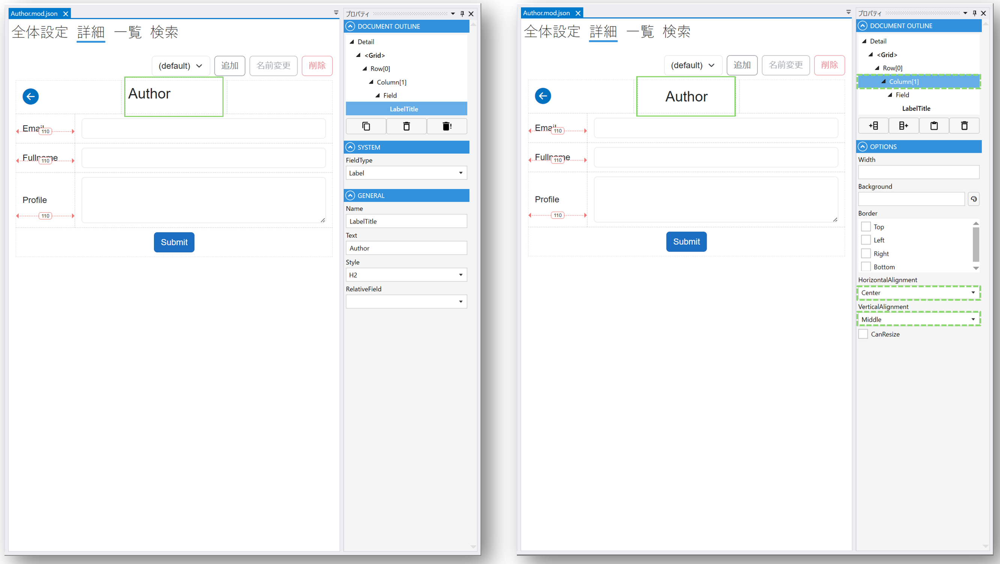

# Labelの位置を調整する
## 完成イメージ

## 設定ステップ

### 1. Designerで設定するLabel Fieldを選択します

### 3. Document OutlineパネルでLabel/Fieldの親であるColumnを選択して、Optionsパネルの**HorizontalAlignment**プロパティ、**VerticalAlignment**プロパティにて任意の値を選択します

## 参考情報： 関連するページ
- [デザイナ](../designer/designer.md)
- [Module](../module/module.md)
- [Field](../fields/field.md)