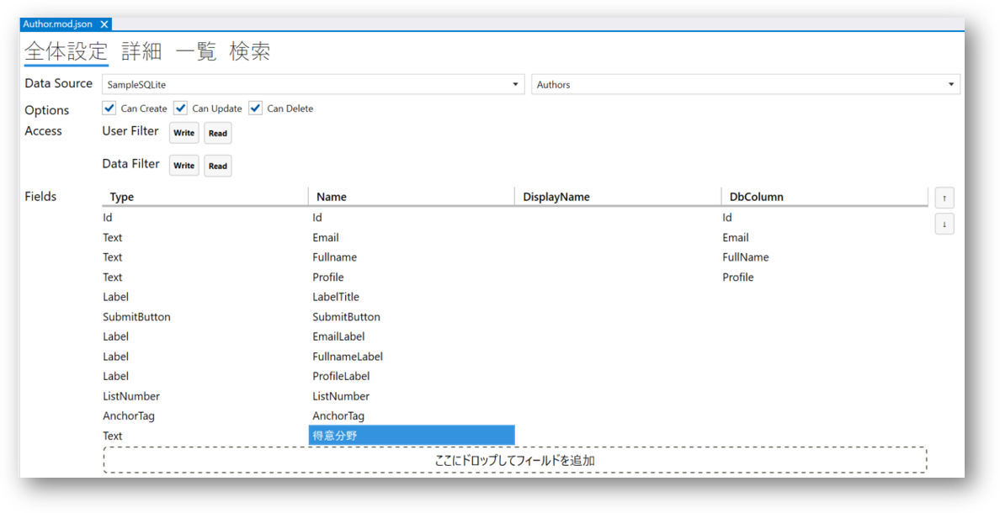
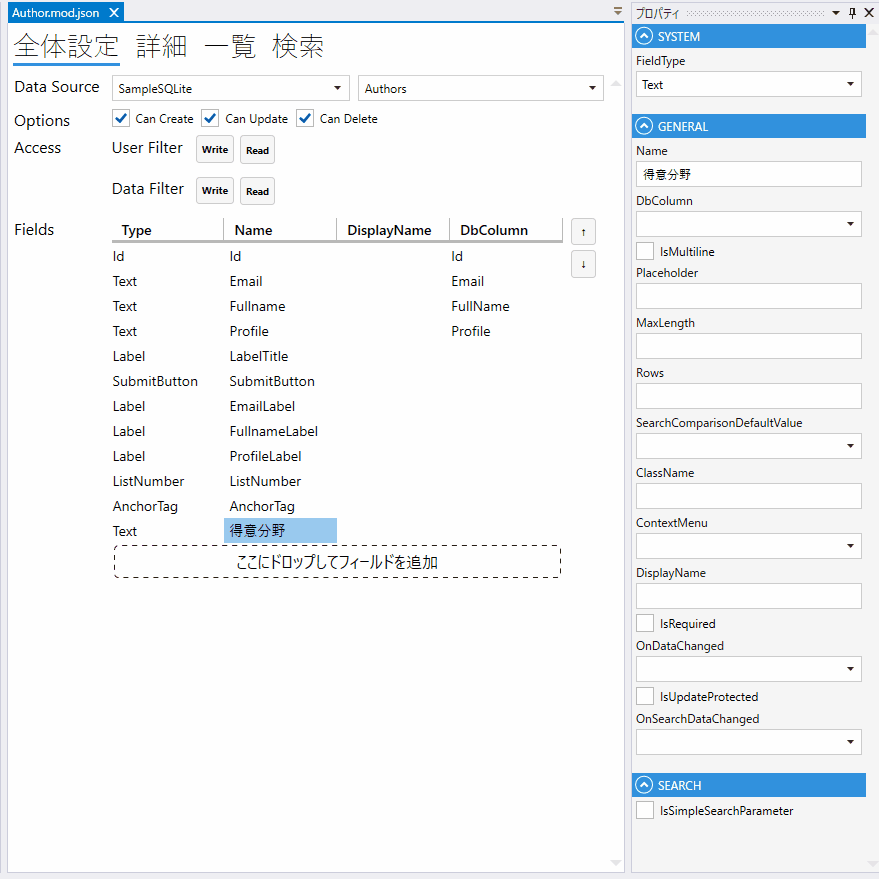

# ScriptでModuleSearcherを使って他のモジュールにアクセスする

## ModuleSearcherについて
ノーコードで`Link` Fieldや`Select` Fieldを通じて他のモジュールにアクセスし、データの取得ができますが、Scriptを使って他のモジュールにアクセスすることも可能です。

ノーコードの方法と比べ、Script(ローコード)を通じて他モジュールから取得したデータをアレンジしたり、より柔軟に操作することができます。

本文では例を通じでScriptで`ModuleSearcher`を使って、他のモジュールからデータを取って、少し変換してから表示する方法を紹介します。

## 完成イメージ

Designerのテンプレートで作成されるAuthorモジュールに、**得意分野**というText Fieldを追加して、**Recipe**モジュールからデータを取得し、そのAuthorの料理得意分野を表示します。


**Recipe**モジュールのデータは画像のようになっています。**Recipename**列はデータ取得の対象で、**Author**列は検索の一致条件となります。


## 手順
### 1. **Author**モジュールに**得意分野**というText Fieldを配置します




### 2. **Author**モジュールの一覧画面の`OnAfterInitialization`イベントを作成します
> `OnAfterInitialization`イベントは一覧画面が初期化された後に発生します。詳細画面にもあります。



### 3. スクリプト編集画面で処理を書きます
```Csharp
void ListLayoutDesign_OnAfterInitialization()
{
  var category = "特になし";
  
  //ModuleSearcherを初期化する: Recipeモジュールを探す
  var searcher = new ModuleSearcher<Recipe>();
  
  //「Recipeの著者Emailアドレスが現在の著者Emailが同じ」という条件に合致するデータを持つRecipeモジュールに限定する
  searcher.AddEquals(recipe => recipe.Author.Value, this.Email.Value);
  
  //Searcherを実行する
  var recipeList = searcher.Execute();
  
  //検索結果があればその最初のRecipeのカテゴリをとる
  if(recipeList.Count > 0)
     category = recipeList[0].Recipename.Value.Split(" ")[1];
     
  //検索の結果をAuthorモジュールの「得意分野」TextFieldに書き込む
  this.得意分野.Value = category;
}
```

### 4. デザインデータをデプロイして完了

## ModuleSearcherの仕様情報
`ModuleSearcher`は`AddEquals`以外にもさまざまな検索条件で検索できます。また、検索の結果を並び替えすることもできます。

  | メソッド名                   | 戻り値  | 使用例        |
  |-------------------------|------|-----------|
  | AddEquals()             | void |AddEquals(x=>x.Name.Value, "test")|
  | AddLessThan()           | void |AddLessThan(x=>x.Age.Value, 20) |
  | AddLessThanOrEqual()    | void |AddLessThanOrEqual(x=>x.Age.Value, 20) |
  | AddGreaterThan()        | void |AddGreaterThan(x=>x.Age.Value, 20)|
  | AddGreaterThanOrEqual() | void |AddGreaterThanOrEqual(x=>x.Age.Value, 20) |
  | AddLike()               | void |AddLike(x=>x.Name.Value, "test")  |
  | AddConditions()         | void |AddConditions(anotherSearcher) 複数の条件を一遍に追加|
  | OrderBy()               | void |OrderBy(x=>x.Ranking.Value) |
  | OrderByDescending()     | void |OrderByDescending(x=>x.Ranking.Value)  |

## 関連情報
- [スクリプト](../overview/script.md)
- [モジュール](../module/module.md)
