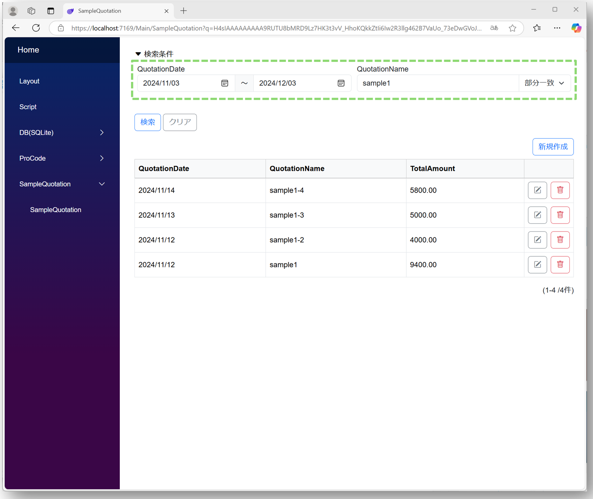
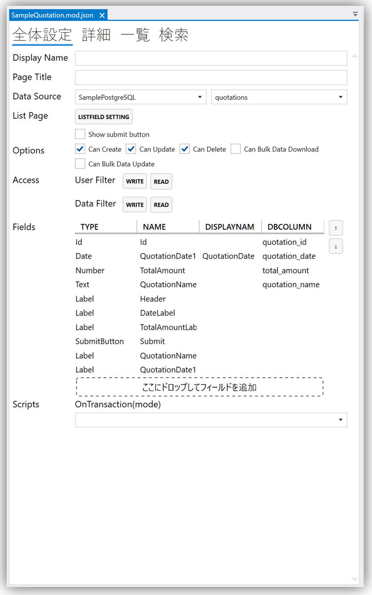
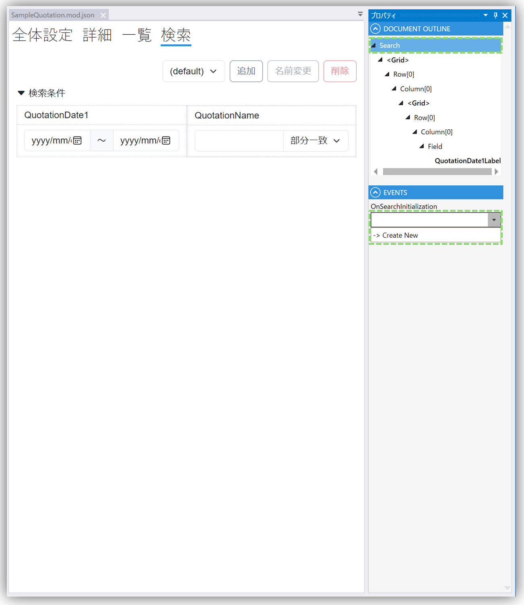
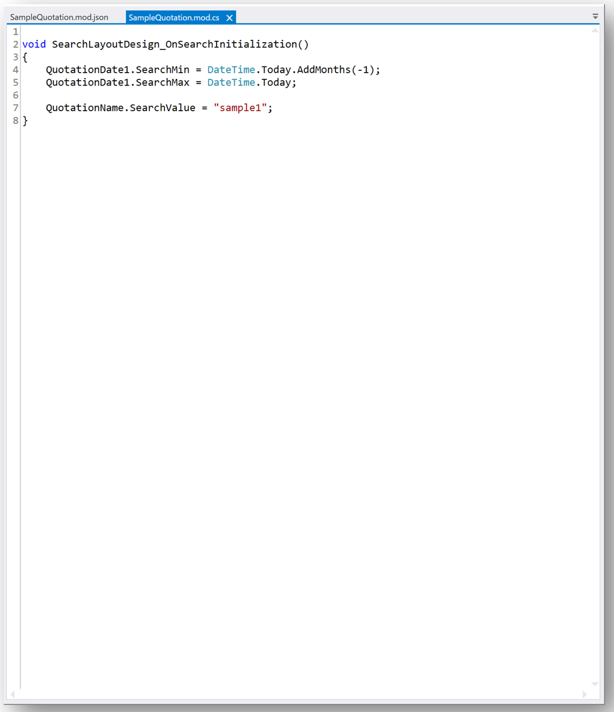

# 検索条件に初期値を設定する
## 完成イメージ



## 設定ステップ
#### ※moduleはサンプル用に作成しています
#### ※下図のmoduleを例に説明を行います



### 1. Designerで検索の設定を任意で行います

### 2. Document OutlineパネルでSearchを選択して、Eventsパネルの**OnSearchInitialization**プロパティにてプルダウンを開きCreate Newをクリックします



### 3. Scriptで検索条件の初期値を設定します



```csharp
	// 画像で記載されているScript
	
void SearchLayoutDesign_OnSearchInitialization()
{
    //Date FieldのFromToの設定
    QuotationDate1.SearchMin = DateTime.Today.AddMonths(-1);
    QuotationDate1.SearchMax = DateTime.Today;
    
    //Text Fieldの設定
    QuotationName.SearchValue = "sample1";
}
```

```csharp
	// その他のScript例
	
void SearchLayoutDesign_OnSearchInitialization()
{
    //Boolean Fieldの設定
    //SampleBooleanには設定したいField名を記載
    SampleBoolean.SearchValue = true;
}
```

## 参考情報： 関連するページ
- [デザイナ](../designer/designer.md)
- [Module](../module/module.md)
- [Field](../fields/field.md)
- [Script](../overview/script.md)