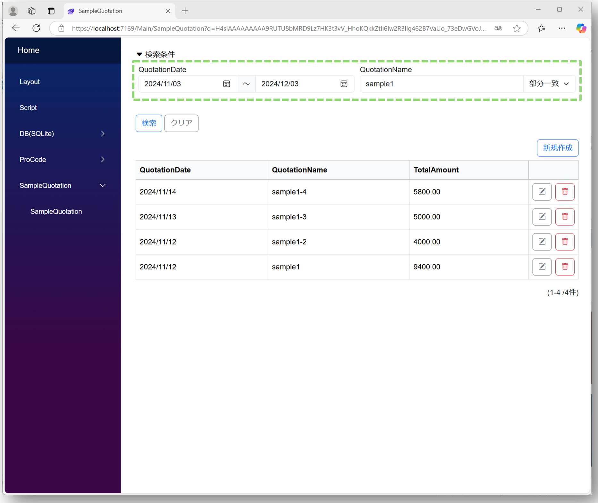
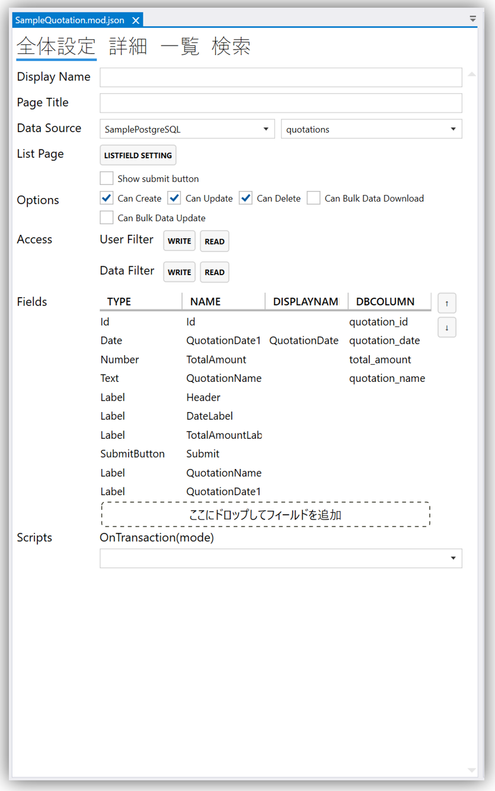
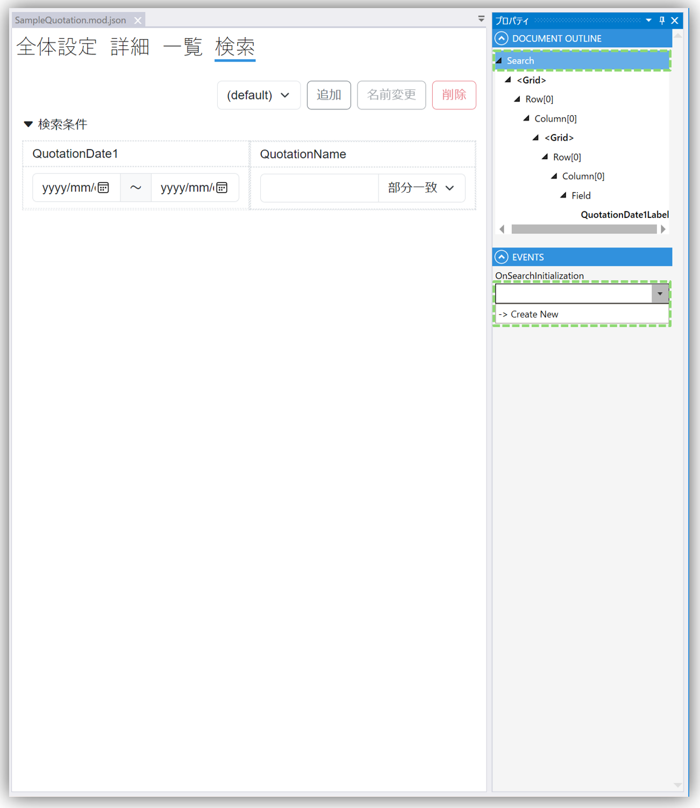
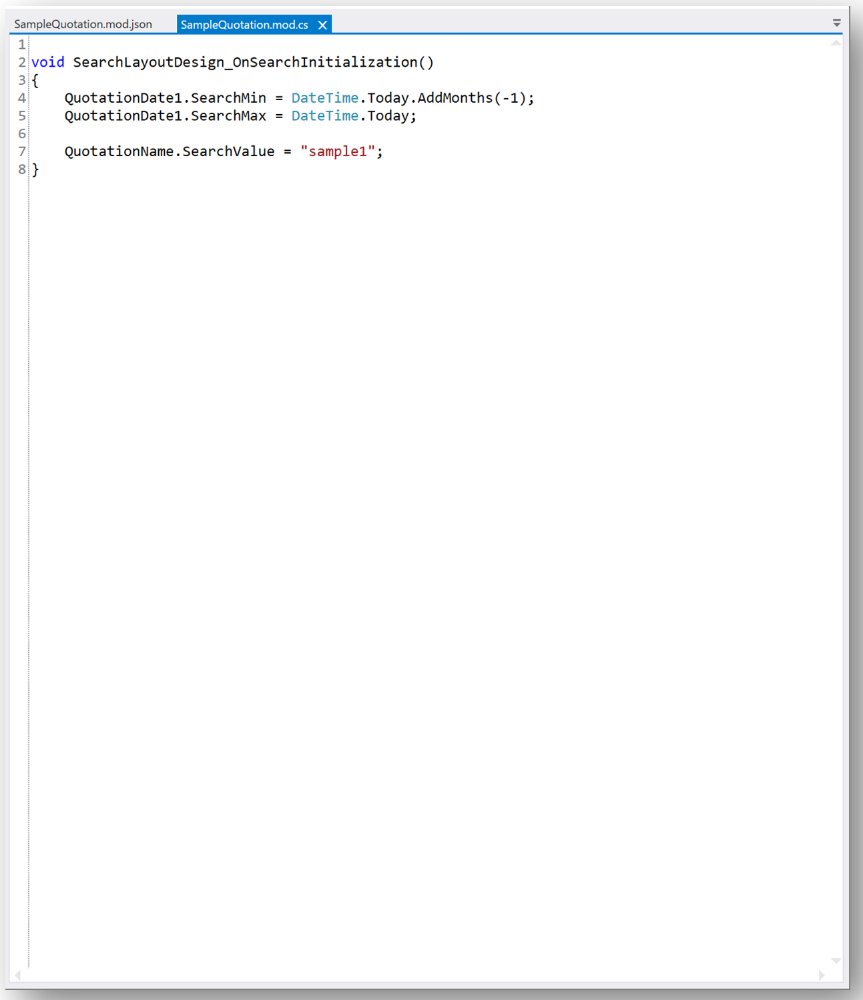

# ���������ɏ����l��ݒ肷��
## �����C���[�W



## �ݒ�X�e�b�v
#### ��module�̓T���v���p�ɍ쐬���Ă��܂�
#### �����}��module���ɐ������s���܂�



### 1. Designer�Ō����̐ݒ��C�ӂōs���܂�

### 2. Document Outline�p�l����Search��I�����āAEvents�p�l����**OnSearchInitialization**�v���p�e�B�ɂăv���_�E�����J��Create New���N���b�N���܂�



### 3. Script�Ō��������̏����l��ݒ肵�܂�



```csharp
	// �摜�ŋL�ڂ���Ă���Script
	
void SearchLayoutDesign_OnSearchInitialization()
{
    //Date Field��FromTo�̐ݒ�
    QuotationDate1.SearchMin = DateTime.Today.AddMonths(-1);
    QuotationDate1.SearchMax = DateTime.Today;
    
    //Text Field�̐ݒ�
    QuotationName.SearchValue = "sample1";
}
```

```csharp
	// ���̑���Script��
	
void SearchLayoutDesign_OnSearchInitialization()
{
    //Boolean Field�̐ݒ�
    //SampleBoolean�ɂ͐ݒ肵����Field�����L��
    SampleBoolean.SearchValue = true;
}
```

## �Q�l���F �֘A����y�[�W
- [�f�U�C�i](../designer/designer.md)
- [Module](../module/module.md)
- [Field](../fields/field.md)
- [Script](../script/script.md)