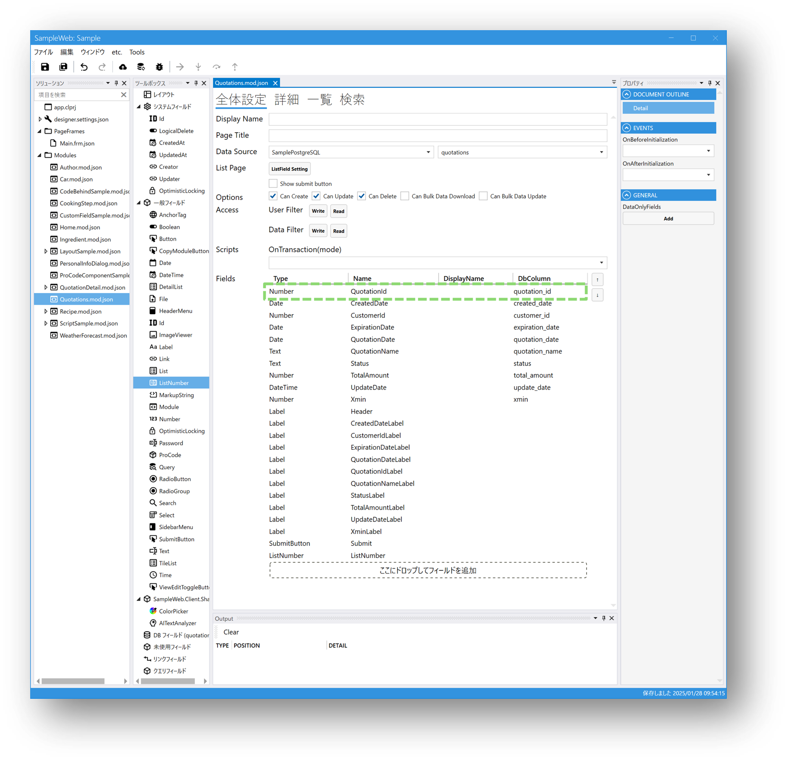
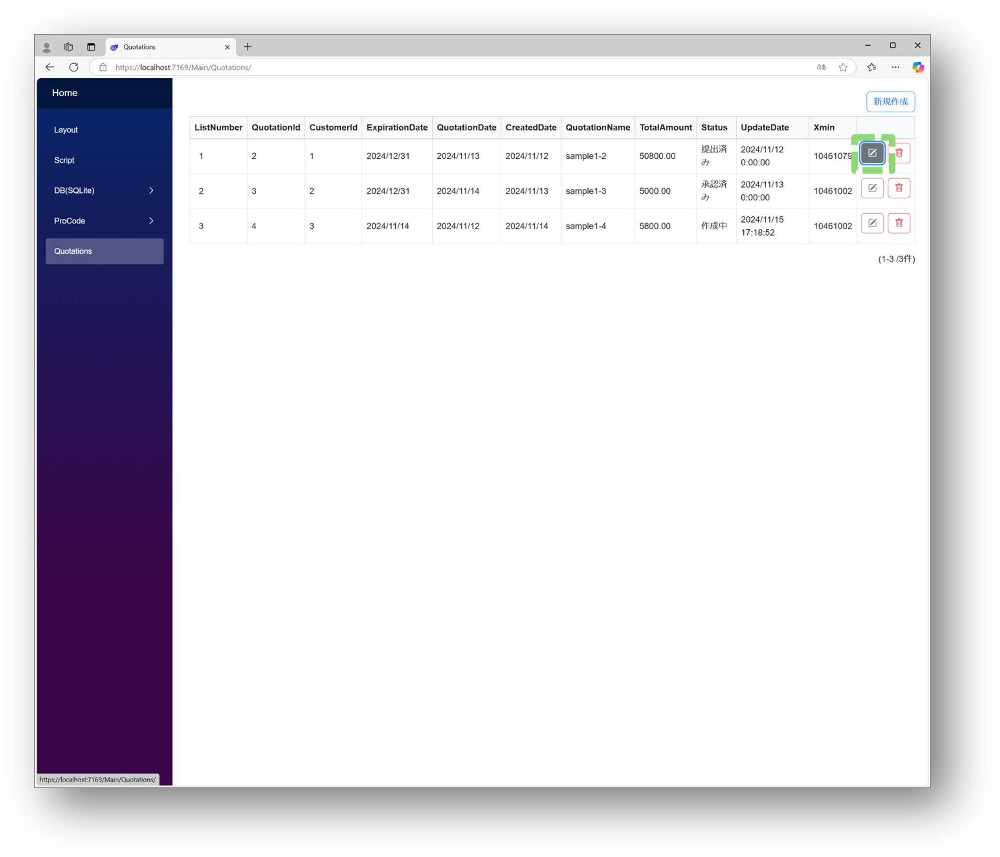
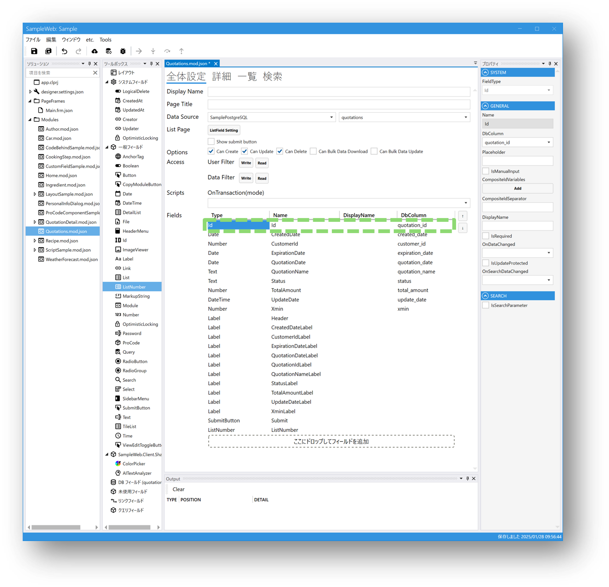

# モジュール作成時の注意点

## システムフィールドのId
新規登録や更新を行うmoduleは、システムフィールドのIdを設定する必要があります。  
システムフィールドのIdを設定しないままデプロイすると、一覧から詳細画面への遷移や新規登録を行うことができません。  

モジュールを新規作成する場合は、システムフィールドのIdの設定をご確認ください。

### 例）DatabaseからModuleを作成した場合 
Databaseのカラム名が「id」ではない場合、システムフィールドのIdではなく別のフィールドで設定されます。  

そのままデプロイすると一覧から詳細への遷移や新規登録を行うことができません。  
※画像ではアイコンをクリックしても一覧画面にとどまっています。

該当のフィールドをシステムフィールドのIdに変更することで問題が解消されます。

  
