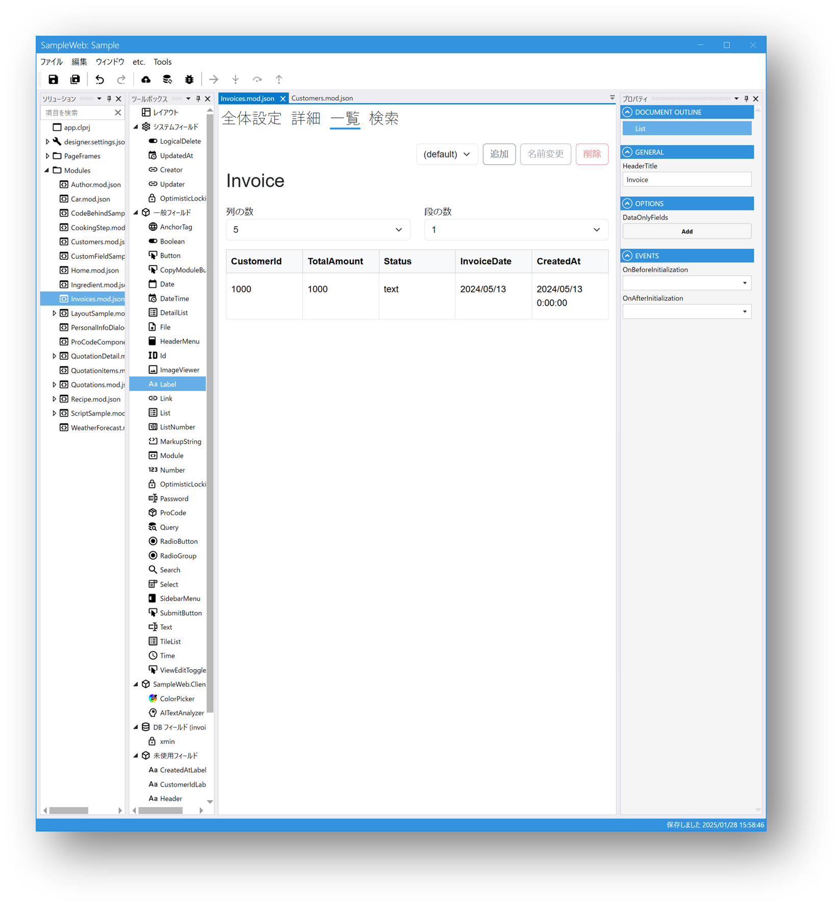
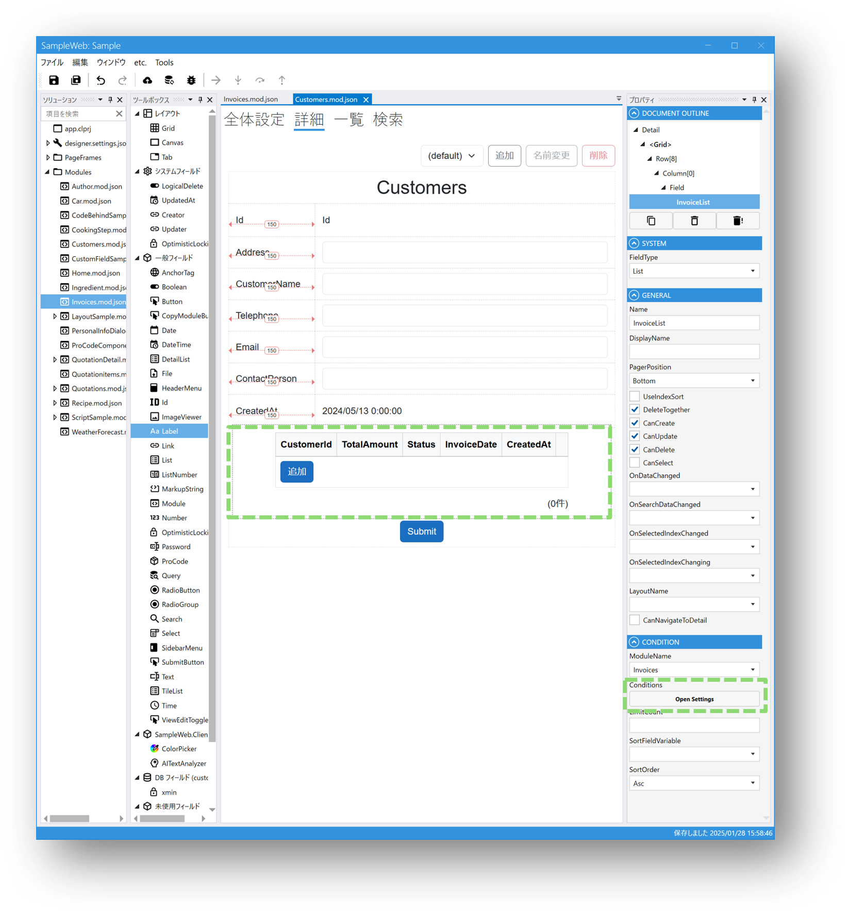
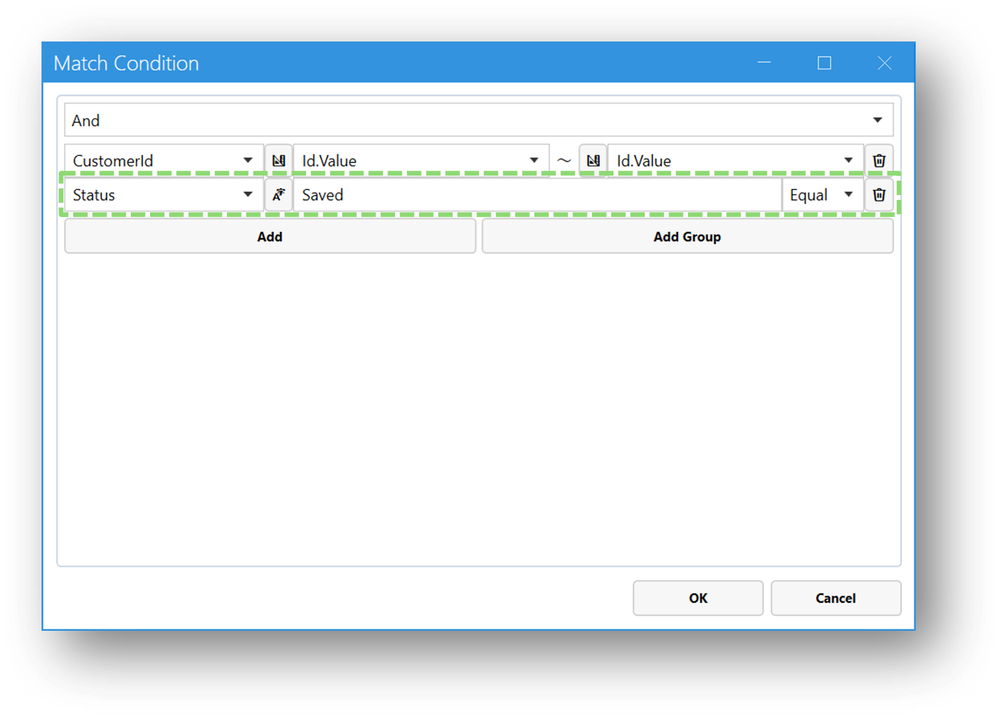
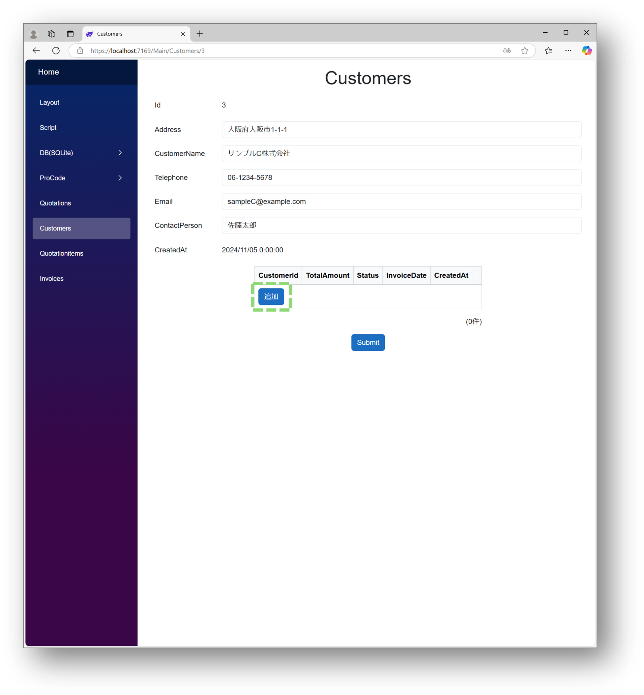
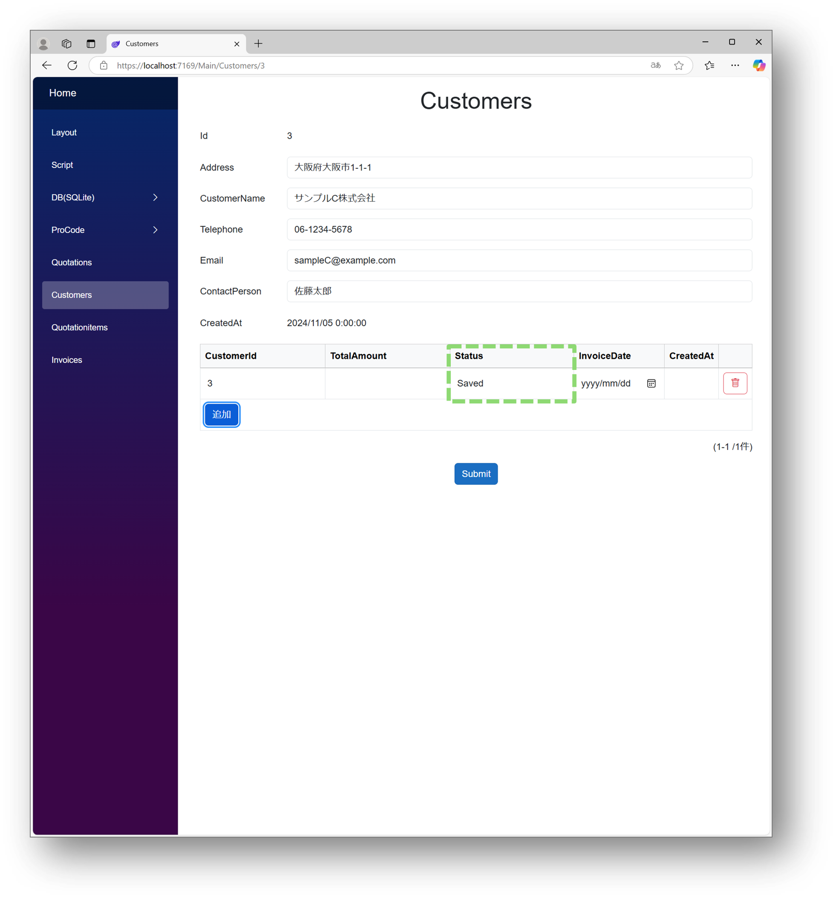
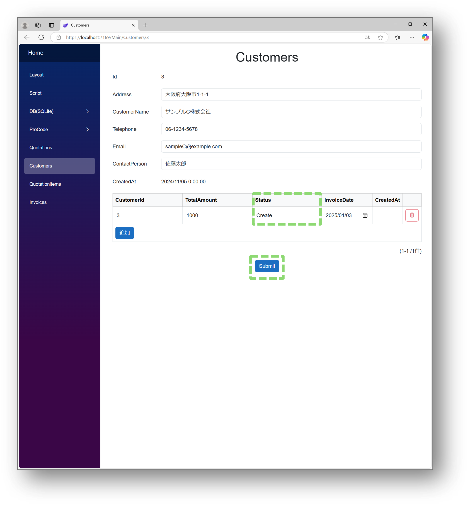
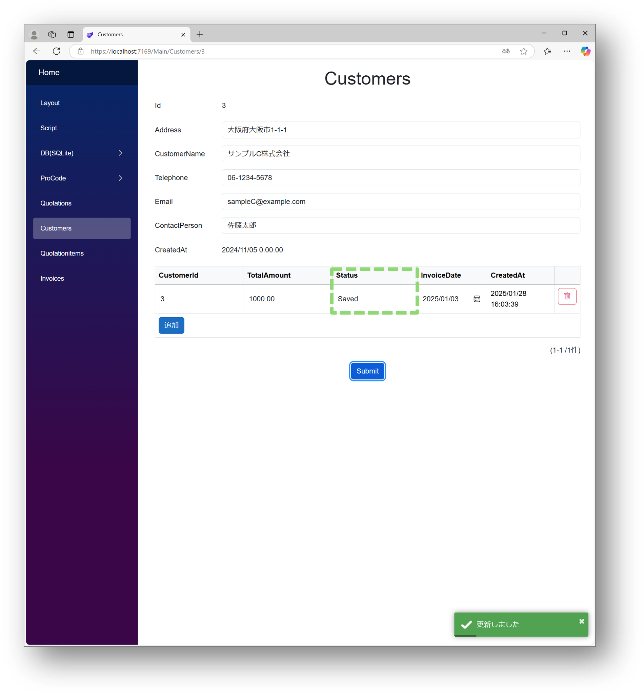

# ListのConditionsを設定する場合の注意点

## Conditionsの影響範囲
List、DetailList、TileListフィールドのConditionで表示する条件を設定することが可能ですが  
Conditionsの設定はListの表示だけではなく、Listの登録、更新時にも影響します。  

変更が必要なフィールドをConditionsに設定する場合はご注意ください。

### 例）画面でListの値を変更する場合
ListのConditionを設定します。  
※ListにInvoicesモジュールを設定しています。

  
ConditionでInvoicesモジュールのCustomerIdとStatusを条件に設定します。

  
デプロイし、リストの追加ボタンをクリックします。

追加ボタンをクリックするとStatusに、Conditionsで設定した値が格納されています。

Statusの値を変更してSubmitしても、Conditionsで設定した値で保存されます。

