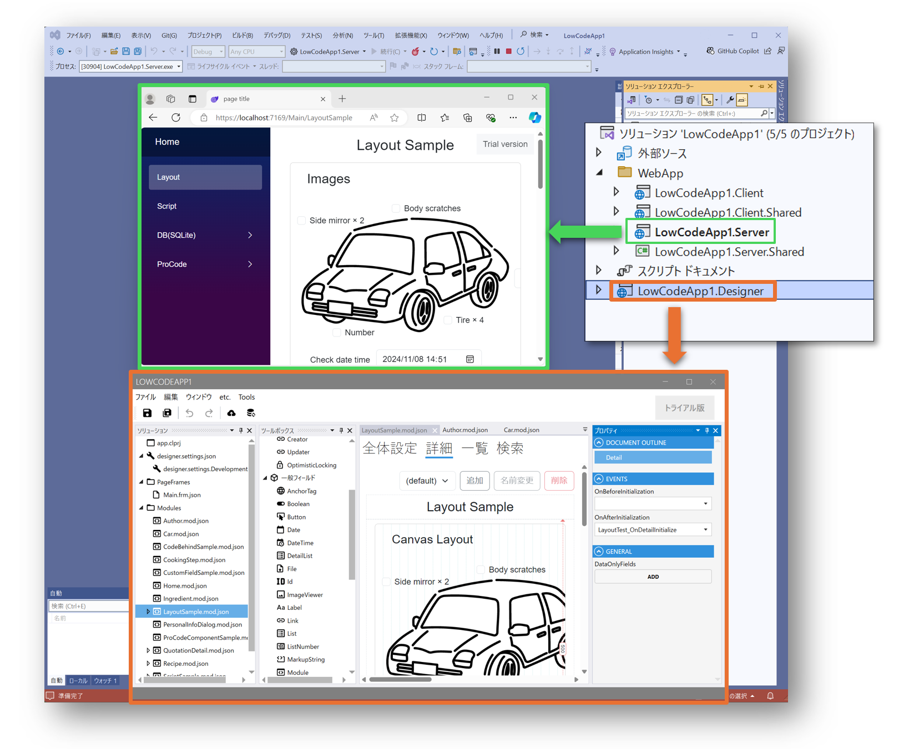
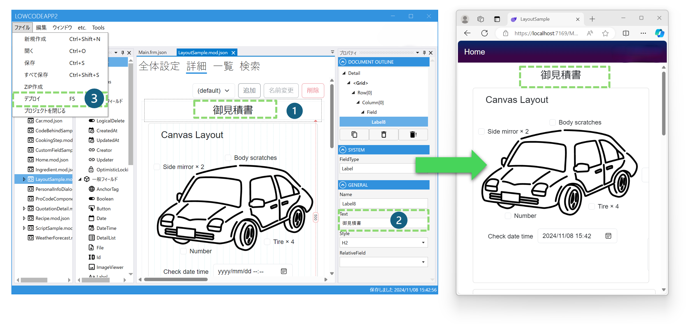

# Codeer.LowCode.Blazor

Codeer.LowCode.Blazorは、Blazorアプリにローコード機能を追加するためのライブラリです。素早く簡単にアプリケーションを構築できるよう設計されています。

## ライセンス情報
Codeer.LowCode.Blazorの使用ライセンスの詳細については、[こちら](https://www.nuget.org/packages/Codeer.LowCode.Blazor/1.0.9/License)をご覧ください。
日本語版は[こちら](LicenseJP.md)です。本契約の英語版とその翻訳版の間に何らかの齟齬または相違が生じた場合、英語版が優先され本契約の意味を規律するものとします。

- このソフトウェアの試用版は本製品の評価目的でのみ無料で30日間使用できます。
- ライセンスの購入は、商用目的でのソフトウェアの使用、または商用配布を目的とした製品の開発プロセスの一部としてのソフトウェアの使用を含むがこれに限定されない、あらゆる形式の商用使用に必要です。
- コミュニティ利用を希望される方には、申請により無償利用ライセンスを発行いたしますのでCodeerまでお問合せ下さい。

## 特徴
Codeer.LowCode.Blazorは以下の特徴を持っています:
- 強力なローコードエンジン
- ノーコード/ローコード/プロコードのシームレスな連携
- 一般的な.NET/Blazorコードとの高い親和性

## 利用方法
各セクションを参考にしてください:
- [Getting Started](#getting-started)
- [概略](overview/overview.md)
- [デザイナ](designer/designer.md)
- [Module](module/module.md)
- [Field](fields/field.md)
- [データモデルとModule](data_model/data-model.md)
- [PageFrame](designer/page_frame.md)
- [app.clprj](designer/app_clprj.md)
- [designer.settings](designer/designer_settings.md)
- [スクリプト](overview/script.md)
- [プロコード](overview/procode.md)
- [css](look_and_feel/css.md)

## こんなプロジェクトにおすすめ
- コストと時間を節約したい
- RDBを効果的に活用したい
- 既存のデータ、システムを活用したい
- **WinForms, WebFormsをモダンなフレームワークにリプレイスしたい**
- こだわりの機能がある
- リリース後にカスタマイズしたい

## ポトペタで画面作成
CanvasLayout、GridLayout、FlowLayoutの組み合わせで自由に画面を作成できます。通常の画面だけでなくダイアログも作成可能です。各UI部品の連動もノーコードや僅かなスクリプトで作成可能です。サイドバー、ヘッダ、フッターなど一般に必要なものは取り揃えております。こだわりのあるお客様はプロコードで各種カスタマイズしたものに交換できます。

## RDBと自在に連携
FormとDBのTableを関連付けてデータの入出力ができます。複数のFormを連携させることでJoinや1:Nの関係を表現できます。FormはTableだけでなくViewにも関連付けることができるのでBI機能も簡単に実現できます。論理削除/楽観ロック/作成更新情報など一般的にDBの操作で必要になるものは取り揃えています。変更履歴ももちろん残せます。

## スクリプトでより自由に
C#とほぼ同じ構文で記述できます。僅かな実装で機能を実現できるようにAPI設計をしています。もちろんコード補完も効くので簡単に実装できます。カスタマイズができてプロコードで実装した機能を呼び出すこともできます。基本的にはクライアントサイドで実行されますが、サーバーサイドでの実行もサポートしています。
- 一般的な演算処理
- 画面制御
- WebAPIの実行
- Excel編集/PDF作成

## Excelとの連携のサポート
一般的なデータ入出力はもちろん、テンプレートをExcelで作成してそれを書き換えることで帳票にも対応できます。pdfへの変換も可能です。

## 認証・認可
認証は一般的なCookie認証やAzureActiveDirectoryを使った認証をテンプレートコードで提供します。その他の認証もカスタマイズで対応可能です。認可に関してはアプリ、画面、データそれぞれでアクセス制御が可能です。

## こだわりの機能はプロコードで実装
場合によっては特殊な画面/機能が必要になることもあります。Codeer.LowCodeはBlazorのライブラリなので、そのような場合は.NETのコードを追加して作りこみが可能です。さらにField単位で作っておけばそれを様々な箇所で利用することができます。

## ライセンス情報
Codeer.LowCode.Blazorの使用ライセンスの詳細については、[こちら](https://www.nuget.org/packages/Codeer.LowCode.Blazor/1.0.0/License) をご覧ください。
- このソフトウェアの試用版は、製品の評価目的のみで使用できます。
- 商用目的でのソフトウェアの使用には開発ライセンスの購入が必要です。製品の開発時の利用も商用利用に含まれます。
- コミュニティ利用を希望される方には、申請により無償利用ライセンスを発行する予定です。

## Getting Started
Visual Studio拡張機能を使用してプロジェクトを作成できます。 
[Codeer.LowCode.Blazor.Templates](https://marketplace.visualstudio.com/items?itemName=Codeer.LowCodeBlazor)

### Step1
プロジェクト新規作成

### Step2
BlazorアプリとWPFのデザイナアプリをビルドして起動

### Step3
デザイナーで新しいプロジェクトを作成します。サンプルを含むプロジェクトが作成されます。

### Step4
それをWebアプリにデプロイします。画面がホットリロードされ、デザイナーの設定に従って画面が表示されます。

### Step5
デザイナーの設定を確認し、小さな変更を加えてWebアプリに送信して、感覚をつかんでください。
