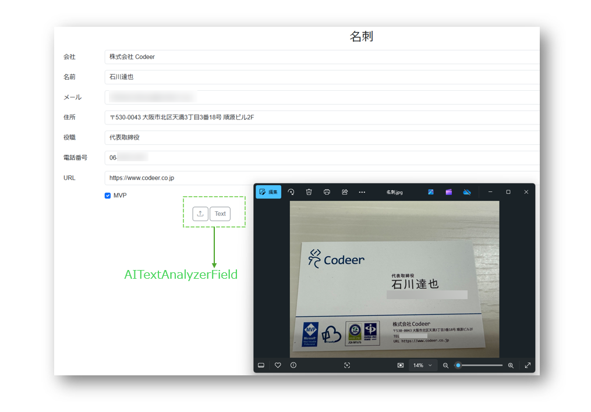
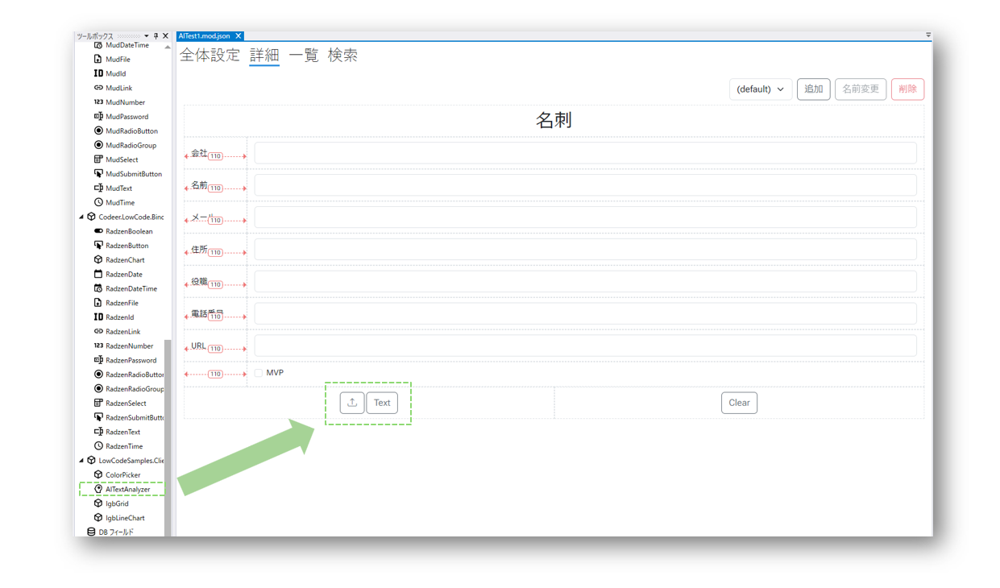
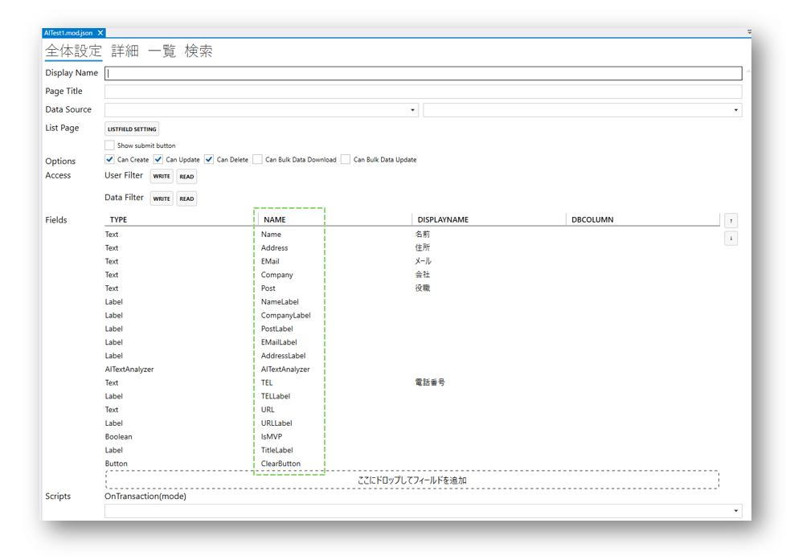

# AITextAnalyzerFieldを使う
Codeer.LowCode.Blazorは、PDF/画像/Textから文字を抽出し分析して、Moduleの詳細ページに置かれる各Fieldに自動的に振り分ける機能をひとつのFieldに集約しました。AITextAnalyzerFieldを使うことで、開発者がモジュールを作成する時にField名を有意なものにするだけで、簡単にテキスト分析・自動振り分け機能を実装できます。

AITextAnalyzerFieldは拡張ライブラリ [Codeer.LowCode.Blazor.Extras](https://github.com/Codeer-Software/Codeer.LowCode.Blazor.Extras) が提供するFieldで、アプリテンプレートには最初から組み込まれています。プロパティやサーバー側の設定の詳細は Extras の [AITextAnalyzerField](https://github.com/Codeer-Software/Codeer.LowCode.Blazor.Extras/blob/main/docs/AITextAnalyzerField.md) を参照してください。

## 完成イメージ
```AITextAnalyzerField```のアップロードボタンでPDF/画像を選び取り込みます。
Textボタンではフォーマットされていないテキストデータを入力とすることもできます。


## 使用方法
1. [AIを使うための設定](ai_setup.md)が完了していない場合はまず行ってください
2. 作成するモジュールの「詳細」詳細画面に```AITextAnalyzerField```と分析後データの受け皿となる各データフィールドを配置します


AIの分析精度をあげるために、各データフィールドの名前は読み込みデータに合わせて、有意なものにしてください：


## 関連情報
- [AI](ai_overview.md)
- [AIを使うための設定](ai_setup.md)
- [Module](../module/module.md)
- [Field](../fields/field.md)


