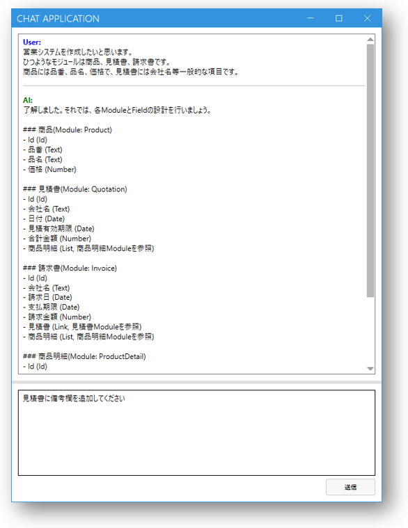
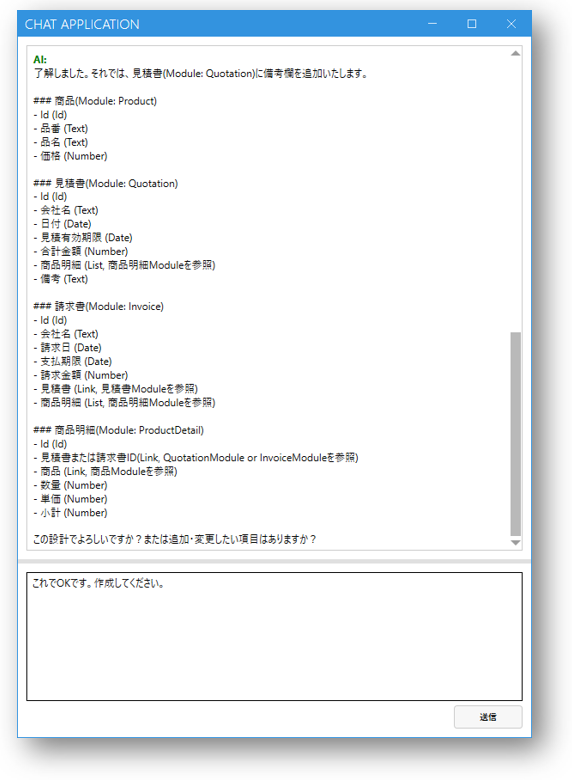
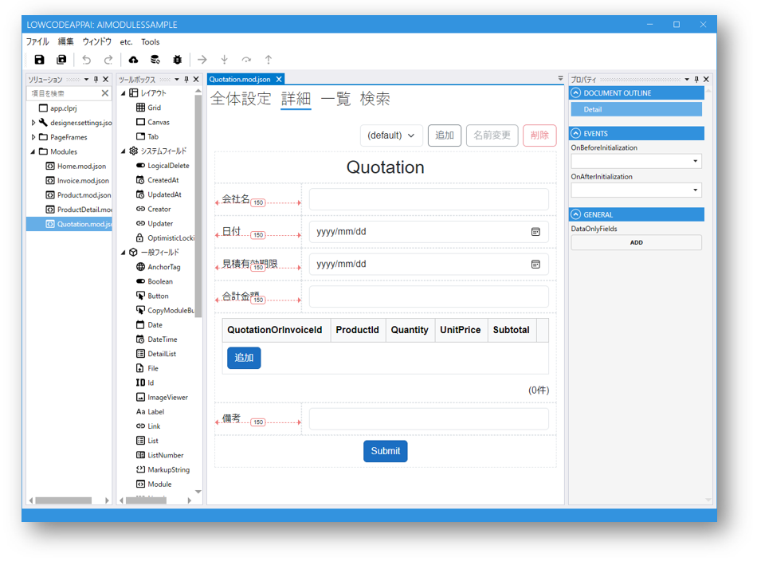

# ModuleをAIで作成
モジュールを手動で作成する場合は、数多くのフィールドを配置することがあります。

AIを使えば、自然言語で要求だけ出して、モジュールを自動作成することができます。

自動作成されたモジュールをベースに微調整等を行うことで、ニーズぴったりのモジュールを素早く作成することができます。

また、作成されたモジュールのDDLを出力することができ、データベースの構築も簡単にできます。
## 作成ステップ一例
1. [AIを使うための設定](ai_setup.md)が完了していない場合はまず行ってください
2. Designerを開き、「Tools」メニューから[Create Modules by AI]をクリックします
3. AIとチャットする形で指示を出し、モジュールを作っていきます。チャットの途中で指示を追加したり、修正したりすることもできます。

4. 最終的に確認し指示を出したら、モジュール自動作成が開始し、完成します。
この例で作成されたモジュール群はこのようなイメージです：

5. 自動作成されたモジュールに微調整等を加え、ニーズに合わせます

## 関連情報
- [AI](ai_overview.md)
- [AIを使うための設定](ai_setup.md)
- [Module](../module/module.md)