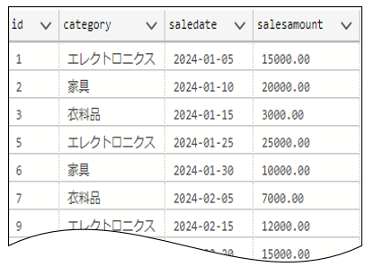
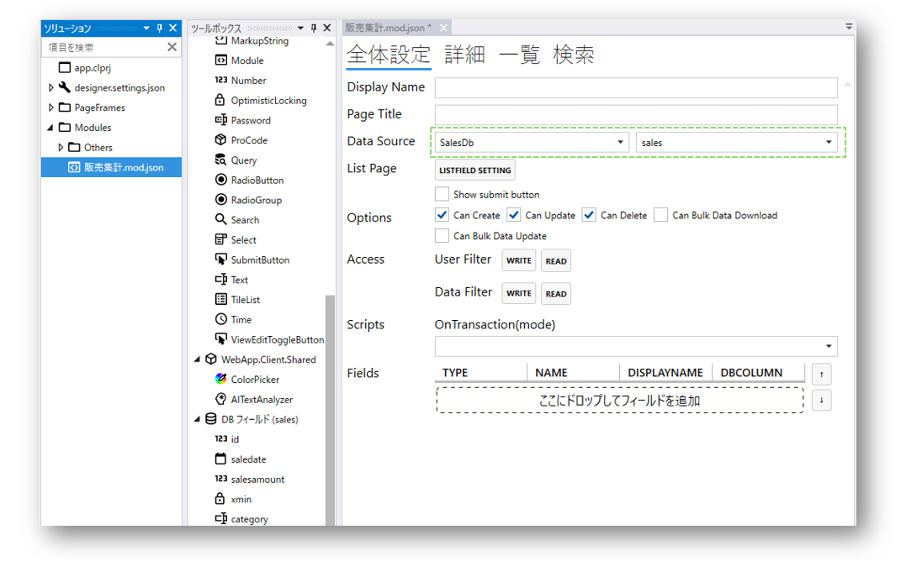
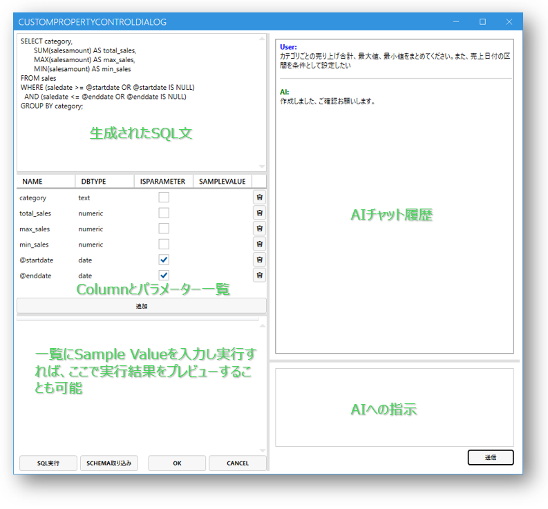

# クエリをAIで作成
Codeer.LowCode.BlazorはLowCodeアプリの開発者が定義したSQL文をベースに、モジュールフィールドを作成することができ、より自由度の高いデータ集計をサポートしています。

AIを利用すれば、素早く複雑なSQL文を生成することができます。

## AIによるクエリ生成一例
### 環境
この例では、以下のデータベーステーブル"sales"があることを前提とします。

### ステップ
1. [AIを使うための設定](ai_setup.md)が完了していない場合はまず行ってください
2. Designerでモジュール「販売集計」を作成し、Data Sourceを設定します

3. モジュールのFields一覧にQueryフィールドを追加し、「Open Settings」を開きます

4. Query Settings画面でAIとチャットする形でSQL文とパラメーター一覧を作成します。
　OKを押すことで設定データが保存され、ツールボックスにSQLフィールドが生成されます

5. Query Settingsにより生成されたSQLフィールドをモジュールに配置します

6. デザインプロジェクトをデプロイしサーバーを起動します。下図は完成イメージです：

## 関連情報
- [AI](ai_overview.md)
- [AIを使うための設定](ai_setup.md)
- [Module](../module/module.md)

