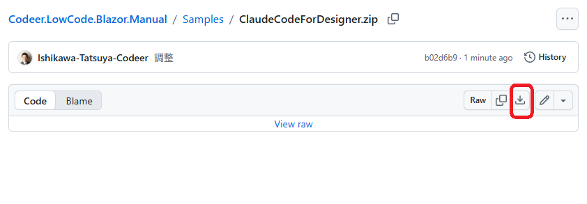
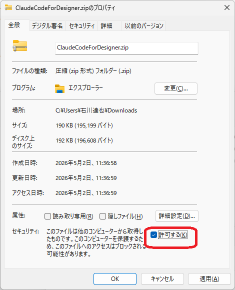

# Claude Code でデザインプロジェクトを編集する

[Claude Code](https://docs.claude.com/ja/docs/claude-code/overview) は Anthropic が提供する CLI ベースの AI 開発支援ツールです。Codeer.LowCode.Blazor のデザインファイル（`*.mod.json` / `*.mod.cs` / `*.frm.json` / SQL / app.css 等）はすべてテキストベースのため、Claude Code から直接読み書きできます。

「自然言語で指示 → モジュール／レイアウト／スクリプトを作成・編集」する流れで、デザイナでの操作と組み合わせて使うことを想定しています。

## 手順

### 1. 作業フォルダを作成する

任意の場所に作業フォルダを作成します。本マニュアルでは `C:\work\Test` を例として使用します。

### 2. デザイナでデザインプロジェクトを作成する

デザイナを起動し、`File` → `New Project` を選択してプロジェクトを作成します。

- **Name**: 任意（例: `Design`）
- **Folder**: 1. で作った作業フォルダ（例: `C:\work\Test`）
- **Template**: 任意（例: `Empty`）


### 3. リファレンス ZIP をダウンロードして配置する

#### 3-1. ZIP をダウンロード

[GitHub の Samples/ClaudeCodeForDesigner.zip ページ](https://github.com/Codeer-Software/Codeer.LowCode.Blazor.Manual/blob/main/Samples/ClaudeCodeForDesigner.zip) を開き、右上の **ダウンロードアイコン**（赤枠）をクリックします。



> 上のリンクから [直接ダウンロード](../../Samples/ClaudeCodeForDesigner.zip) も可能です（マニュアルをローカルクローンしている場合）。

#### 3-2. ZIP のブロックを解除

ダウンロードした ZIP は **インターネットからのファイル**としてブロックされた状態になっています（Windows の Mark of the Web）。展開前に **必ずブロック解除** してください。

1. エクスプローラで `ClaudeCodeForDesigner.zip` を **右クリック → プロパティ**
2. 「全般」タブ下部の **「セキュリティ: このファイルは他のコンピュータから取得したものです…」**
3. **「許可する」のチェックボックス**（赤枠）にチェック
4. OK で閉じる



> 解除しないまま展開すると、中の各ファイルがすべてブロック扱いになり、Claude Code がファイル読み込み時に警告を出すなどの不具合の原因になります。

#### 3-3. 作業フォルダに展開

ブロック解除後、ZIP を作業フォルダ（例: `C:\work\Test`）の直下に展開します。中身がフラット構成なので、展開すると下記のように並びます。

```
C:\work\Test\
├── Design\                        ← 2. で作ったデザインプロジェクト
│   ├── app.clprj
│   ├── Modules\
│   ├── PageFrames\
│   └── Resources\
├── ClaudeCodeForDesigner\         ← ZIP から展開（仕様リファレンス）
│   ├── CLAUDE.md
│   └── Docs\
│       ├── ModuleDesign.md
│       ├── Layouts.md
│       ├── Fields\
│       └── ...
└── CLAUDE.md                      ← ZIP から展開（Claude Code が起動時に自動読み込み）
```

`CLAUDE.md` は短いガイドで、`ClaudeCodeForDesigner/` 配下のリファレンスと `Project.md`（次節）を参照すべき場所として Claude Code に伝える役割を持ちます。

### 4. 作業フォルダで Claude Code を起動する

```bash
cd C:\work\Test
claude
```

`CLAUDE.md` が同フォルダにあるので、Claude Code は起動時に自動で読み込み、`ClaudeCodeForDesigner/` 以下の仕様リファレンスを参照できる状態になります。

### 5. プロジェクト固有の情報を `Project.md` に蓄積する

そのプロジェクト固有の前提・規約は **`Project.md`** に書いておくと、Claude Code が作業時に読み取って参照してくれます。Claude Code と作業する中で気づいた都度、口頭で「これも `./Project.md` に追記して」と伝えると蓄積できます。

書くと有効な例:

- **接続先 DB**: 「このプロジェクトは PostgreSQL に接続。テーブル・カラム名は `snake_case`」
- **命名規約**: 「モジュール名は `Pascal` ＋単数形、フィールド名はキャメルケース」
- **業務ルール**: 「`Order.Status` は 0=新規, 1=処理中, 2=完了, 9=キャンセル」
- **共有ライブラリ**: 「日付フォーマットは常に `yyyy-MM-dd HH:mm`」
- **既存資産**: 「`SharedComponents/` 以下に共通コンポーネントあり、新規作成前に確認」
- **多言語対応**: 「ja/en の Resources を必ず両方更新」

これらを蓄積していくと、毎回の指示が短くて済み、Claude Code の出力が一貫します。`Project.md` は ZIP に含まれないので、リファレンス更新（ZIP 再ダウンロード→上書き）で消える事故を防げます。

> Claude Code 内蔵のメモリ機能（`#` で始まる発言や `/memory` コマンド）でも永続化できます。詳しくは [公式ドキュメント](https://docs.claude.com/ja/docs/claude-code/memory) を参照。

## 使い方の例

準備が整ったら自然言語で指示を出します。

- 「商品マスタのモジュールを作って。フィールドは商品コード、商品名、価格、在庫数」
- 「`Customer` モジュールに `登録日` の Date フィールドを追加して」
- 「`Order` 一覧で `合計金額` が 10000 円以上の行を赤背景にするスクリプトを書いて」
- 「サイドバーに `売上集計` ページを追加して、新しい `SalesSummary` モジュールにナビゲートさせて」

## データベース

### テーブル作成も Claude Code に任せられる

モジュールが必要とするテーブルの DDL や、初期データ投入の INSERT 文も自然言語で指示すれば Claude Code が生成・実行してくれます。例:

- 「商品マスタモジュールに対応するテーブルを SQLite に作って。サンプルデータも 5 件入れて」
- 「`Order` モジュールに `Status` 列を追加して既存テーブルにマイグレーションして」
- 「`Customer` テーブルから 100 件のテストデータを生成して INSERT 文を書いて」

モジュール定義（`*.mod.json`）と DB スキーマを両方触れるので、フィールド追加 → 列追加までを一気に指示できます。

### サポート DB

新規プロジェクトはテンプレートに同梱されているサンプルの **SQLite** に接続された状態で立ち上がりますが、以下のデータベースをすべてサポートしています。

- Microsoft SQL Server
- MySQL
- Oracle Database
- PostgreSQL
- SQLite

接続先の切り替えも Claude Code に指示できます。例:

- 「DataSource を SQL Server に切り替えて。接続文字列は `designer.settings.Development.json` に置いて」
- 「PostgreSQL 用のサンプルデータベースに接続するように変更して」

`designer.settings.json` / `designer.settings.Development.json` / サーバープロジェクトの `appsettings.json` の編集と、必要に応じた DDL 方言の調整までやってくれます。

> 設定ファイルの仕様詳細は [designer.settings](../designer/designer_settings.md) を参照（Claude Code は同等の仕様を `ClaudeCodeForDesigner/Docs/ProjectSettings.md` から自動取得）。

## ヒント

- **デザイナと並行して使う**: ビジュアルで配置を細かく調整するのはデザイナ、フィールド・スクリプトの一括追加や繰り返し作業は Claude Code、と使い分けると効率的です。
- **指示は具体的に**: 「いい感じに」より「Title フィールドを追加し、ListLayout にも表示」など、対象モジュール・フィールド名・配置先を明示するほうが意図通りに動きます。
- **生成結果は必ず確認**: スクリプトや SQL は実行前にデザイナでプレビューする / バージョン管理にコミットして差分を確認する運用を推奨します。
- **リファレンスを最新に保つ**: フレームワーク／マニュアルが更新されたら ZIP を再ダウンロードし、`CLAUDE.md` と `ClaudeCodeForDesigner/` を上書きしてください。`Project.md` は ZIP に含まれないので触られず、プロジェクト固有の情報は維持されます。

## 関連情報

- [Codeer.LowCode.Blazor とは](../introduction/what_is_lowcode.md)
- [デザイナ概要](../designer/designer.md)
- [AI 概要](ai_overview.md)
- [AI でモジュールを作成（デザイナ内蔵 AI）](ai_modules.md)
- [GitHub: ClaudeCodeForDesigner](https://github.com/Codeer-Software/Codeer.LowCode.Blazor.Manual/tree/main/Claude/ClaudeCodeForDesigner)
