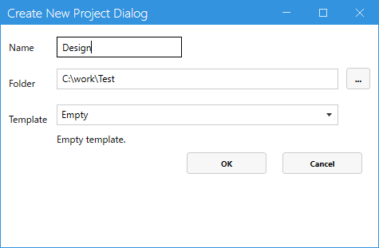

# Claude Code でデザインプロジェクトを編集する

[Claude Code](https://docs.claude.com/ja/docs/claude-code/overview) は Anthropic が提供する CLI ベースの AI 開発支援ツールです。Codeer.LowCode.Blazor のデザインファイル（`*.mod.json` / `*.mod.cs` / `*.frm.json` / SQL / app.css 等）はすべてテキストベースのため、Claude Code から直接読み書きできます。

「自然言語で指示 → モジュール／レイアウト／スクリプトを作成・編集」する流れで、デザイナでの操作と組み合わせて使うことを想定しています。

Claude Code 用の **ワークスペース**（作業ルール `CLAUDE.md`・CLB のリファレンス一式・検証 CLI の許可設定・プロジェクト固有ルールの置き場 `Project.md`）は、**デザイナ（1.3.15 以降）が展開します**。ZIP のダウンロードや exe パスの手動設定は不要です。

## 手順

### 1. デザインプロジェクトを用意する（手順 2 と前後してもよい）

デザイナを起動し、`File` → `New Project` でデザインプロジェクトを作成します（既に作ってあるプロジェクトを開くだけでも構いません）。ワークスペースの展開（手順 2）を先に行い、あとからその中にプロジェクトを作成しても構いません。

- **Name**: `Design`（例）
- **Folder**: 任意の作業フォルダ（例: `C:\work\Test`）
- **Template**: 任意（例: `Empty`）



### 2. メニューからワークスペースを展開する

メニュー **Tools > Claude Code Workspace** を実行し、展開先フォルダを選びます。ワークスペース専用の**空のフォルダ**（例: `C:\work\Test`）を選んでください。ドキュメントフォルダのように既存ファイルのある場所に展開すると、その場所がワークスペースのファイルと混ざってしまいます。展開したフォルダの中に、デザインプロジェクト（`Design`）を置きます。

この操作は**デザインプロジェクトを開いていなくても実行できます**。先にワークスペースだけ展開しておき、あとからプロジェクトを作成しても構いません。

展開後のフォルダ構成:

```
C:\work\Test\                      ← ワークスペース（この中で Claude Code を起動する）
├── CLAUDE.md                      ← Claude Code が起動時に自動読み込み（作業ルール）
├── ClaudeCodeForDesigner\         ← CLB のリファレンス一式（デザイナが丸ごと自動更新）
│   ├── CLAUDE.md                  ← 作り方の詳細指示書（規約・パターン集の索引）
│   ├── Docs\                      ← 規約・パターン集
│   ├── _field_catalog.md ほか     ← 自動生成リファレンス（仕様・全型のデフォルト JSON・サンプル）
│   └── ...
├── Project.md                     ← プロジェクト固有ルールの置き場（無ければ自動生成）
├── LocalEnvironment.md            ← マシン固有情報（デザイナ exe のパスを自動記録）
├── .claude\                       ← Claude Code 用の許可設定・フック（exe パス設定済み）
├── .gitignore                     ← 再生成物・マシン固有ファイルの除外（無ければ自動生成）
├── ddl\                           ← テーブル作成用 SQL（DDL）を置く場所
└── Design\                        ← 1. で作ったデザインプロジェクト
    ├── app.clprj
    ├── Modules\
    ├── PageFrames\
    └── Resources\
```

デザイナ exe のパスや、デザインチェック・SQL 実行などの CLI を Claude Code から確認なしで使うための許可設定は、**展開時に自動で書き込まれます**。手作業のセットアップはありません。

> 自動生成リファレンス（フィールド型カタログ・全型のデフォルト JSON・実装サンプル等）は、展開時にデザインプロジェクトがあればその場で、無ければプロジェクト設置後の Claude Code セッションでフックが `ClaudeCodeForDesigner/` 配下に生成します。内容はインストールされているデザイナ（と拡張ライブラリ・独自フィールド）から動的に取得されるため、常に実環境と一致します。

#### `ClaudeCodeForDesigner` フォルダについて

`ClaudeCodeForDesigner` は、Claude Code が Codeer.LowCode.Blazor のデザインを正しく組み立てるための**リファレンス**一式です。CLB の規約・フィールド型・レイアウト・スクリプト・よくある間違い・業務アプリのパターン集・自動生成リファレンスをまとめており、Claude Code は作業前にこれを読み込みます。「使い方を教えて」「この機能はどう作る?」といった**質問にも、Claude Code はこのリファレンスをもとに答えられます**。中身はデザイナと同じバージョンに保たれます（デザイナや拡張ライブラリの更新をフックが検知して**丸ごと自動更新**。メニューの再実行でも可）。デザイナが毎回作り直すフォルダなので、ユーザーが直接編集したり、この中にファイルを置いたりしないでください。

### 3. プロジェクト固有の情報を `Project.md` に蓄積する

展開時に `Project.md`（見出しだけの雛形）が作られています。そのプロジェクト固有の前提・規約を書いておくと、Claude Code が作業時に読み取って参照してくれます。Claude Code と作業する中で気づいた都度、口頭で「これも `./Project.md` に追記して」と伝えると蓄積できます。

書くと有効な例:

- **接続先 DB**: 「このプロジェクトは PostgreSQL に接続。テーブル・カラム名は `snake_case`」
- **命名規約**: 「モジュール名は `Pascal` ＋単数形、フィールド名はキャメルケース」
- **業務ルール**: 「`Order.Status` は 0=新規, 1=処理中, 2=完了, 9=キャンセル」
- **共有ライブラリ**: 「日付フォーマットは常に `yyyy-MM-dd HH:mm`」
- **既存資産**: 「`SharedComponents/` 以下に共通コンポーネントあり、新規作成前に確認」
- **多言語対応**: 「ja/en の Resources を必ず両方更新」

これらを蓄積していくと、毎回の指示が短くて済み、Claude Code の出力が一貫します。`Project.md` はワークスペースの更新（自動更新・メニュー再実行）でも上書きされません。

> Claude Code 内蔵のメモリ機能（`#` で始まる発言や `/memory` コマンド）でも永続化できます。詳しくは [公式ドキュメント](https://docs.claude.com/ja/docs/claude-code/memory) を参照。

### 4. ワークスペースで Claude Code を起動する

```bash
cd C:\work\Test
claude
```

`CLAUDE.md` がワークスペース直下にあるので、Claude Code は起動時に自動で読み込み、リファレンスや `Project.md` を参照できる状態になります。あとは自然言語で指示を出せば、`Design/` 配下のデザインファイルを作成・編集してくれます。

> ワークスペースの `CLAUDE.md` には、作成・編集したデザイン定義を検証する「デザインチェック」や、DB の中身確認・テストデータ投入を Claude Code から行うための手順も含まれています。

### ホストのソリューションごと Claude Code に用意させる場合

Visual Studio のソリューション作成からデザイナの起動までを Claude Code に任せることもできます。空のフォルダで Claude Code を起動し、[Starter リポジトリ](https://github.com/Codeer-Software/Codeer.LowCode.Blazor.Starter) の URL を渡すだけです（[クイックスタート](../quickstart/quickstart.md#claude-code-に環境構築を任せる) 参照）。この場合、ワークスペースは `DesignProjects\<名前>\`（デザインプロジェクト本体は `design\`）に展開され、上の手順 1・2 は不要です。

## 使い方の例

準備が整ったら自然言語で指示を出します。

- 「商品マスタのモジュールを作って。フィールドは商品コード、商品名、価格、在庫数」
- 「`Customer` モジュールに `登録日` の Date フィールドを追加して」
- 「`Order` 一覧で `合計金額` が 10000 円以上の行を赤背景にするスクリプトを書いて」
- 「サイドバーに `売上集計` ページを追加して、新しい `SalesSummary` モジュールにナビゲートさせて」

## データベース

### テーブル作成も Claude Code に任せられる

モジュールが必要とするテーブルの DDL や、初期データ投入の INSERT 文も自然言語で指示すれば Claude Code が生成・実行してくれます。例:

- 「商品マスタモジュールに対応するテーブルを SQLite に作って。サンプルデータも 5 件入れて」
- 「`Order` モジュールに `Status` 列を追加して既存テーブルにマイグレーションして」
- 「`Customer` テーブルから 100 件のテストデータを生成して INSERT 文を書いて」

モジュール定義（`*.mod.json`）と DB スキーマを両方触れるので、フィールド追加 → 列追加までを一気に指示できます。

### サポート DB

新規プロジェクトはテンプレートに同梱されているサンプルの **SQLite** に接続された状態で立ち上がりますが、以下のデータベースをすべてサポートしています。

- Microsoft SQL Server
- MySQL
- Oracle Database
- PostgreSQL
- SQLite

接続先の切り替えも Claude Code に指示できます。例:

- 「DataSource を SQL Server に切り替えて。接続文字列は `designer.settings.Development.json` に置いて」
- 「PostgreSQL 用のサンプルデータベースに接続するように変更して」

`designer.settings.json` / `designer.settings.Development.json` / サーバープロジェクトの `appsettings.json` の編集と、必要に応じた DDL 方言の調整までやってくれます。

> 設定ファイルの仕様詳細は [designer.settings](../designer/designer_settings.md) を参照（Claude Code は同等の仕様をワークスペースの自動生成リファレンスから取得します）。

## ヒント

- **デザイナと並行して使う**: ビジュアルで配置を細かく調整するのはデザイナ、フィールド・スクリプトの一括追加や繰り返し作業は Claude Code、と使い分けると効率的です。
- **指示は具体的に**: 「いい感じに」より「Title フィールドを追加し、ListLayout にも表示」など、対象モジュール・フィールド名・配置先を明示するほうが意図通りに動きます。
- **生成結果は必ず確認**: スクリプトや SQL は実行前にデザイナでプレビューする / バージョン管理にコミットして差分を確認する運用を推奨します。
- **リファレンスは自動で最新に保たれる**: デザイナや拡張ライブラリを更新すると、次の Claude Code セッションでフックが検知し、リファレンス一式（`ClaudeCodeForDesigner/`）をデザイナと同じバージョンに自動更新します。メニュー **Tools > Claude Code Workspace** の再実行でも同じことができます（自分で書いた `Project.md` や `Design/` のデザインプロジェクトは上書きされません）。

## 注意事項

- 本機能で展開されるワークスペース（ドキュメント・サンプル・設定ファイル）は MIT ライセンスの下、現状有姿 (AS IS) で提供されます。内容の正確性・完全性を含めいかなる保証もなく、利用に起因する損害について Codeer Software は責任を負いません。
- Claude Code 等の AI ツールは、読み取ったファイルの内容やプロンプトを**利用者自身が契約する LLM プロバイダへ送信します**。接続文字列・パスワード等の秘密情報を含むファイル（`designer.settings.Development.json` 等）の取り扱いには注意してください。
- AI が生成した SQL・スクリプト・設定は、実行・保存の前に利用者の責任で内容を確認してください。特に SQL 実行 CLI はデータベースへ実際に書き込みます。

## 関連情報

- [Codeer.LowCode.Blazor とは](../introduction/what_is_lowcode.md)
- [デザイナ概要](../designer/designer.md)
- [AI 概要](ai_overview.md)
- [ワークスペースのソース (ClaudeWorkspace)](https://github.com/Codeer-Software/Codeer.LowCode.Blazor.Designer.Standard/tree/main/Source/Codeer.LowCode.Blazor.Designer.Standard/ClaudeWorkspace)
