# 認証付きプロジェクトの始め方

ログイン（認証）付きのアプリを作るときのプロジェクトの立ち上げ方を説明します。
認証・認可の仕組みそのものは [認証 / 認可の概要](authorization.md) を、設定の手順は [チュートリアル: 認証を有効にする](../tutorials/tutorial_auth.md) を参照してください。

## 全体の流れ

| 手順 | やること |
|---|---|
| 1 | Visual Studio で **Codeer.LowCode.Blazor.Cookie** テンプレートからソリューションを作成 |
| 2 | ビルドしてデザイナと Web アプリ（Server）を起動 |
| 3 | デザイナの新規プロジェクトで **「空のプロジェクト（認証付き）」** または **「認証パターン集」** テンプレートを選択 |
| 4 | デプロイしてブラウザからログイン |

---

## Step 1. Visual Studio で Cookie テンプレートからソリューションを作成

Visual Studio の「新しいプロジェクトの作成」で `Codeer.LowCode.Blazor` を検索し、**Codeer.LowCode.Blazor.Cookie** を選んでソリューションを作成します。

> **⚠ 認証付きのデザインテンプレートを使う場合は「Codeer.LowCode.Blazor.Cookie」で作成してください。その他のものとは整合しません。**

Cookie テンプレートで作成したソリューションには、認証まわりのユーザーコードが最初から含まれています。

- ログイン / ログアウト画面
- Cookie 認証（ASP.NET の標準機能）によるログイン処理
- `app_users` テーブルとパスワード（ハッシュ）を照合するログインチェック

Visual Studio 拡張のインストールやソリューション作成の基本手順は [クイックスタート](../quickstart/quickstart.md) と同じです。

---

## Step 2. デザイナで認証付きテンプレートを選ぶ

ビルドしてデザイナを起動したら、「ファイル」→「新規プロジェクト」でテンプレートを選びます。
認証付きのテンプレートは 2 つあります。

| テンプレート | 向いている場面 | 初期ユーザー |
|---|---|---|
| **空のプロジェクト（認証付き）** | ログインまわりだけ用意された状態から自分のアプリを作り始めたい | admin / admin |
| **認証パターン集** | 認証・権限・ワークフローの実装パターンを実際に動かして学びたい | admin / admin、alice / bob / carol / dave（パスワード: test） |

デザイナのデプロイボタンで Web アプリへ送信すると、起動中の Web アプリにそのまま反映されます。
ブラウザでアクセスすると、まずログイン画面が表示されます。

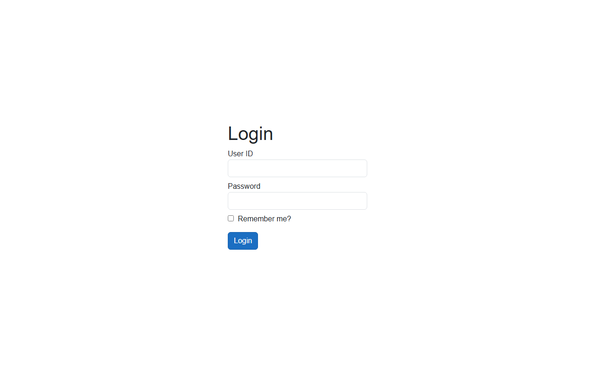

---

## 「空のプロジェクト（認証付き）」の中身

ログインできる最小構成のプロジェクトです。`admin / admin` でログインできます。

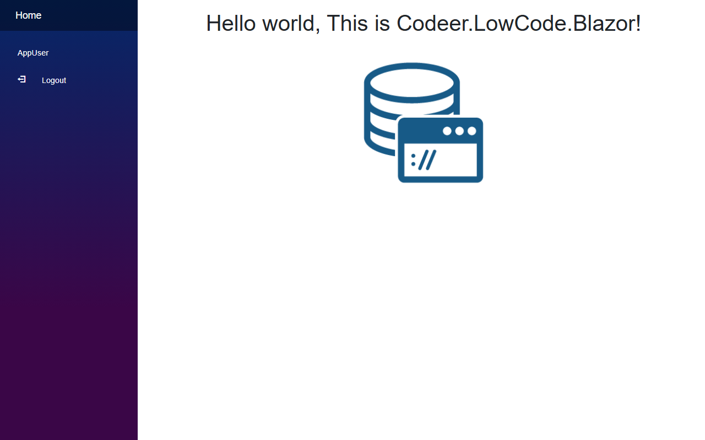

含まれているのは次の 2 モジュールだけです。

| モジュール | 役割 |
|---|---|
| `Home` | ホーム画面（表示のみ） |
| `AppUser` | ユーザーマスタ。ユーザー識別名・表示名・パスワードを管理 |

`AppUser` は app.clprj の **Current User Module** に設定済みで、ログインしたユーザーと `app_users` テーブルの行が結びついた状態になっています。つまり、デザイナでの認可設定（PageFrame / Module / データ単位のアクセス制御）をすぐに使い始められます。

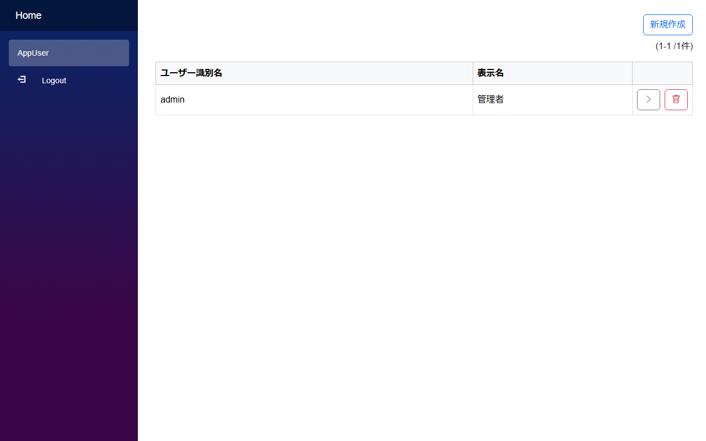

パスワードはそのままの文字列では保存されません。PasswordHash フィールドによってハッシュ化され、`app_users` テーブルの `hash` / `salt` 列に保存されます。ユーザーを増やすには、この画面の「新規作成」でユーザー識別名・表示名・パスワードを登録するだけです。

ここから先は通常のプロジェクトと同じように、モジュールを追加してアプリを作っていきます。認可設定の進め方は [チュートリアル: 認証を有効にする](../tutorials/tutorial_auth.md) を参照してください。

---

## 「認証パターン集」の中身

認証ならではの実装パターンを動かして確認できるサンプル集です。
`admin / admin`（管理者）と `alice / bob / carol / dave`（一般ユーザー、パスワード: `test`）の 5 ユーザーが登録済みです。

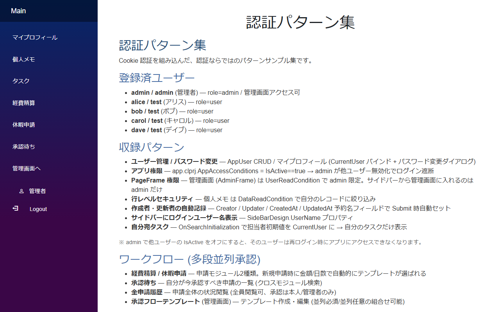

各パターンの作り方の詳細は [認証パターン集](../patterns/auth_patterns.md) に個別記事があります。ここでは画面を動かしたときの様子を紹介します。

### ログイン中ユーザーの表示とパスワード変更

「マイプロフィール」はログイン中のユーザー（CurrentUser）の情報を表示する画面です。サイドバー下部にもログイン中ユーザーの表示名が出ています。

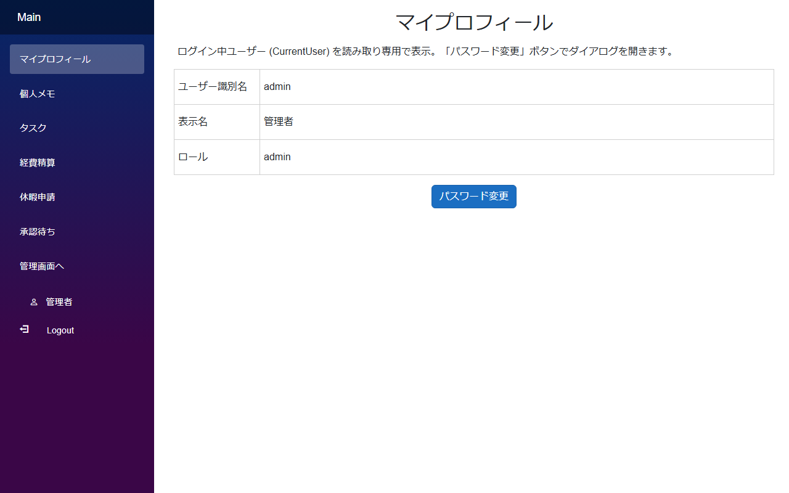

「パスワード変更」ボタンでダイアログを開き、自分のパスワードを変更できます。変更後のパスワードもハッシュ化されて保存されます。

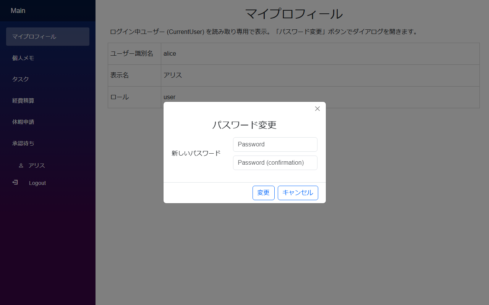

→ 詳細: [ユーザーモジュールと認証連動](../patterns/auth_user_module.md)

### 自分のデータだけ見せる（行レベルセキュリティ）

「個人メモ」はデータ単位の読み取り条件（DataRead）で「自分が作成した行」だけに絞り込んでいます。
alice でログインすると alice のメモだけが見えます。

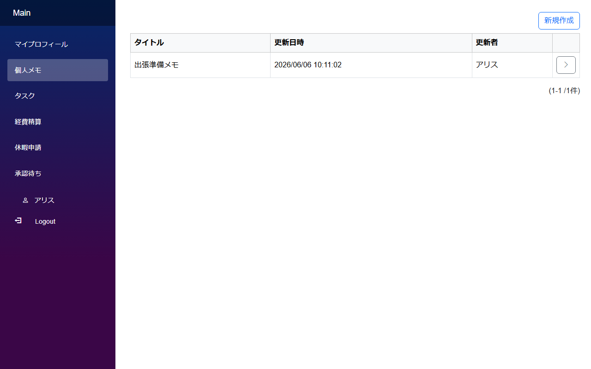

同じ画面を bob で開くと、alice のメモは存在しないかのように扱われ、bob のメモだけが表示されます。

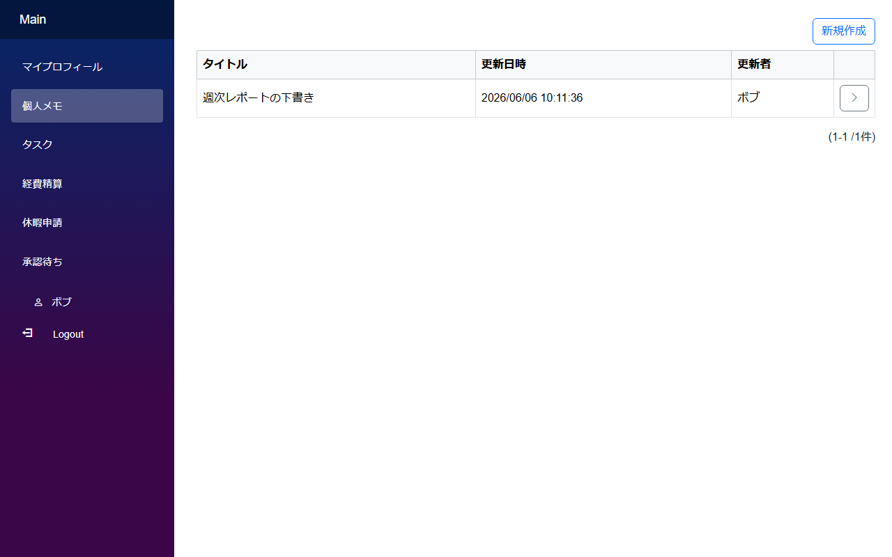

作成者・更新者・作成日時・更新日時は、Field の Name を予約名（`Creator` / `Updater` / `CreatedAt` / `UpdatedAt`）にしておくことで登録時に自動でセットされます。スクリプトは不要です。

→ 詳細: [個人データのフィルタと権限](../patterns/auth_personal_data.md)

### 一般画面と管理画面の分離（PageFrame 権限）

このサンプルは一般ユーザー向けの `Main` と管理者向けの `AdminFrame` の 2 つの PageFrame で構成されています。`AdminFrame` には「`CurrentUser` のロールが admin であること」という表示条件が設定されています。

admin でログインすると、サイドバーに「管理画面へ」リンクが表示され、ユーザー管理画面に入れます。

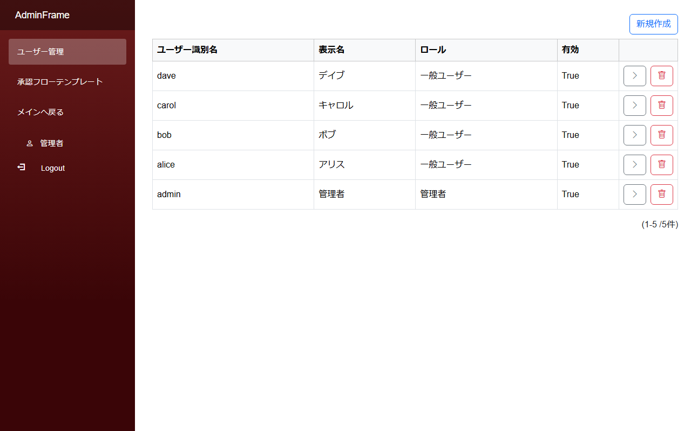

一般ユーザー（alice）でログインすると、サイドバーから「管理画面へ」リンク自体が消えます。

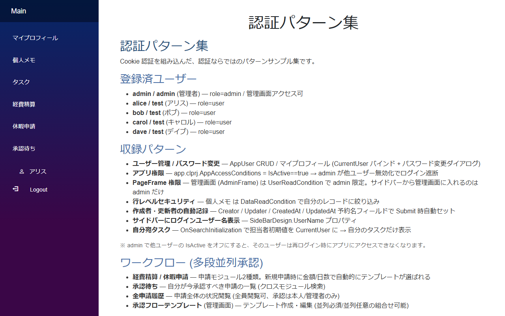

URL を直接入力して管理画面にアクセスしようとしても拒否されます。

管理画面のユーザー管理では、ユーザーの追加のほか「有効」フラグの切り替えができます。無効にされたユーザーはアプリ全体のアクセス条件（app.clprj の条件設定）を満たさなくなり、再ログイン時にアプリに入れなくなります。

→ 詳細: [一般画面と管理画面の分離 (複数 PageFrame)](../patterns/auth_admin_frame.md)

### 申請 → 承認のワークフロー

「経費精算」「休暇申請」は申請モジュールのサンプルです。申請すると金額や日数に応じた承認フローが自動で組み立てられ、操作履歴が記録されていきます。

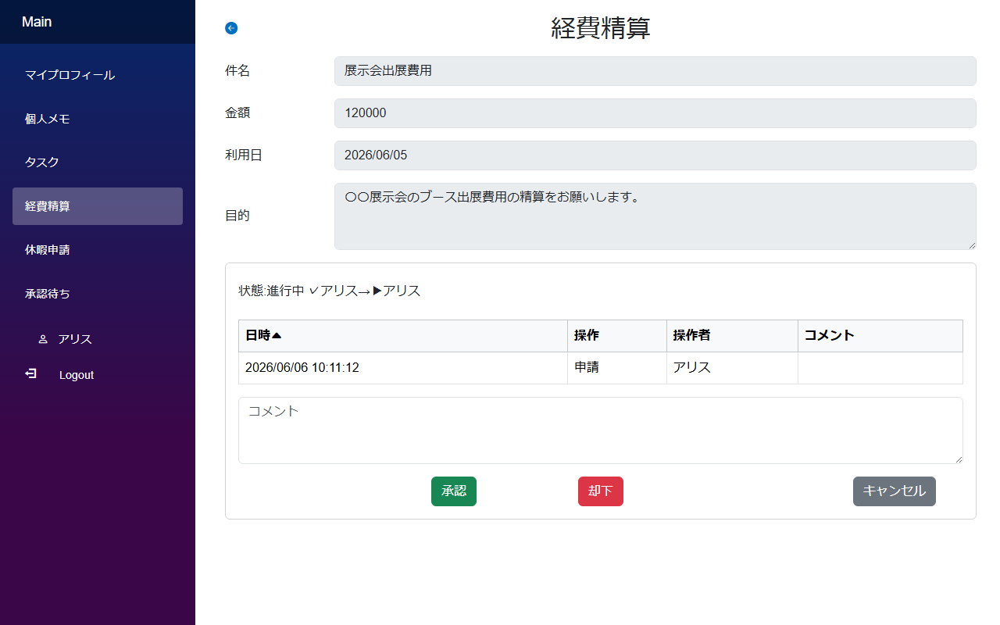

承認者側は「承認待ち」を開くと、自分が今承認すべき申請だけが一覧されます。「開く」から申請内容を確認し、コメントを付けて承認・却下できます。

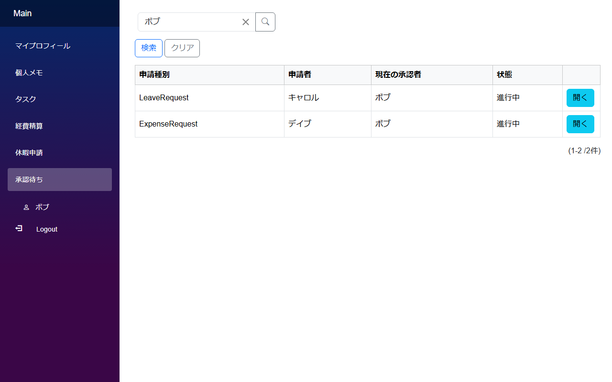

→ 詳細: [承認フローのワークフロー](../patterns/auth_workflow.md)

---

## 関連ドキュメント

- [認証 / 認可の概要](authorization.md) — 認可の仕組みと設定項目
- [チュートリアル: 認証を有効にする](../tutorials/tutorial_auth.md) — 認可設定を段階的に組み込む手順
- [認証パターン集](../patterns/auth_patterns.md) — 各パターンの作り方の個別記事
- [クイックスタート](../quickstart/quickstart.md) — Visual Studio テンプレートからの基本的な始め方
