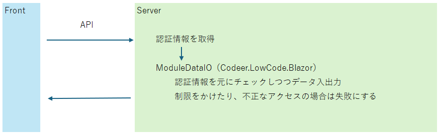
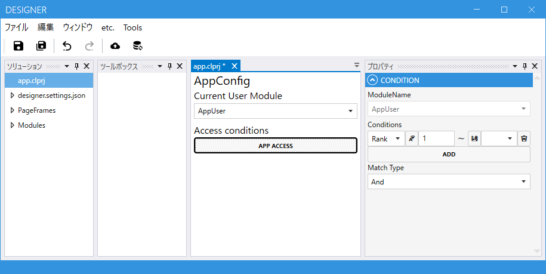
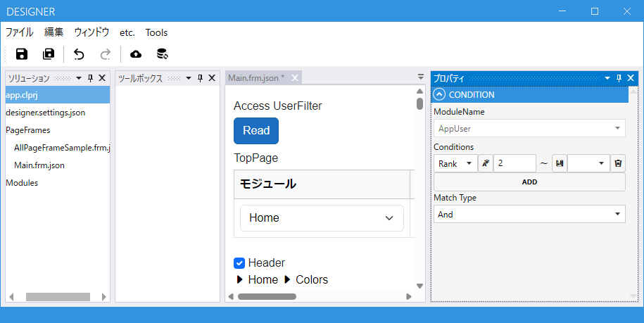
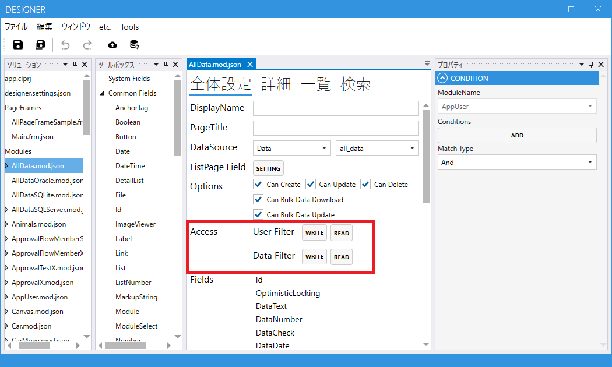
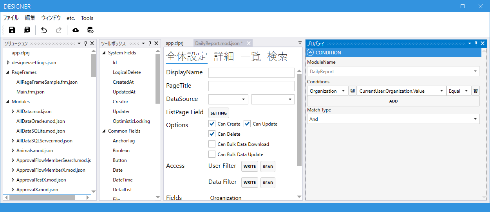

# 認証・認可
Codeer.LowCode.Blazorでは認可に関する機能があります。
認証に関してはユーザーコードで実装する必要があります。
ただテンプレートでCookie認証とAzure Entra Idによる認証のユーザーコードを作成できます。
テンプレートは認証機能はAsp.Netの標準的な機能で実装しています。

```cs
[Authorize, AutoValidateAntiforgeryToken]
[ApiController]
[Route("api/module_data")]
public class ModuleDataController : ControllerBase, IAuthenticationContext, IAsyncDisposable
```
```cs
public static class ControllerExtensions
{
    public static async Task<string> GetCurrentUserIdAsync(this ControllerBase ctrl, ApplicationDbContext context)
    {
        //Cookie認証では認証情報を元にはUsersテーブルでヒットするユーザーのIdを取得しています。
        var userName = ctrl.User?.Identity?.Name;
        var user = await context.Users.FirstOrDefaultAsync(e => e.UserName == userName);
        return user?.Id??string.Empty;
    }
}
```

## 認可
認可に関しては基本は app.clprj で設定した Current User Module を使います。
認証で取得する情報から Current User Module の Id を取得して、現在のユーザーの情報を取得します。
現在のユーザーの情報を元に様々な認可を設定することができます。


## アプリ全体
app.clprj の Current User Module を設定することで認可機能を利用することができます。
ここで設定したModuleに存在しないユーザーはアプリのどのページ、データにもアクセスできません。
またここで設定した条件に当てはまらないユーザーもアプリにアクセスできません。
図の例ではAppUserテーブルに登録されているユーザーのうちRankが1以上のユーザーがアプリにアクセスすることができます。


## PageFrame
これはUIでのアクセス制限です。条件を満たさないユーザーに関してそのPageFrame自体の表示を制限することができます。
図の例ではAppUserテーブルに登録されているユーザーのうちRankが2以上のユーザーがMain.frmを表示することができます。


## Module
これはデータアクセス自体のアクセス制限です。権限のないユーザーはCodeer.LowCode.BlazorのAPIを使ってデータにアクセスすることができません。例えばSelectFieldなどに表示されるデータも権限のないものは表示されなくなります。


### ユーザーによる認可
#### - 読み取り
読み取りの条件を満たしていないユーザーはModuleのデータ自体にアクセスすることができません。
またPageFrameのサイドバーやヘッダのモジュールリストからも消えます。

#### - 書き込み
書き込みの条件を満たしていないユーザーはModuleのデータを見ることはできますが、新規作成/編集/削除の操作ができません。

### データによる認可
#### - 読み取り
読み込みの条件を満たしていないデータ自体にアクセスすることができません。リスト表示では条件を満たしているデータのみが表示されます。図の例では同一組織のデータのみにアクセスできます。


#### - 書き込み
書き込み条件を満たしていないデータは表示することはできますが、編集/削除することはできません。
