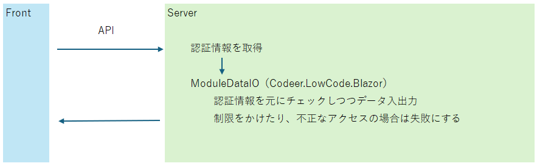
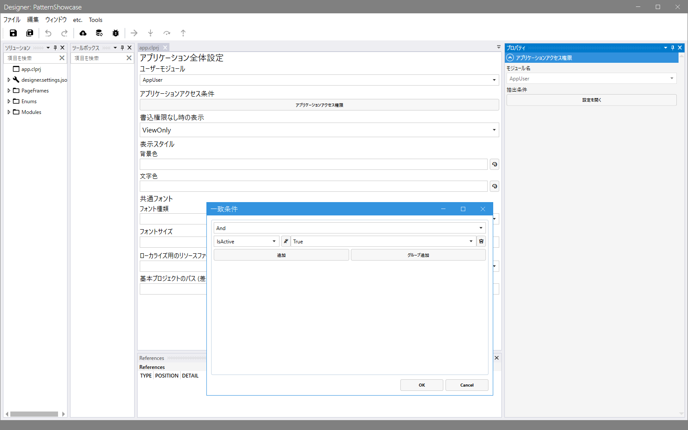
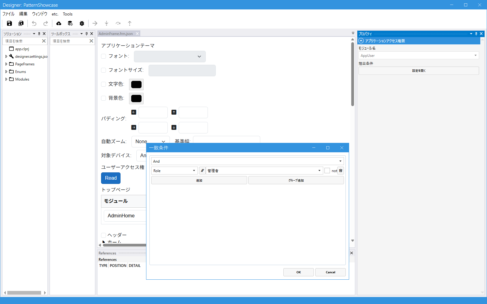
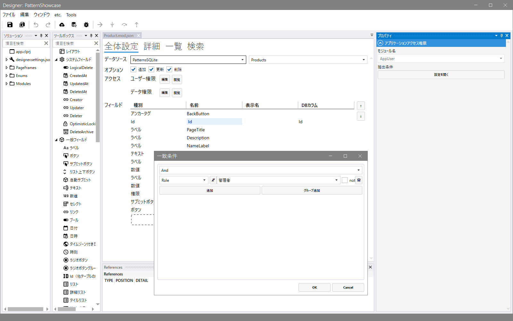
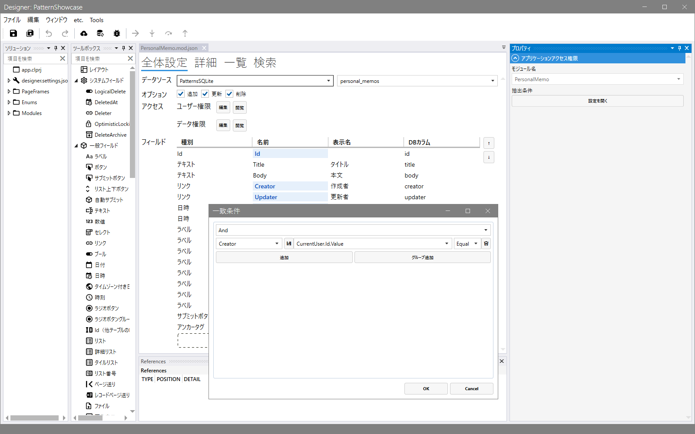

# 認証・認可

> 認証付きプロジェクトの立ち上げ方（テンプレートの選び方とサンプルの動かし方）は [認証付きプロジェクトの始め方](auth_getting_started.md) を参照してください。

## 認証と認可は別のものです

| | 何を決めるか | 担当 | このページでの扱い |
|---|---|---|---|
| **認証** (Authentication) | **誰が**ログインしたか。ID/パスワード、Entra ID などの外部ログイン、二要素認証 | **ライブラリの外**。テンプレートが生成するホストアプリと、MIT の拡張ライブラリ [Codeer.LowCode.Blazor.Extras](https://github.com/Codeer-Software/Codeer.LowCode.Blazor.Extras) | 次の節で Extras への案内だけ |
| **認可** (Authorization) | ログインしたユーザーに**何を見せ、何を書かせるか** | **Codeer.LowCode.Blazor 本体**。デザイナで設定する | このページの本題 (「認可」以降) |

Codeer.LowCode.Blazor 本体がやるのは認可だけです。本体が認証に求めるのは「ログイン中ユーザーの Id」を受け取ることだけで、
それを app.clprj の Current User Module の行に結びつけて、以降の認可に使います。
どの方式でログインしても認可の設定は同じで、認証方式を変えても認可の設定は変わりません。

## 認証はライブラリの外 (Extras が提供)

認証の実装は、Visual Studio テンプレートが生成するホストアプリ (ログイン画面と `api/account/*`) と、MIT ライセンスの Extras (ID/パスワード照合・外部 IdP・二要素認証) にあります。
テンプレートで作ったソリューションには最初から入っていて、次の方式をデザインと appsettings だけで使えます。

| 方式 | 有効にする方法 | 詳細 (Extras) |
|---|---|---|
| ID / パスワード | ユーザーモジュールの `LoginAccountContractField` (ログインアカウント契約。テンプレートの `AppUser` に配置済み) | [認証の全体像](https://github.com/Codeer-Software/Codeer.LowCode.Blazor.Extras/blob/main/docs/Authentication.md) |
| Entra ID / Google / AWS Cognito / OpenID Connect | サーバーの appsettings に IdP の設定を書く | [外部ログイン](https://github.com/Codeer-Software/Codeer.LowCode.Blazor.Extras/blob/main/docs/ExternalLogin.md) |
| 二要素認証 (認証アプリ TOTP / メールのワンタイムコード) | 契約フィールドに TOTP の列、またはメール送信先のフィールドを設定 | [二要素認証](https://github.com/Codeer-Software/Codeer.LowCode.Blazor.Extras/blob/main/docs/TwoFactorLogin.md) |

認証のコードはテンプレートのソースと Extras のソース (MIT) なので、社内 SSO など独自の方式に差し替えることもできます。
**認証について知りたいときは、まず [認証の全体像 (Extras)](https://github.com/Codeer-Software/Codeer.LowCode.Blazor.Extras/blob/main/docs/Authentication.md) を読んでください。** このページの以降の内容は認証には関係しません。

## 認可 (このページの内容)

ここから先はすべて**認可**の設定です。本体はログイン中ユーザーの Id を app.clprj の Current User Module の行に結びつけ、
その行の値 (`CurrentUser`) を元に「アプリに入れるか」「どの画面・モジュール・行・項目を見せるか、書かせるか」を判定します。

## 認可の全体像

認可は5つの階層で設定できます。上から順に広い範囲を守ります。

| 階層 | 設定場所 | 決められること |
|---|---|---|
| アプリ全体 | app.clprj の Current User Module とアクセス条件 | アプリに入れるユーザー |
| PageFrame | PageFrame のユーザーアクセス権 | そのフレーム（画面の枠組みとメニュー）を見せるユーザー |
| Module × ユーザー | Module のユーザーによる認可（読み取り / 書き込み） | そのモジュールのデータを**誰が**読める・書けるか |
| Module × データ | Module のデータによる認可（読み取り / 書き込み） | **どのデータ（行）**が読める・書けるか |
| 項目 | 権限フィールド | **どの項目**が読める・書けるか |

## 基本的な考え方

1. **判定はサーバーで行われます。** 画面のボタンや入力欄が消える・無効になるのは利用者への案内であり、
   守っているのはサーバーです。スクリプトや直接のリクエストで画面の制御を回避しても、サーバーが拒否します。
2. **読み取りが書き込みの前提になるかは、操作によって分かれます。**
   新規作成は書き込む先のデータを指定しない操作なので、読み取りの条件を満たさなくてもできます。
   既存データの編集・削除は対象のデータを指定する操作なので、読み取りの条件も必要です。
3. **直接開くとエラー、他の画面に載って表示されるときは空。**
   読み取りの条件を満たさないモジュールを直接開いたり検索したりするとエラーになります。
   他のモジュールの画面に同梱されて表示される場合（リンクの表示値、埋め込みのリストなど）はエラーにならず、
   その部分だけが空になります。
4. **SQL を書くフィールド（Query / ExecuteSql）では、SQL の内容に行・項目の認可は効きません。**
   SQL の内容までは判定できないためです。行の絞り込みは SQL の WHERE 句に書きます
   （ユーザーごとの絞り込みには `current_user_id` パラメータが使えます）。
   ただし ExecuteSqlField 自体を権限フィールドの対象にすると「その SQL を実行できるか」は制御できます。
   守られない組み合わせを設定した場合はデザインチェックが知らせます。

## 操作と認可の対応表

○=判定される -=判定されない（不具合ではなく仕様です。※の付いたものの理由は表の下）

| 操作 | ユーザー認可(読取) | ユーザー認可(書込) | データ認可(読取) | データ認可(書込) | 項目の権限 |
|---|---|---|---|---|---|
| 一覧・詳細の表示 | ○ | - | ○ 行が絞られる | - | ○ 項目が消える |
| 新規作成 | - ※1 | ○ | - ※2 | - ※2 | ○ |
| 編集・削除 | ○ | ○ | ○ | ○ 条件外はエラー | ○ |
| 洗い替え保存（ListField） | ○ | ○ | ○ | ○ 条件外の行は**残る** | ○ |
| Excel/CSV 一括出力 | ○ | - | ○ | - | ○ 列が出ない |
| Excel/CSV 一括入力 | ○ | ○ | ○ | ○ | ○ 値を変えるとエラー |
| ファイルのダウンロード | ○ | - | ○ | - | ○ |
| ExecuteSql（Standalone）の実行 | - ※3 | ○ | - ※4 | - ※4 | ○ 実行できるか ※5 |
| Query モジュールの表示 | ○ | - | - ※6 | - | ○ |
| リンクの表示値 | ○ 空になる | - | - ※7 | - | ○ |
| 埋め込みリスト・モジュール | ○ 空になる | - | ○ 行が絞られる | - | ○ |

無印の「-」は、読み取りだけの操作に書き込みの条件は関与しない、という自明な対象外です。

- ※1 新規作成は書き込む先のデータを指定しない操作のため、読み取りの条件を要求しません（これを利用して投函フォームが作れます）
- ※2 新規作成には対象のデータがまだ存在しないため、行の条件は判定する対象がありません
- ※3 Standalone の実行はデータの読み取りをしない操作のためです（読み取り用途には QueryField を使います。そちらでは読み取りの認可が効きます）
- ※4 SQL の内容までは判定できないため、行の条件は適用できません。行の絞り込みは SQL の WHERE 句に書きます
- ※5 権限フィールドで ExecuteSqlField を対象にすると「その SQL を実行できるか」を制御できます。SQL が触る列には効きません
- ※6 クエリの行は SQL 自身が定義するため、行の条件は適用されません。絞り込みは SQL の WHERE 句と `current_user_id` で行います
- ※7 リンクの表示値は「表示しているモジュールのデータの一部」という扱いのためです。隠したい場合は権限フィールドでリンクの項目を対象にします

## アプリ全体
app.clprj の Current User Module を設定することで認可機能を利用することができます。
ここで設定したModuleに存在しないユーザーはアプリのどのページ、データにもアクセスできません。
またここで設定した条件に当てはまらないユーザーもアプリにアクセスできません。
図の例ではAppUserテーブルに登録されているユーザーのうちRankが1以上のユーザーがアプリにアクセスすることができます。

## PageFrame
これはUIでのアクセス制限です。条件を満たさないユーザーに関してそのPageFrame自体の表示を制限することができます。
図の例ではAppUserテーブルに登録されているユーザーのうちRankが2以上のユーザーがMain.frmを表示することができます。

PageFrameの制限はメニューや画面の枠組みを見せるかどうかの話で、データ自体はModule以下の階層が守ります。
サイドバーのリンクの出し分けは、遷移先のModuleのユーザーによる認可（読み取り）で行うのがおすすめです。
PageFrameのリンク側だけを絞ると「リンクは見えるが開くと拒否される」状態になります。

## Module
これはデータアクセス自体のアクセス制限です。権限のないユーザーはCodeer.LowCode.BlazorのAPIを使ってデータにアクセスすることができません。例えばSelectFieldなどに表示されるデータも権限のないものは表示されなくなります。

### ユーザーによる認可
#### - 読み取り
読み取りの条件を満たしていないユーザーはModuleのデータ自体にアクセスすることができません。
またPageFrameのサイドバーやヘッダのモジュールリストからも消えます。

他のModuleの画面に表示される場合（リンクの表示値、埋め込みのリストやモジュール）も同様に守られます。
この場合はエラーにはならず、その部分だけが空で表示されます。

ただし新規作成だけは読み取りの条件を満たしていなくても行えます。
書き込む先のデータを指定しない操作のため、書き込みの条件を満たしていれば新規作成の画面を開いて保存できます。
既存データの編集/削除は対象のデータを指定する操作なので、読み取りの条件が必要です。

#### - 書き込み
書き込みの条件を満たしていないユーザーはModuleのデータを見ることはできますが、新規作成/編集/削除の操作ができません。

#### - 投函フォーム
読み取りを管理者だけに絞り、書き込みは全員に許可すると、投稿した本人にも内容を見せないフォームを作ることができます。
問い合わせの受付、申請の提出、匿名アンケートなどに使えます。
保存した後はそのデータの画面へは移動せず、入力した内容がそのまま残ります
（保存したデータの編集には読み取りの条件が必要なため、保存後のフォームは表示専用になります。
続けて投函する場合は新規作成の画面を開き直してください）。

| 設定 | 値 |
|---|---|
| ユーザーによる認可（読み取り） | 管理者だけが満たす条件 |
| ユーザーによる認可（書き込み） | 設定しない（または投函させたいユーザーの条件） |

### データによる認可
#### - 読み取り
読み込みの条件を満たしていないデータ自体にアクセスすることができません。リスト表示では条件を満たしているデータのみが表示されます。図の例では同一組織のデータのみにアクセスできます。

条件には自分のModuleの項目のほか、ログインユーザーの値（CurrentUser）や、リンク先の項目
（例: `Customer.Dept` が自分の部署と等しい）も使えます。

#### - 書き込み
書き込み条件を満たしていないデータは表示することはできますが、編集/削除することはできません。

ListFieldの洗い替え保存（全件を削除して入れ直す保存方式）では、書き込み条件を満たしていないデータは
エラーにならず、削除されずに残ります。結果として「残った条件外のデータ」と「入れ直したデータ」が並びます。

## 項目単位の認可（権限フィールド）

権限フィールド（PermissionField）をModuleに置くと、項目ごとに読み取り・書き込みの条件を設定できます。

- 対象の項目（TargetFields）と、読み取りできる条件・書き込みできる条件を設定します
- 条件にはログインユーザーの値（`CurrentUser.Rank` など）と、そのデータ自身の値（`State` など）が使えます
- 読み取りできない項目は画面から消え、検索条件やソートにも使えなくなります
- 書き込みできない項目は表示専用になります
- 読み取りできない項目は書き込みもできません
- 複数の権限フィールドが同じ項目を対象にした場合は、すべての条件を満たさないと許可されません
- ExecuteSqlField を対象にすると「その SQL を実行できるか」の条件になります（実行はデータを対象にしない操作のため、条件にはログインユーザーの値だけが使えます）

モジュール単位の認可との違いは対象の細かさです。「このモジュールは経理だけ」ならユーザーによる認可、
「給与の項目だけ人事に絞る」なら権限フィールドを使います。

## リンク・埋め込み表示と認可

Moduleの画面には他のModuleのデータが載ることがあります（リンクの表示値、埋め込みのリストやモジュール）。
それぞれ次のように守られます。

| 表示のされ方 | 相手のユーザー認可（読取）を満たさない場合 | 相手のデータ認可（読取） |
|---|---|---|
| リンクの列（`Customer.Name` などリンク先の項目） | 列が空になる | 効かない |
| LinkField / SelectField の表示テキスト | 表示テキストだけ空になる（値そのものは自分のデータなので残る） | 効かない |
| 埋め込みのリスト（ListField） | 空のリストになる | 効く（行が絞られる） |
| 埋め込みのモジュール（ModuleField） | 空になる | 効く（条件外のデータは表示されない） |

リンクの表示値には相手のデータによる認可（行の条件）は効きません。リンクの表示値は
「それを表示しているModuleのデータの一部」という扱いです。隠したい場合は権限フィールドで
リンクの項目を対象にしてください（この組み合わせはデザインチェックが知らせます）。

なおこれは表示（読み込んだデータと一緒に取得される場合）の話です。画面上でリンクの値を変更したときの
表示の取り直しはリンク先への検索になるため、行の条件が効きます。条件の対象外のデータを指した場合は
リンクの表示が空になります（条件の対象外のデータを探し当てられないようにするためです）。

なお「リンク先の項目を自分のデータによる認可の条件に使う」こと（例: `Customer.Dept` が自分の部署と等しいデータだけ読める）は
これとは別の話で、普通にできます。こちらは自分のModuleに書いた条件のデータとしてリンク先の値を使うだけです。

## SQL を書くフィールドと認可

[QueryField](../db/query_field.md) と [ExecuteSqlField](../db/execute_sql_field.md) は SQL を直接書くため、
SQL の内容に行・項目の認可は適用されません。行の絞り込みは SQL の WHERE 句に書きます。
ユーザーごとに絞る場合は、サーバーがログインユーザーの Id を必ず渡す **`current_user_id`** パラメータが使えます。
ExecuteSqlField 自体を権限フィールドの対象にすると「その SQL を実行できるか」を制御できます。
詳細は各フィールドのページを参照してください。
