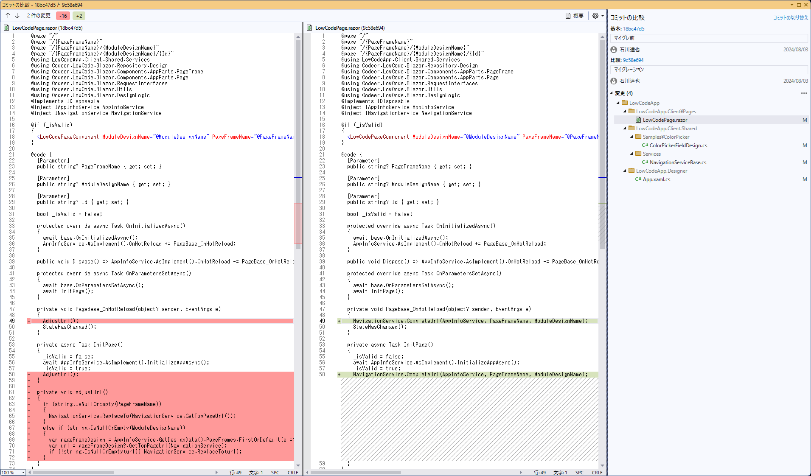
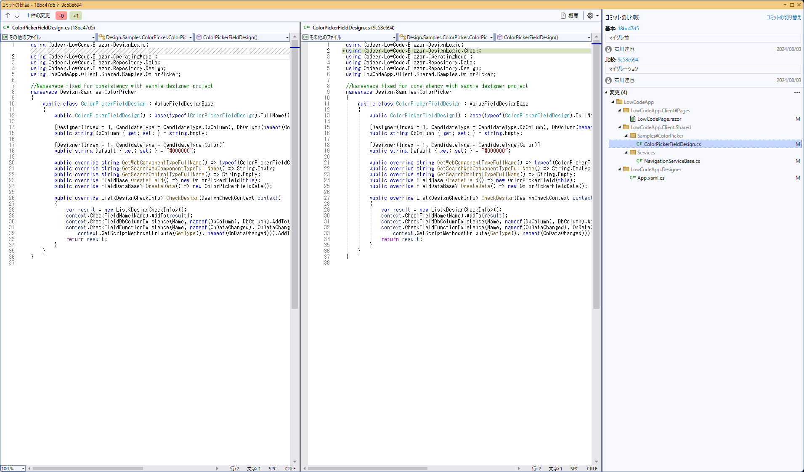
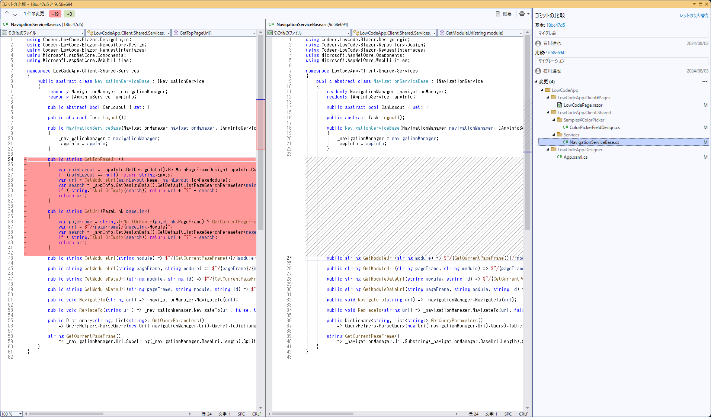
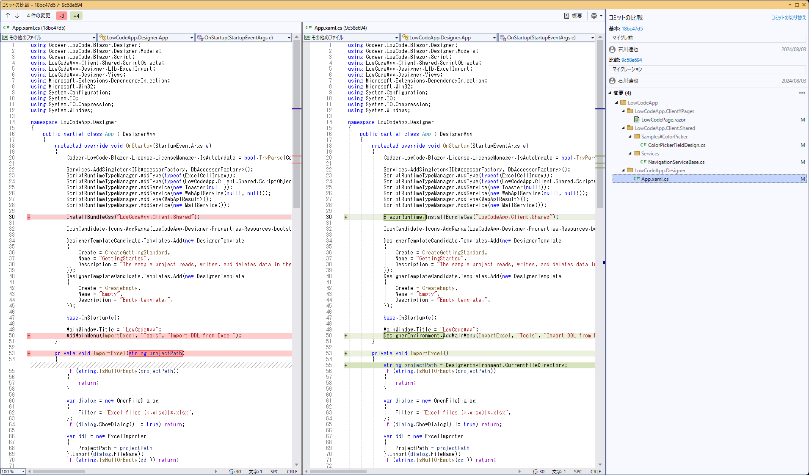

# 1.0.26
最新のCodeer.LowCode.Blazor.Templatesを使って最新のコードを生成してそこから該当部分を取得して置き換えるのが簡単です。

NavigationServiceからGetTopPasgeUrlを削除してCompleteUrlをNavigationServiceExtensionsに追加しました

DesignCheck関連のクラスのネームスペースをCoder.LowCode.Blazor.DesignLogic.Checkに変更しました

INavigationServiceからGetTopPageUrlとGetUrlを削除しました

DesignerAppに定義されていたInstallBundleCssとAddMainMenuをDesignerEnvironmentとBlazorRuntimeを導入してそちらに定義しました

