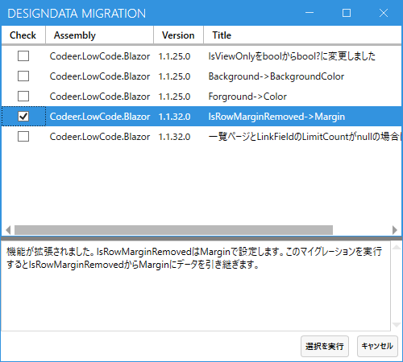

# 1.1.32

### Breaking change
- Removed the use of IsRowMarginRemoved
- Changed the behavior when LimitCount is null in list pages and LinkField

## IsRowMarginRemoved
IsRowMarginRemoved を利用しないようにしました。代わりにGridRowにはマージンを設定する機能を追加しました。これで下マージンを0にすると同様のこうかがあります。Desingerのマイグレーション機能を利用すると IsRowMarginRemoved がtrueの行の下マージンを0に設定します。

マイグレーションしたデータをデプロイしなおしてください。

## LimitCount
一覧ページとLinkFieldでLimitCountがnullの時の挙動を変更しました。nullの場合は数に制限なくデータを取得します。既存のデータでnullのものはDesignerのマイグレーション機能を利用すると50に変更できます。

マイグレーションしたデータをデプロイしなおしてください。

