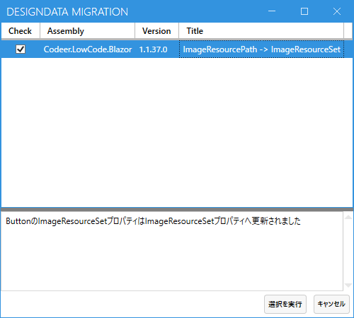

# 1.1.37

## ContextMenuServiceが必要になった
1.1.36以前のテンプレートでコードを作成している場合はServiceInitializerにこの一行を追加してください。
```cs
services.AddSingleton<ContextMenuService>();
```

```cs
public static class ServiceInitializer
{
    public static void AddSharedServices(this IServiceCollection services)
    {
        services.AddScoped<IAppInfoService, AppInfoService>();
        services.AddScoped<IModuleDataService, ModuleDataService>();
        services.AddScoped<IUIService, UIService>();
        services.AddScoped<Codeer.LowCode.Blazor.RequestInterfaces.Services>();
        services.AddScoped<ILogger, Logger>();
        services.AddSingleton<ModuleDialogService>();
        services.AddSingleton<ModulePanelService>();
        services.AddSingleton<MessageBoxService>();
        
        services.AddSingleton<ContextMenuService>();//※これを追加

        services.AddSingleton<LoadingService>();
        services.AddToaster(config =>
        {
            config.PositionClass = Defaults.Classes.Position.BottomRight;
            config.MaximumOpacity = 100;
            config.VisibleStateDuration = 1000 * 5;
            config.ShowTransitionDuration = 10;
            config.HideTransitionDuration = 500;
        });
        services.AddScoped<ToasterEx>();
        services.AddScoped<HttpService>();
        services.AddScoped<IAITextAnalyzerCore, AITextAnalyzerCore>();

        var cultureName = CultureInfo.CurrentCulture.Name;
        if (cultureName == "ja") cultureName = "ja-JP";
        var cultureInfo = new CultureInfo(cultureName);
        CultureInfo.DefaultThreadCurrentCulture = cultureInfo;
        CultureInfo.DefaultThreadCurrentUICulture = cultureInfo;
    }
}
```

## ボタンのイメージを複数種類設定できるようにした影響
ImageResourcePathに設定していたイメージへのパスをImageResourceSetに移す必要があります。
マイグレーションツールで移動可能です。

マイグレーションしたデータをデプロイしなおしてください。

