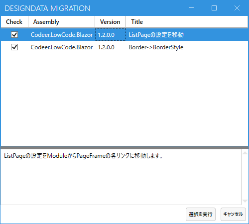
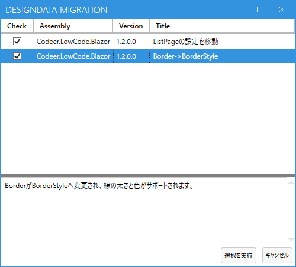

# 1.2.0

## ListPageの設定を移動した
ListPageの設定をModuleからPageFrameの各リンクに移動しました。
マイグレーションによりデータを更新できます。
Webアプリの参照するCodeer.LowCode.Blazorのバージョンを1.2.0にバージョンアップした場合は
必ずマイグレーションしたデータを送ってください。

## Borderの設定を移動した
Boderの設定をenumからBorderStyleというデータに変更しました。
これにより線の太さや色を指定できるようになります。
過去に罫線を設定している場合はマイグレーションをおこないデータを送信してください。
