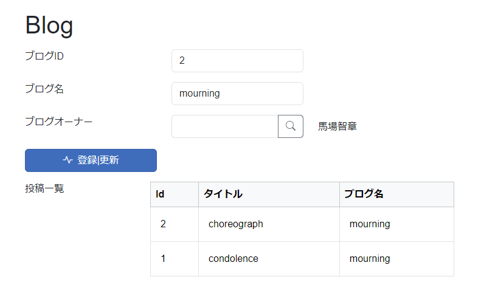

# データモデルとモジュール

ユーザーによって書かれたたくさんのpostを持つblogを考えます.


```sql
CREATE TABLE users
(
    id bigserial primary key ,
    name text
);

CREATE TABLE blog
(
    id bigserial primary key ,
    blog_name text,
    owner bigint NOT NULL,
    FOREIGN KEY (owner) REFERENCES users(id)
);

CREATE TABLE post
(
    id bigserial primary key ,
    subject text,
    content text,
    blog_id bigint NOT NULL,
    FOREIGN KEY (blog_id) REFERENCES blog(id)
);
```

## Link, Select で表現するモジュールの関係
- 1 - 1  (1 - 0..1) の関係を表す場合に， 参照するModule（`Blog`）に`Link`(`Select`)フィールドを配置し，参照先のModule(`User`)を設定します.
- Link はモーダルから1レコードを選択します．(複数のフィールドを表示して，選択する場合に使用します．)
- SelectはSelectBoxから1レコード選択します．(名前等，1つのフィールドで選択する場合に使用します．)


画面では参照先のModuleを一覧から選択できるようになります.


## List, DetailList, TileList で表現するモジュールの関係
- 1 - N  (1 - 0..N) の関係を表す場合に， 参照するModule（`Blog`）に`List`(`DetailList`, `TileList`)フィールドを配置します.

- 被参照Module
  - 被参照Moduleに(`Blog`)に`List`(`DetailList`, `TileList`)フィールドを配置
  - Conditionに一覧に表示する条件を設定

    
  - 一覧形式でBlogを参照しているPostが表示されます.

    


## N - N

多対多の関係

- 従業員は複数の部署を兼務
- 部署には複数の従業員が所属

