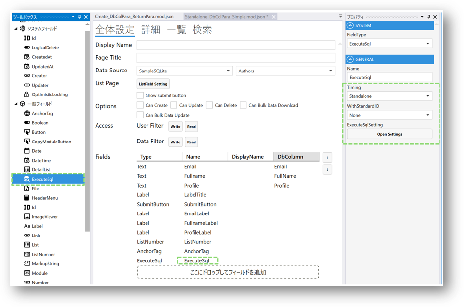
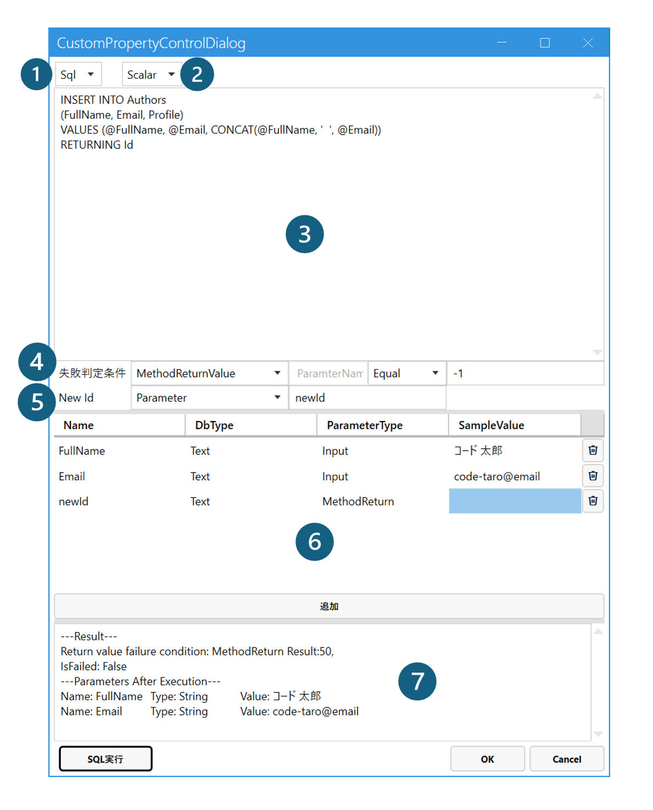

# ExecuteSqlField (ExecuteSql)

## これは何か

**任意の SQL 文をユーザーが指定したタイミングで実行する Field**。標準の CRUD（Insert / Update / Delete）では実現できない処理を、SQL 文や ストアドプロシージャ呼び出しで挟み込めます。

UI は持ちません。デザイナでの設定のみで動作します。

## いつ使うか

- **標準 Submit の前後で追加の DB 操作**をしたい（例: ログ挿入、別テーブルの整合性更新）
- **標準 CRUD を抑止して独自 SQL に置き換え**たい
- **特定ボタン（Standalone）で SQL を実行**したい
- ストアドプロシージャを呼び出したい

---

## デザイナでの設定

### プロパティ一覧

#### システム

| C#名 | 日本語表示名 | 説明 |
|---|---|---|
| - | フィールドタイプ | `ExecuteSql` 固定 |

#### 基本設定

| C#名 | 日本語表示名 | 型 | 既定値 | 説明 |
|---|---|---|---|---|
| **Name** | 名前 | string | `""` | フィールド識別子 |
| **Timing** | タイミング | enum | `Standalone` | SQL が実行されるタイミング |
| **WithStandardIO** | 標準IOとの関係 | enum | `None` | 標準の CRUD 処理との組み合わせ方 |
| **ExecuteSqlSetting** | SQL設定 | ExecuteSqlSetting | - | SQL 本文・パラメータ・失敗判定などの詳細（「設定を開く」から編集） |
| **IgnoreModification** | 変更判定から除外 | bool | `false` | 変更検知から除外 |

### Timing（タイミング）

| 値 | 実行タイミング |
|---|---|
| **Create** | 新規作成画面で Submit されたとき |
| **Update** | 編集画面で Submit されたとき |
| **Delete** | 一覧画面で削除ボタンが押されたとき |
| **Standalone** | 上記のどれでもない時。Submit ボタンが押された時に実行 |

### WithStandardIO（標準 IO との関係）

`Standalone` 以外の時に有効。標準の CRUD 処理とカスタム SQL の実行順を指定します。

| 値 | 挙動 |
|---|---|
| **None** | 標準処理は**実行されない**。カスタム SQL のみ実行される |
| **Before** | 標準処理 → カスタム SQL の順で実行 |
| **After** | カスタム SQL → 標準処理の順で実行 |

---

## SQL 設定（ExecuteSqlSetting ダイアログ）

プロパティパネルの「**設定を開く**」ボタンから詳細ダイアログを開きます。

### Command Type

| 値 | 用途 |
|---|---|
| **Sql** | 通常の SQL 文 |
| **StoredProcedure** | ストアドプロシージャ呼び出し |

### Method Type

実行方法。戻り値の扱いが変わります。

| 値 | 用途 | 戻り値 |
|---|---|---|
| **NonQuery** | INSERT / UPDATE / DELETE 等 | 影響行数 |
| **Reader** | SELECT（行を取得） | データセット |
| **Scalar** | 単一値を取る | 最初の行の最初の列 |

### SQL 文

Command Type に応じた構文で記述します。

### 失敗判定条件

SQL 実行結果をどう「失敗」と判定するかを指定します（デザイナ上は試し実行結果で確認可能、Web では失敗時に例外発生）。

| 項目 | 値 | 説明 |
|---|---|---|
| **判定ターゲット** | `None` / `MethodReturnValue` / `Parameter` | 何を見て判定するか |
| **判定用Parameter名** | string | 判定ターゲットが `Parameter` の場合 |
| **判定条件** | `Equal` / `NotEqual` | 比較方法 |

### New Id 取得（Insert で WithStandardIO = None の時）

標準処理を抑止して自前で Insert する場合、追加された行の Id をどう得るかを指定します。

| 項目 | 値 | 説明 |
|---|---|---|
| **NewId取得方法** | `None` / `MethodReturnValue` / `Parameter` | 何を Id として返すか |
| **NewId取得用parameter名** | string | `Parameter` の場合 |

### パラメータ一覧

SQL 内で使うパラメータ（`@name` 等）の定義。

| 項目 | 説明 |
|---|---|
| **パラメータ名** | SQL 内で参照する名前 |
| **DbType** | DB の型 |
| **方向タイプ** | `Input` / `Output` / `InputOutput` / `ReturnValue` / `MethodReturn`（`MethodReturn` は実行結果を格納する内部用） |
| **Sample Value** | デザイナ上で試し実行するときのサンプル値 |

### 試し実行

ダイアログの「実行」ボタンでデザイナから SQL を実行して結果を確認できます。

> **注意**: 試し実行もデザイナが接続している本物の DB に対して行われます。DELETE / UPDATE の試し実行は実際にデータを書き換えるので取り扱い注意。

---

## スクリプトから

スクリプト公開メンバーはありません（全メンバー `[ScriptHide]`）。実行タイミングと SQL はデザイナ設定で完結します。

---

## 関連項目

- [QueryField](query_field.md) — 任意の SELECT 文の結果を画面に表示する
- [クエリを AI で作成](../ai/ai_query.md)
- [Field 共通プロパティ](../fields/common_properties.md)
