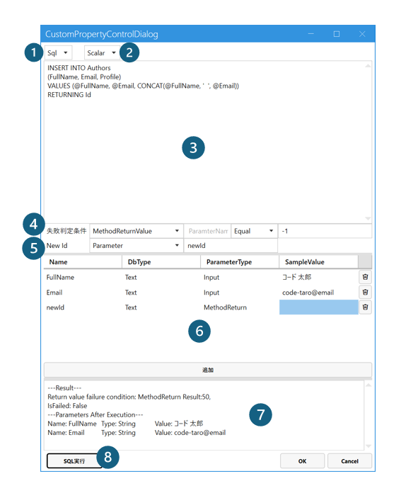

## ExecuteSql Field概要
Codeer.LowCode.Blazorは、標準として提供しているデータベースの編集機能(Insert/Update/Delete)以外に、柔軟に高度な機能を実現するために、ユーザーが指定するタイミングで任意のSQL文を実行する ExecuteSql フィールドを提供しています。


## プロパティ


### Timing
カスタムSQLが実行されるタイミングをを指定します。

`Create, Update, Delete, Standalone`
- Create: 新規作成画面で、Submitボタンがクリックされた時に実行
- Update: データ更新画面で、Submitボタンがクリックされた時に実行
- Delete： 一覧画面でデータ削除ボタンがクリックされた時に実行
- Standalone: 上記全部該当せず、Submitボタンが押されたときに実行

### WithStandardIO
元の標準処理(追加、更新、削除)の実行可否・実行タイミングを指定します。
`Standalone`の場合は元処理がないため、この設定が無効となります。

`None, Before, After`
- None: 元の処理が実行されない
- Before: 元の処理が先に実行されてから、カスタムSQLが実行される
- After: カスタムSQLが先に実行されてから、元処理が実行される

## 詳細設定
プロパティパネルの`Open Settings`ボタンで詳細設定画面を開きます。



### 1. Command Type
SQL文の種類を指定します。選択された種類に合わせたSQL文を記述してください。

```
Sql,
StoredProcedure
```

### 2. Method Type
SQLの実行メソッドを指定します。選択されたメソッドによって戻り値も変わります。
```
NonQuery,
Reader,
Scalar,
```

### 3. SQL文
実行されるSQL文です。上記 `1. Command Type`に合わせたシンタックスで記述してください。


### 4. 失敗判定条件
SQL文の実行結果の失敗判定条件を指定します。

デザイナでの実行は`7. 試し実行結果`で実行結果を確認できます。Webでの実行は失敗の場合は例外が発生します。

#### 4-1. 判定ターゲット
何をもって実行結果を判定するかを指定します。

`None, MethodReturnValue, Parameter`

- None: 失敗判定をしない
- MethodReturnValue: 実行メソッドの戻り値をもって判定する
- Parameter: パラメータの値をもって判定する

#### 4-2. 判定用parameter名(判定ターゲットがParameter時のみ)
上記判定ターゲットがParameterになっている場合は、そのParameter名を指定します。

#### 4-3. 判定条件
判定条件を指定します。
```
Equal,
NotEqual
```

### 5. New Id(Insert時のみ)
Insert時通常の処理では、追加された行のIdを返しますが、上述`WithStandardIO`プロパティが`None`で、通常の処理が実行されない場合は、ここでNew Idの値を指定することができます。

#### 5-1. NewId取得方法
`None, MethodReturnValue, Parameter`

- None: `String.Empty`が返される
- MethodReturnValue: メソッドの戻り値がNewIdとして返される
- Parameter: 指定されたParameter値がNewIdとして返される

#### 5-2. NewId取得用parameter名(5-1.取得方法がParameter時のみ)
上記5-1.NewId取得方法がParameterになっている場合は、そのParameter名を指定します。


### 6.パラメーター一覧
SQL文のParameter一覧です。追加、更新、削除の操作ができます。
#### 6-1. パラメーター名
Parameter名です。
#### 6-2. パラメーターDbType
Parameterのデータベースタイプです。
#### 6-3. パラメーター方向タイプ
パラメーターの方向を指定します。データーベースの仕様に合わせて指定してください。

また、`MethodReturn`はメソッドの戻り値を格納するParameterとなります。
```
Input,
Output,
InputOutput,
ReturnValue,
MethodReturn
```
#### 6-4. パラメーターSample Value
デザイナで実行をする場合は、パラメーターのサンプル値を設定する必要があります。

### 7. 実行結果
デザイナでの実行結果を表示します。

### 8. 実行ボタン
SQL文を実行します。

**SQL文によりデザイナで接続しているデータベースへの変更がありえます。ご注意ください。**

## 関連情報
- [Queryフィールド](query_field.md)
- [クエリをAIで作成](../ai/ai_query.md)


