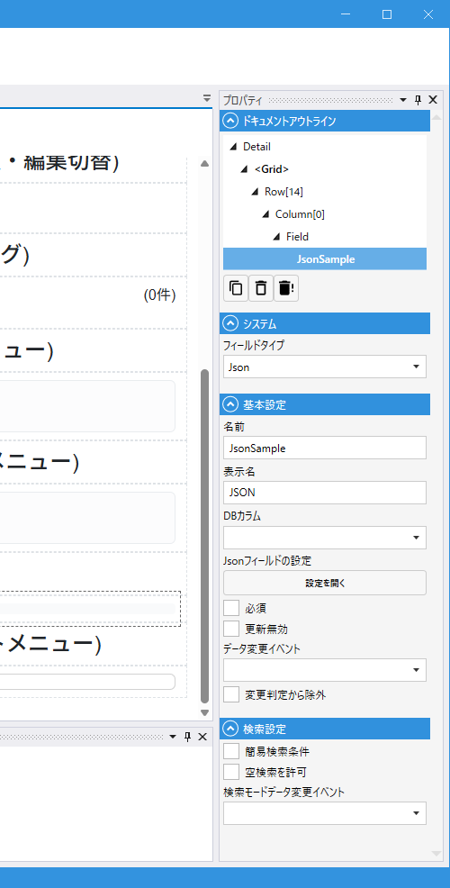

# JsonField (JSON)

## これは何か

**1 つの DB 列に、複数のキー付きの値を JSON 文字列としてまとめて保存する Field**。スキーマをあまり増やさずに可変の属性を持たせたい時に使います。

ユーザー操作の UI はこの Field 自体には持たず、設定した**子ノード（Key）ごとに個別の Field として扱える**のが特徴です。定義したキーは、通常の Field と同様にレイアウトに配置したりスクリプトから参照したりできます。

## いつ使うか

- マスタとは別に、可変属性（付帯情報）をまとめて 1 列に保存したい
- DB のスキーマ変更を避けたいが、画面側では複数のプロパティを扱いたい
- JSON 列（PostgreSQL の `jsonb`、SQL Server の `nvarchar(max)` など）と連携したい

---

## デザイナでの設定

### プロパティ一覧

#### システム

| C#名 | 日本語表示名 | 説明 |
|---|---|---|
| - | フィールドタイプ | `Json` 固定 |

#### 基本設定

| C#名 | 日本語表示名 | 型 | 既定値 | 説明 |
|---|---|---|---|---|
| **Name** | 名前 | string | `""` | フィールド識別子 |
| **DisplayName** | 表示名 | string | `""` | 画面表示用の名前 |
| **DbColumn** | DBカラム | string | `""` | JSON を保存する DB 列（JSON 文字列を格納できる型） |
| **JsonFieldSettings** | Jsonフィールドの設定 | JsonFieldSettings | - | 子ノードのキー一覧と型 |
| **IsRequired** | 必須 | bool | `false` | 入力必須 |
| **IsUpdateProtected** | 更新無効 | bool | `false` | 更新時に値を変更できないようにする |
| **OnDataChanged** | データ変更イベント | string | `""` | 値変更時のスクリプト |
| **IgnoreModification** | 変更判定から除外 | bool | `false` | 変更検知から除外 |

#### 検索設定

| C#名 | 日本語表示名 | 型 | 既定値 | 説明 |
|---|---|---|---|---|
| **IsSimpleSearchParameter** | 簡易検索条件 | bool | `false` | 簡易検索対象 |
| **AllowEmptySearch** | 空検索を許可 | bool | `false` | 空検索を許可 |
| **OnSearchDataChanged** | 検索モードデータ変更イベント | string | `""` | 検索条件変更時のスクリプト |

### JSON 設定（JsonFieldSettings）

子ノード一覧を登録します。

| プロパティ | 説明 |
|---|---|
| **Key** | JSON 内でのキー名 |
| **NodeType** | 型（`Text` / `Number` / `Boolean`） |

例: `Key = "Age"`, `NodeType = Number` を登録すると、モジュール内から数値型のサブ Field としてアクセスできます。

---

## スクリプトから

JsonField 自体の公開プロパティは `Value`（JSON 全体の文字列）です。
通常は**子ノード単位でアクセス**することが多いです。

共通プロパティは [Field 共通プロパティ](../fields/common_properties.md) を参照。

---

## 関連項目

- [Field 共通プロパティ](../fields/common_properties.md)
- [TextField](../fields/Text.md) / [NumberField](../fields/Number.md) / [BooleanField](../fields/Boolean.md) — 子ノードの型
- [QueryField](query_field.md) / [ExecuteSqlField](execute_sql_field.md) — DB 系 Field
