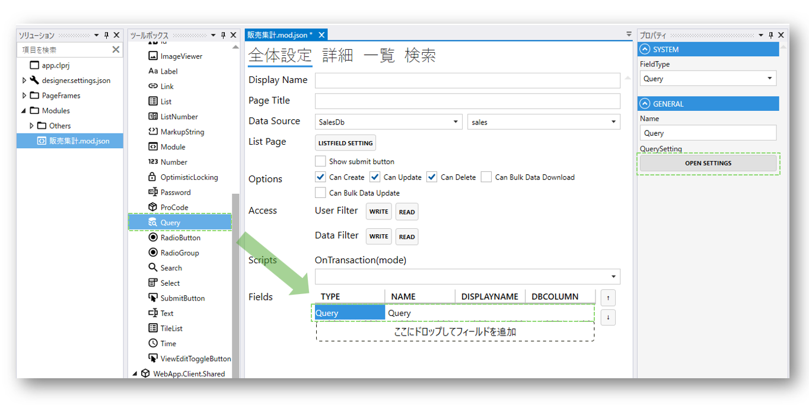
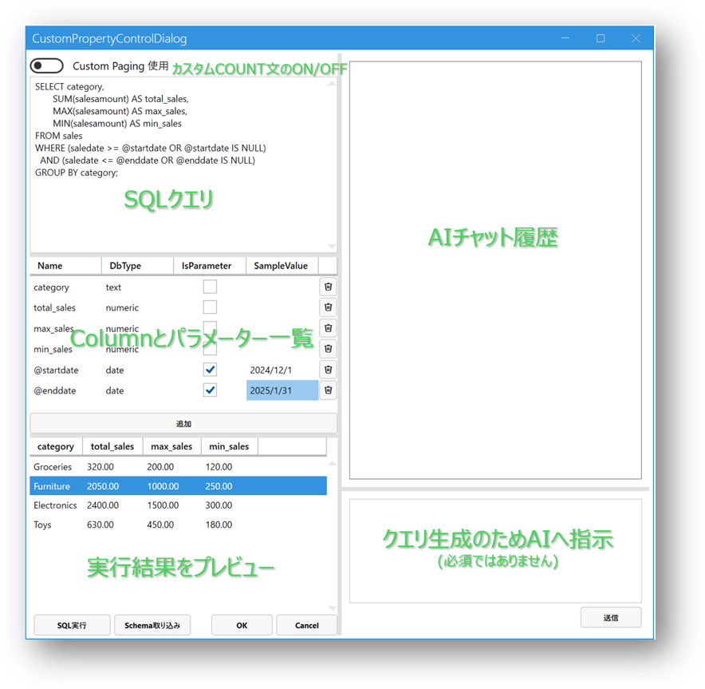
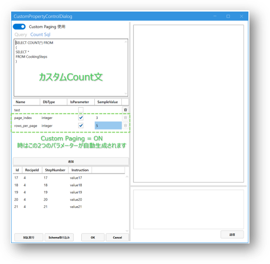
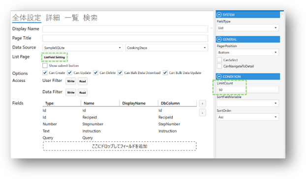
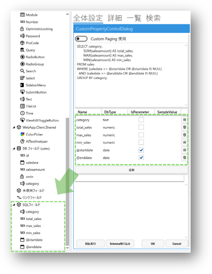
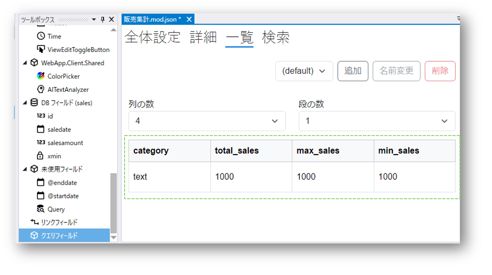
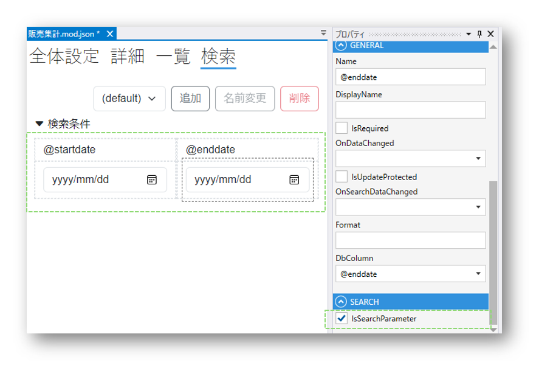
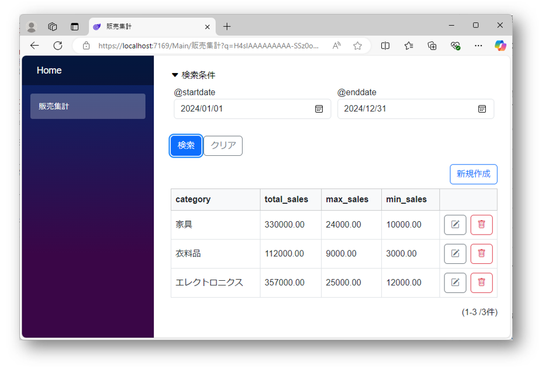

## Query Field概要
Codeer.LowCode.Blazorは、標準として提供しているデータベースとの連携機能以外に、カスタムクエリを実行し、画面にデータを表示する`Query`フィールドを搭載しています。

SQL文とカスタムフィールド・パラメーターを設定したうえで、実行結果をDesignerでプレビューしたり、Web画面に表示したりすることができます。

また、SQLはAIの補助でより効率的に作ることができます。
詳しくは[クエリをAIで作成](../ai/ai_query.md)をご参照ください。

## SQLクエリ
カスタムSQL文を使うことができます。計算列やGROUP BY等を用いて自由なクエリを作成することができます。

### Custom Paging使用
複雑なクエリの場合は、結果のCOUNT文を指定することで、Webページの表示時に正確にページングすることができます。
`Custom Paging`使用をONにし、カスタムCOUNT文を指定します。

また、1ページの行数上限は下図のようにモジュールの`ListField Setting`→`LimitCount`で設定することができます。

## Queryにより生成されたSQLフィールド
Query設定画面で定義されたColumnおよびParameterはSQLフィールドノードの下に追加されます。

これらのフィールドを`詳細`、`一覧`、`検索`画面にドラッグ&ドロップで設置したら、データを表示したり、検索条件として値を読み込んだりすることができます。

## 関連情報
- [クエリをAIで作成](../ai/ai_query.md)
- [ExecuteSqlフィールド](execute_sql_field.md)

