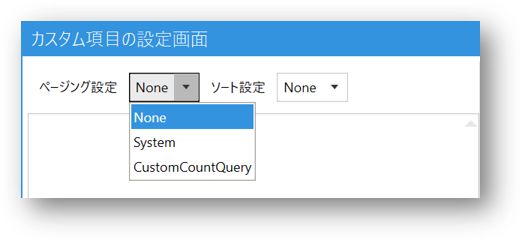
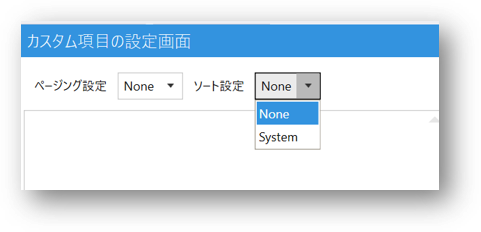

## Query Field概要
Codeer.LowCode.Blazorは、標準として提供しているデータベースとの連携機能以外に、カスタムクエリを実行し、画面にデータを表示する`Query`フィールドを提供しています。

SQL文とカスタムフィールド・パラメーターを設定したうえで、実行結果をDesignerでプレビューしたり、Web画面に表示したりすることができます。

また、SQLはAIの補助でより効率的に作ることができます。
詳しくは[クエリをAIで作成](../ai/ai_query.md)をご参照ください。

## SQLクエリ
任意のSQL文を指定します。計算列やGROUP BY等を用いて自由なクエリを作成することができます。

#### ページング設定

クエリの結果を表示する際のページング方法を指定します。

- None: 
ページングせずにすべての結果が1ページに表示されます
- System: 
システムの上限数を使います。SQL文はサブクエリとして利用できる必要があります。
システムの上限数は`PageFrame`で設定されているモジュールのプロパティで設定できます。
- CustomCountQuery:
全体数を求めるSQLを Count Sql に書いてください。1ページに表示する数とデータ取得時のページは `rows_per_page`, `offset` で渡ってくるのでそれを使って1ページ分のデータを取得できるようにしてください。
1ページに表示する上限数は`PageFrame`で設定されているモジュールのプロパティで設定できます。

#### ソート設定

クエリの結果を表示する際のソート方法を指定します。

- None:
システムのソート条件を使いません。ソートをご使用の場合はクエリで`ORDER BY`をお使いください。
- System:
システムのソート条件を使います。クエリの最後に`ORDER BY`を追加できる必要があります。
システムのソート条件は`PageFrame`で設定されているモジュールのプロパティで設定できます。

#### クエリの記述に関する注意事項
クエリの列とパラメータと連動するFieldが正常に動作するために、クエリの記述時には以下の点をご注意ください。
- `SELECT`文には`a.col`ように`.`が含まれる場合は`AS`を使って`.`がないようにしてください。
- `SELECT`文と`WHERE`文に同じ名前のカラム名の使用は避けてください。

## ColumnとParameter一覧
SQL文に使われるColumnあるいはParameterを登録します。

`Schema取り込み`ボタンをクリックすれば、現在のモジュールの`全体設定`→`Data Source`で指定されたデータテーブルのSchema情報が自動的に一覧に登録されます。

デザイナでSQL文を実行する場合は`SampleValue`も記入してください。

## デザイナでのSQL文実行
`SQL実行`ボタンをクリックすれば、SQL文をデザイナで実行することができます。
実行結果はプレビューエリアに表示されます。

**SQL文によりデザイナで接続しているデータベースへの変更がありえます。ご注意ください。**

また、1ページの行数上限は下図のようにモジュールの`ListField Setting`→`LimitCount`で設定することができます。

## Queryにより生成されたSQLフィールド
Query設定画面で定義されたColumnおよびParameterはSQLフィールドノードの下に追加されます。

これらのフィールドを`詳細`、`一覧`、`検索`画面にドラッグ&ドロップで設置したら、データを表示したり、検索条件として値を読み込んだりすることができます。

#### `IsSearchParameter`プロパティについて
Parameterを検索フィールドとして使用する場合は、`IsSearchParameter`をチェックすれば、フィールドの外観をParameter専用の「単一値」スタイルに変更することができます。

完成イメージ

## 関連情報
- [クエリをAIで作成](../ai/ai_query.md)
- [ExecuteSqlフィールド](execute_sql_field.md)

