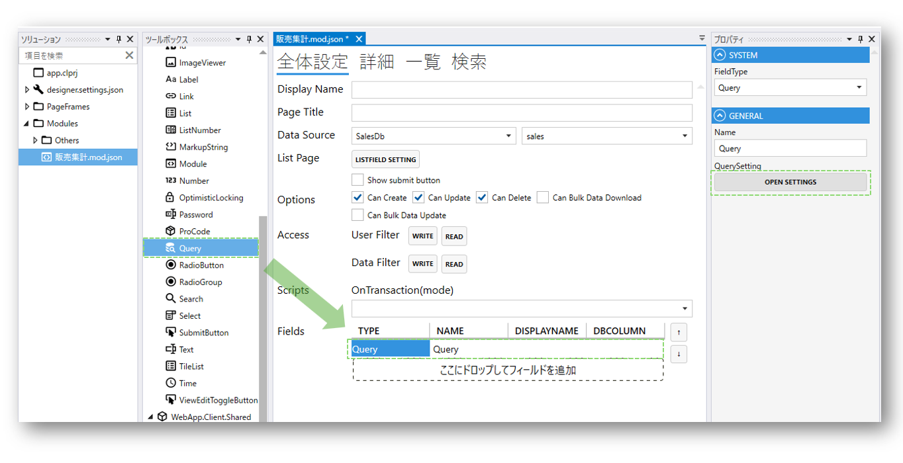
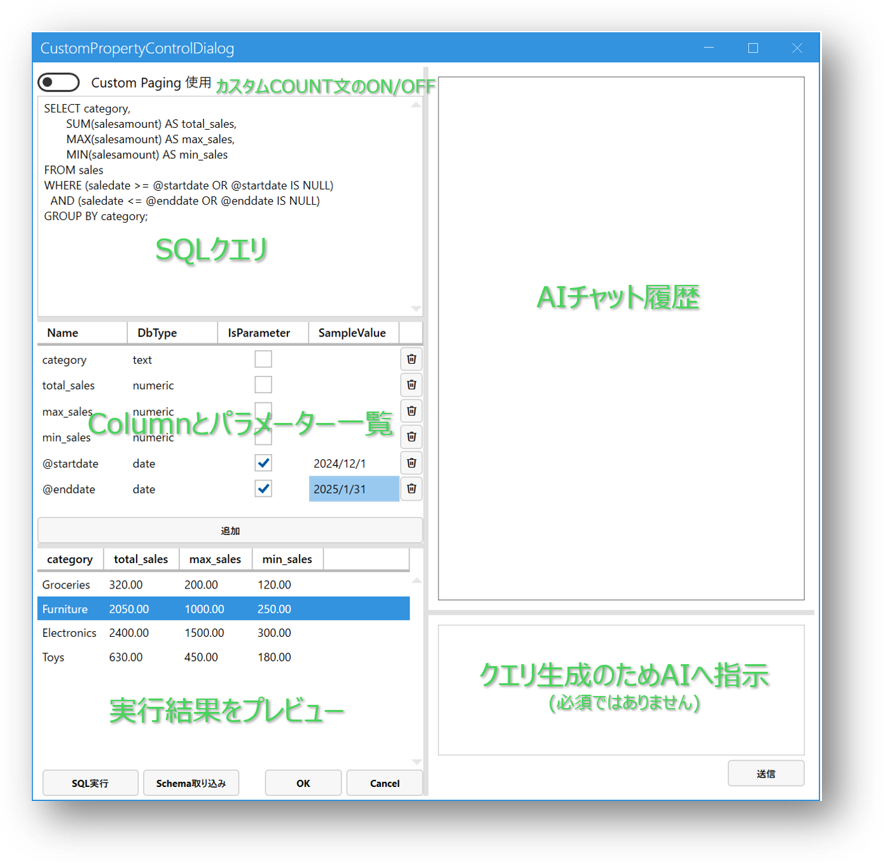
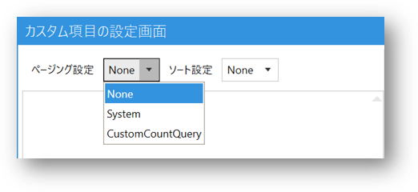
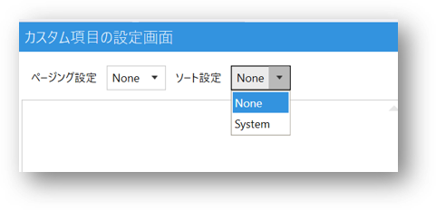
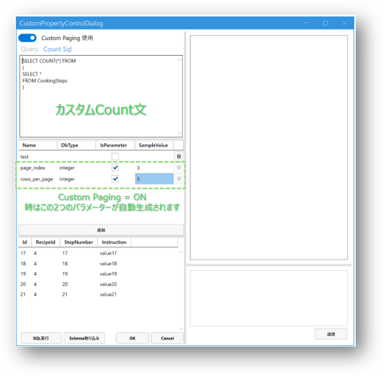
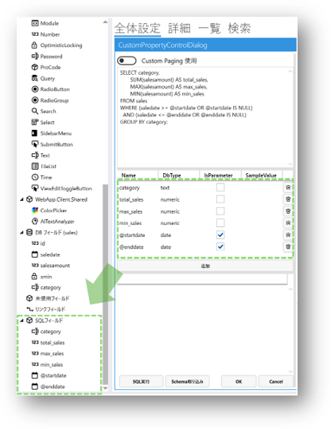
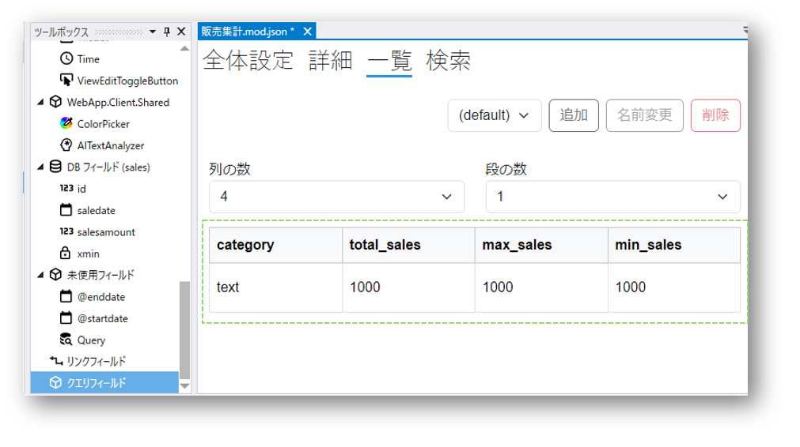
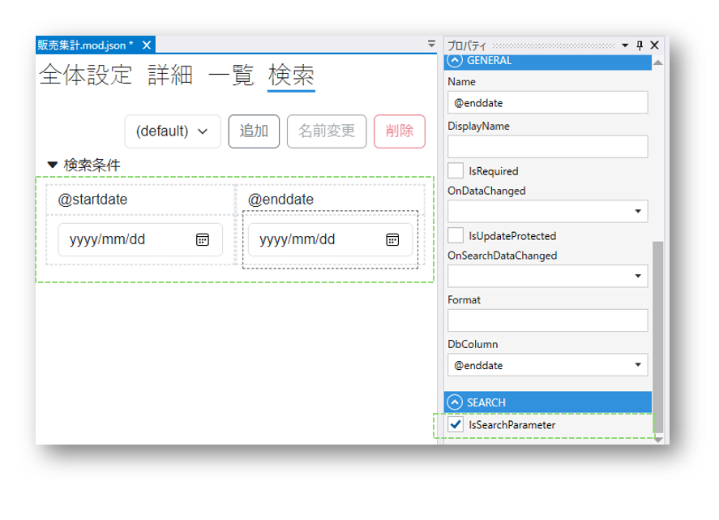
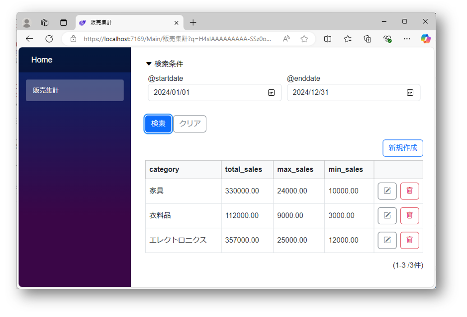
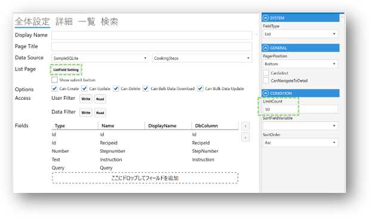

# QueryField (Query)

## これは何か

**任意の SELECT 文（または関数・ビューの参照）を実行し、その結果を画面で扱えるようにする Field**。計算列・GROUP BY・結合などを含む自由なクエリを書いて、その結果を一覧画面に表示したり、検索条件として使ったりできます。

UI は持ちません（デザイナでの設定のみ）。クエリの SELECT 列とパラメータは、モジュール内の**別 Field として自動生成**されます。

## いつ使うか

- 標準の DataSource テーブル連携では表現できない集計・結合・計算が必要な時
- ビューや関数の結果を画面に表示したい時
- 複雑な検索条件を SQL で記述したい時

> SQL の生成は [AI でクエリを作成](../ai/ai_query.md) 機能で補助できます。

---

## デザイナでの設定

### プロパティ一覧

#### システム

| C#名 | 日本語表示名 | 説明 |
|---|---|---|
| - | フィールドタイプ | `Query` 固定 |

#### 基本設定

| C#名 | 日本語表示名 | 型 | 既定値 | 説明 |
|---|---|---|---|---|
| **Name** | 名前 | string | `""` | フィールド識別子 |
| **QuerySetting** | Query設定 | QuerySetting | - | SQL・ページング・ソート・Column/Parameter の詳細（「設定を開く」から編集） |
| **IgnoreModification** | 変更判定から除外 | bool | `false` | 変更検知から除外 |

---

## Query 設定（QuerySetting ダイアログ）

### SQL クエリ

任意の SELECT 文を記述します。計算列や GROUP BY、サブクエリなどが使えます。

#### ページング設定

| 値 | 挙動 |
|---|---|
| **None** | ページングせずに全件を 1 ページに表示 |
| **System** | システム標準のページングを使う。SQL がサブクエリとして利用できる必要あり。1 ページあたりの件数は `PageFrame` で設定しているモジュールの `LimitCount` に従う |
| **CustomCountQuery** | 全体数を求める SQL を「Count Sql」に別途記述。本体 SQL では `rows_per_page` / `offset` パラメータが渡ってくるので、それを使って 1 ページ分を取得する書き方にする |

#### ソート設定

| 値 | 挙動 |
|---|---|
| **None** | システムのソート条件を使わない（SQL 側で `ORDER BY` を書く） |
| **System** | システムのソート条件を使う。SQL の末尾に `ORDER BY` を追加できる構造にしておく |

#### SQL 記述の注意点

- `SELECT` 文で `a.col` のように `.` が含まれる列名はそのまま使えない。**`AS` を使って `.` を含まない別名**にする
- `SELECT` のカラム名とパラメータ名は**重複させない**

### Column / Parameter 一覧

SQL 内で使う列とパラメータを登録します。

- **「Schema 取り込み」ボタン**: 現在のモジュールの Data Source のスキーマ情報を自動登録
- **Sample Value**: デザイナから試し実行する際の入力値

### デザイナでの SQL 実行

「SQL 実行」ボタンでデザイナから実行、プレビューエリアに結果表示。

> **注意**: 試し実行もデザイナが接続している本物の DB に対して行われます。

---

## Query が生成する「SQL フィールド」

Query 設定で定義した Column / Parameter は、モジュール内に **SQL フィールド**として自動で登録されます。ツリー上「SQL フィールド」ノードの下に並びます。

これらを通常の Field と同じように**詳細 / 一覧 / 検索レイアウトにドラッグ＆ドロップ**することで、表示・検索条件として使えます。

### IsSearchParameter プロパティ

Parameter を検索条件として使う場合、`IsSearchParameter` にチェックすると**「単一値」スタイル**の検索フィールドとして描画されます。

完成イメージ:

---

## ページ件数の上限設定

ページングの `System` / `CustomCountQuery` を使う場合、1 ページあたりの件数は `PageFrame` で設定するモジュールの **ListField Setting → LimitCount** で指定します。

---

## スクリプトから

QueryField 自体にはスクリプト公開メンバーはありません（全 `[ScriptHide]`）。
Query が生成した**個別の SQL フィールド**に対しては、通常の Field と同じようにスクリプトからアクセスできます。

---

## 関連項目

- [ExecuteSqlField](execute_sql_field.md) — 副作用ありの SQL（INSERT / UPDATE 等）を実行する
- [クエリを AI で作成](../ai/ai_query.md)
- [Field 共通プロパティ](../fields/common_properties.md)
