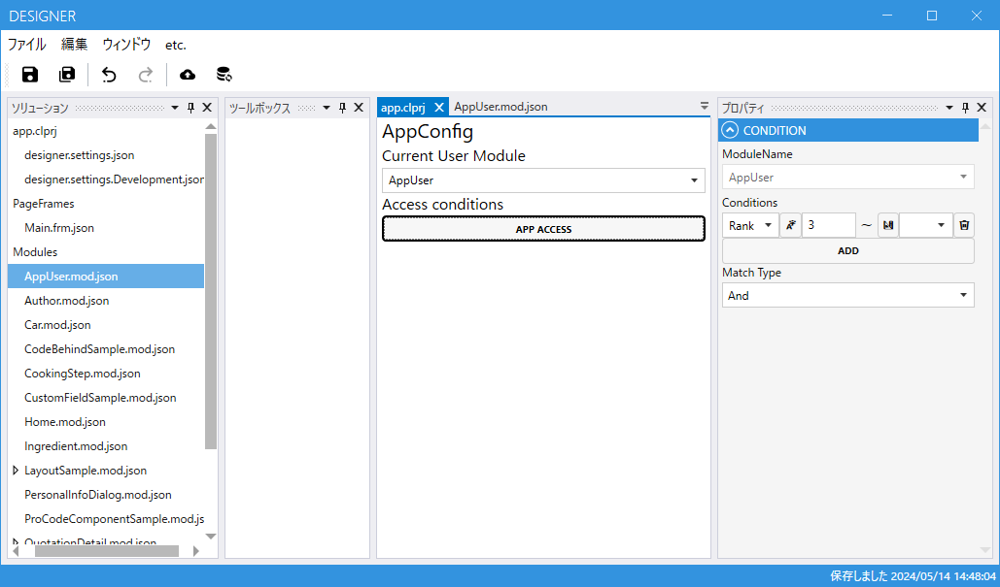

# app.clprj

アプリケーション全体の設定をします。

## Current User Module
現在ログインしているユーザーに関する情報です。
利用するには何らかの認証システムを利用して現在ログインしているユーザーを識別できるようにする必要があります。
CurrentUser に設定する Module の Id はログインユーザーの Id と一致する必要があります。
設定するとそのModuleのデータに登録されているユーザー以外はアプリにアクセスできなくなります。
スクリプトや検索条件から CurrentUser という名前で利用することができます。

## App Access
アプリ自体へのアクセス条件を設定します。
添付画像の例ではRankフィールドが3以上になっているユーザーのみがアプリにアクセスできるようになります。