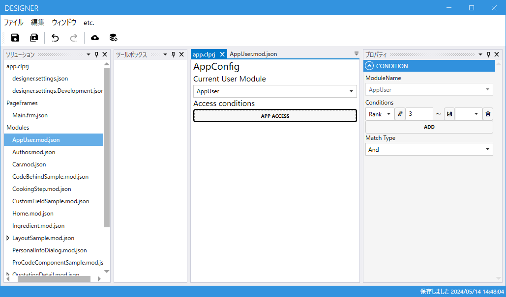

# app.clprj

**app.clprj** は、アプリケーション全体に関わる設定ファイルです。CurrentUserModule・アプリ全体のアクセス制御など、すべての画面・モジュールに関わる横断的な設定をここで行います。

---

## 主な設定項目

### CurrentUserModule

現在ログインしているユーザーを表すモジュールを指定します。

- 指定したモジュールの `Id` が、ログインユーザーの Id と一致する必要があります
- スクリプトや検索条件から `CurrentUser` という名前で参照できます
- このモジュールのデータに存在しないユーザーは、**アプリのどこにもアクセスできません**

> CurrentUserModule の設定は認証機能を前提としています。Cookie 認証・Azure Entra ID 認証はテンプレートで標準提供されており、それ以外の認証はユーザーコードで実装できます。詳しくは [認証・認可](../authorization/authorization.md) 参照。

### App Access

**アプリ全体**のアクセス条件を設定します。

CurrentUserModule に存在するユーザーのうち、ここで指定した条件を**満たすユーザーだけ**がアプリを開けます。

**例**: `CurrentUser.Rank.Value >= 3` → Rank が 3 以上のユーザーのみアクセス可能

これは**最も粗い粒度のアクセス制御**です。より細かい制御は [PageFrame](page_frame.md) や [Module](../module/module.md) の権限設定で行います。

---

## 認可の階層

アクセス制御はこの順で適用されます:

1. **app.clprj の App Access** — アプリ自体への入退場
2. **PageFrame** — 画面グループの表示可否
3. **Module の UserRead / UserWrite** — モジュール単位のアクセス
4. **Module の DataRead / DataWrite** — データ行単位のアクセス

詳しくは [認証・認可](../authorization/authorization.md) / [チュートリアル: 認証を有効にする](../tutorials/tutorial_auth.md)

---

## 関連項目

- [PageFrame](page_frame.md)
- [Module 全体設定](../module/module_general.md)
- [認証・認可](../authorization/authorization.md)
- [チュートリアル: 認証を有効にする](../tutorials/tutorial_auth.md)
