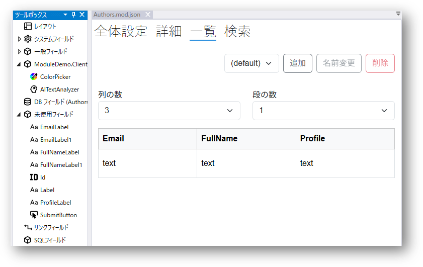

# Moduleの基本的な作成方法とDBへの接続
[動画: Moduleの基本的な作成方法とDBへの接続](https://youtu.be/q7U9tQPOYXI?si=QreIPnTPalT2e1k5)も併せてご覧ください。

## Moduleとは
Moduleの基本情報については、[モジュール](../module/module.md)ページをご参照ください。

## Moduleの基本的な作成方法

### モジュールを追加します
デザイナの`Module`フォルダの上で右クリックして、`モジュール追加`をクリックします。

モジュール名を入力してモジュールを作成します。

### Data Sourceを指定します
作成されたモジュールをダブルクリックで開き、`全体設定`画面でData Sourceを設定します。

> Data Sourceは事前にDesigner及びVisual Studioで定義する必要があります。
詳しくは[Designer.Settings](./designer_settings.md)ページ、または動画ガイド[DB設定の追加方法](https://youtu.be/9NhVhUG57Wk?si=MZC6qBU_I8NOufqd)をご参照ください。

> Data Sourceのテーブル一覧が表示されない場合は、ツールバーのボタンを押してData Source情報を更新してみてください。

### DBフィールドをモジュールに追加します
Data Sourceへの接続が設定されますと、`ツールボックス`に`DBフィールド`リストが出現します。
モジュールに使う予定のフィールドをドラッグ・ドロップでモジュールの`全体設定`の`Fields`リストに追加します。

> 注意：DBのデータを追加・更新・削除するのに、一意性をもつ**システムフィールド**の`Idフィールド`がモジュールに存在する必要があります。**システムフィールド**の`Idフィールド`は、Nameの変更はできません。

> Idは`システムフィールド`と`一般フィールド`の2種類があるため、データの追加と更新は必ず`システムフィールド`のIdが必要となります。
また、IdはDB自動生成のタイプと、ユーザ入力のタイプ(例えば見積番号)、複合タイプ(例えば姓+名)があります。これらはIdフィールドのプロパティで設定できます。

> システムフィールドについては[Field](../fields/field.md)をご参照ください。

###  一覧画面を設定します
一覧画面はモジュールのデータ一覧を表示する画面です。
画面イメージは後述のWebアプリ画面をご覧ください。

一覧画面で段と列の数を設定したうえで、`ツールボックス`の`未使用フィールド`からDBフィールドをドラッグ・ドロップで一覧画面に追加します。

### 詳細画面を設定します
詳細画面はデータテーブルの行を追加・編集する際の画面に当たります。
画面イメージは後述のWebアプリ画面をご覧ください。

詳細画面で[レイアウト](../module/layout.md)を設定したうえで、DBフィールドやラベル等のフィールドを配置します。レイアウトについては[動画ガイド](../movies.md)もありますので、ご参照ください。

### 検索画面を設定します
検索画面で検索条件を設定しますと、一覧画面の上部に検索ボックスが出現します。

検索条件となるフィールドをドラッグ・ドロップで追加します。

複数個の検索条件で検索することができます。その場合は`Or`/`And`の事前指定あるいは検索時にユーザ指定を設定できます。

## 作成されたモジュールをPageFrameに登録します
作成されたモジュールは[PageFrame](../designer/page_frame.md)に登録することで、Webアプリのサイドバー等にリンクが表示されます。

## デプロイしてWebアプリで確認します
ボタンでデザインデータをサーバー側にデプロイします。

上記の例で作成されたモジュールは以下のように表示されます。

## 関連情報
- [動画: Moduleの基本的な作成方法とDBへの接続](https://youtu.be/q7U9tQPOYXI?si=QreIPnTPalT2e1k5)
- [モジュール](../module/module.md)
- [Field](../fields/field.md)
- [Id Field](../fields/Id.md)
- [レイアウト](../module/layout.md)
- [動画ガイド一覧](../movies.md)