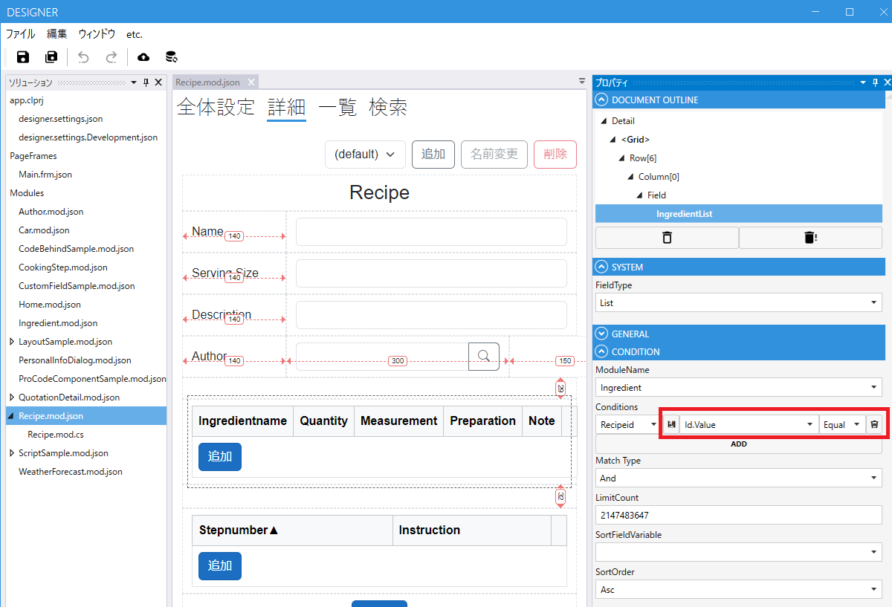

# デザイナ

Codeer.LowCode.Blazorのデザイナは、ローコード実行エンジンで動作する画面や機能を作成するためのツールです。作成するデータはjsonファイルとcsファイルなので、gitなどのバージョン管理ツールで管理することが可能です。

## 編集可能な要素

以下の要素を編集できます
- [Module](../module/module.md)
- [PageFrame](page_frame.md)
- [designer.settings](designer_settings.md)
- [app.clprj](app_clprj.md)

## デザイナのカスタマイズ

デザイナもCodeer.LowCode.Blazor.Desingerを参照するWPFアプリで、ProCodeでカスタマイズ可能です。詳細は以下のリンクを参照してください。
- [デザイナのカスタマイズ](designer-customize.md)

## デザイナ上の検索コンポーネントの実装

デザイナでListField、LinkField、SelectFieldの検索条件を設定可能なフィールドであればGUI上で条件を設定できます。ProCodeでカスタムのFieldを作った場合、そのFieldの持つ値を条件に設定可能にするには、以下の手順を実装する必要があります。
- [検索コンポーネントの実装](designer-match-customize.md)

