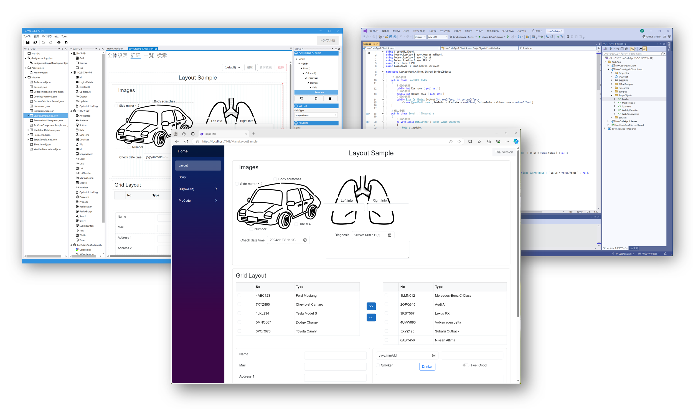
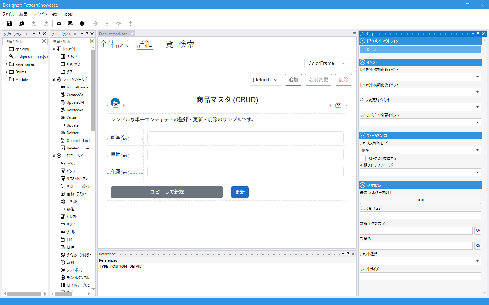

# デザイナ

Codeer.LowCode.Blazor の**デザイナ**は、ローコード実行エンジンで動かす画面や機能を作成するための**ビジュアルエディタ**です。WPF アプリケーションとして配布され、内部に Blazor WebView を持つハイブリッド構成です。

## 保存形式

作成したデータは以下で保存されます:

- **JSON ファイル** — Module・PageFrame などの設定
- **C# スクリプトファイル** — 各 Module のイベントハンドラ・メソッド
- **C# プロジェクトファイル** — app.clprj

すべてテキストベースなので、**Git 等でバージョン管理可能**です。
複数人でのブランチ運用・差分レビュー・自動化も通常のソースコードと同じように行えます。

---

## デザイナで編集できる要素

| 要素 | 用途 | リファレンス |
|---|---|---|
| **Module** | 画面・データ・スクリプトの単位 | [Module](../module/module.md) |
| **PageFrame** | アプリの外枠（ヘッダ／サイドバー／コンテンツ領域） | [PageFrame](page_frame.md) |
| **app.clprj** | アプリ全体の設定（CurrentUserModule など） | [app.clprj](app_clprj.md) |
| **designer.settings** | DataSource・デプロイ先・接続情報 | [designer.settings](designer_settings.md) |

---

## デザイナを起動する

1. Visual Studio テンプレートから作成したプロジェクトをビルド
2. `.Designer` プロジェクトを **Release 構成で発行**
3. 発行された exe を Windows Explorer から起動

> **重要**: Debug 構成で起動すると正常に動作しない場合があります。必ず Release 構成で起動してください。

---

## 基本的な画面構成

- **メインエリア** — Module / PageFrame / app.clprj の編集タブ
- **ツールボックス** — 配置可能な Field のリスト
- **Document Outline パネル** — 階層構造の表示と選択（詳しくは [Document Outline](../module/DocumentOutline.md)）
- **プロパティパネル** — 選択要素のプロパティ編集

---

## デザイナのカスタマイズ

デザイナ自体も Codeer.LowCode.Blazor.Designer を参照する WPF アプリなので、プロコードで拡張できます。

- [デザイナのカスタマイズ](designer-customize.md) — メニュー・パネル追加等
- [検索コンポーネントのカスタマイズ](designer-match-customize.md) — カスタム Field を ListField などの検索条件で使えるようにする

---

## 変更の反映（デプロイ）

ツールバーのボタンで、デザイナの設定を Web アプリに送信できます。
Web アプリ起動中は**ホットリロード**で即時反映されます。

デプロイ先の設定は [designer.settings](designer_settings.md) の `DeployInfo` で管理します。
`FileSystem`（ローカル）と `FTPS`（リモート）に対応しています。

---

## デザインチェック

メニューの **etc. > デザインチェック** で、デザイン全体（Module・スクリプト・PageFrame・app.clprj など）の設定の誤りを検査できます。デプロイ時にも自動で実行され、指摘がある場合はデプロイを続けるか確認されます。

指摘は**出力**ペインに一覧表示されます。行をダブルクリックすると該当箇所を開きます。**Code** 列の指摘コードは `クラス名:番号` の形式（例: `GridLayoutDesign:1`）で、指摘の種類を表します。

### 指摘の抑止

意図して設定している箇所など、対応不要と判断した指摘は抑止できます。抑止した指摘はデザインチェックの結果（デプロイ時の確認を含む）に出なくなります。

- 出力ペインで指摘を選択し、右クリックメニューの **この指摘を抑止** を選ぶ
- 抑止を戻すときは、ツールバーの **抑止済みを表示** をオンにして抑止済みの指摘（灰色で表示）を表示し、右クリックメニューの **抑止を解除** を選ぶ

抑止は「指摘された定義 × 指摘コード」の単位で、デザインファイルに保存されます（Git で管理・レビューできます）。

| 指摘の対象 | 抑止の範囲 |
|---|---|
| Field / Module / レイアウト（詳細・一覧・検索） / PageFrame / app.clprj / enum | その定義に対する、同じ指摘コードの指摘すべて。PageFrame への指摘のうちモジュールごとに出るものは、そのモジュールの分だけ |
| スクリプト | 指摘された**行**だけ。その行の末尾（または直前の行）に `// suppress: 指摘コード` というコメントが書き込まれる。コメントを手で書いても同じ効果があり、カンマ区切りで複数のコードを書ける |

- 指摘コードを持たない指摘（ファイルの読み込み失敗など）は抑止できません
- 差分プロジェクトでは、基本プロジェクト側にしかない定義への指摘は抑止できません

---

## 関連項目

- [Module](../module/module.md)
- [PageFrame](page_frame.md)
- [app.clprj](app_clprj.md)
- [designer.settings](designer_settings.md)
- [Document Outline と Property パネル](../module/DocumentOutline.md)
- [Visual Studio ソリューション構成](../overview/vs_projects.md)
