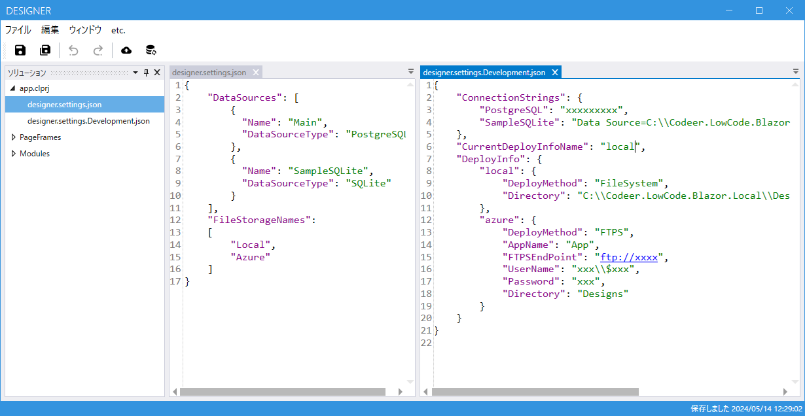

# designer.settings

このドキュメントでは、`DesignerSettings` クラスの設定を `designer.settings.json` および `designer.settings.Develop.json` ファイルで管理する方法について説明します。設定はどちらのファイルに書いてもよく、最終的には両方のファイルの内容がマージされます。


## クラス構造

### DesignerSettings クラス

`DesignerSettings` クラスは、アプリケーションの設定を管理します。

- `CurrentDeployInfoName`: デザイナでデプロイを実行したときに使われるデプロイ情報の名前。DeployInfoのキーのいずれかを指定する
- `ConnectionStrings`: 接続文字列。DataSourceのいずれかのNameをキーに指定する
- `DeployInfo`: デプロイ情報
- `DataSources`: データソース
- `FileStorageNames`: ファイルストレージ名

```csharp
public class DesignerSettings
{
    public string CurrentDeployInfoName { get; set; } = string.Empty;
    public Dictionary<string, string> ConnectionStrings { get; set; } = new();
    public Dictionary<string, DeployInfo> DeployInfo { get; set; } = new();
    public DataSource[] DataSources { get; set; } = [];
    public string[] FileStorageNames { get; set; } = [];
}
```

### DeployInfo クラス

`DeployInfo` クラスは、デプロイに関する情報を管理します。

- `DeployMethod`: デプロイ方法のタイプ（FileSystem/FTPS）
- `Directory`: デプロイ先のディレクトリ(FileSystem時に利用)
- `FTPSEndPoint`: FTPSのエンドポイント（FTPS時に利用）
- `UserName`: ユーザー名（FTPS時に利用）
- `Password`: パスワード（FTPS時に利用）

```csharp
public class DeployInfo
{
    public DeployMethodType DeployMethod { get; set; }
    public string AppName { get; set; } = string.Empty;
    public string Directory { get; set; } = string.Empty;
    public string FTPSEndPoint { get; set; } = string.Empty;
    public string UserName { get; set; } = string.Empty;
    public string Password { get; set; } = string.Empty;
}
```

### DataSource クラス

`DataSource` クラスは、データソースに関する情報を管理します。

- `Name`: 名前
- `DataSourceType`: データソースのタイプ（SQLServer/PostgreSQL/Oracle/SQLite）
- `ConnectionString`: 接続文字列

```csharp
public class DataSource
{
    public string Name { get; set; } = string.Empty;
    public DataSourceType DataSourceType { get; set; }
    public string ConnectionString { get; set; } = string.Empty;
}
```

## JSON ファイルの例

### designer.settings.json

```json
{
    "DataSources": [
        {
          "Name": "Main",
          "DataSourceType": "PostgreSQL"
        },
        {
          "Name": "SampleSQLite",
          "DataSourceType": "SQLite"
        }
    ],
    "FileStorageNames": 
    [
        "Local",
        "Azure"
    ]
}
```

### designer.settings.Develop.json

```json
{
    "ConnectionStrings": {
        "PostgreSQL": "xxx",
        "SampleSQLite": "Data Source=C:\\Codeer.LowCode.Blazor.Local\\Data\\sqlite_sample.db;Version=3;"
    },
    "CurrentDeployInfoName": "local",
    "DeployInfo": {
        "local": {
            "DeployMethod": "FileSystem",
            "Directory": "C:\\Codeer.LowCode.Blazor.Local\\Designs"
        },
        "azure": {
            "DeployMethod": "FTPS",
            "AppName": "App",
            "FTPSEndPoint": "ftps://xxx",
            "UserName": "xxx\\$xxx",
            "Password": "Exxx",
            "Directory": "Designs"
        }
    }
}
```

## 設定のマージ

`designer.settings.json` と `designer.settings.Develop.json` は、アプリケーションの起動時に読み込まれ、最終的に設定がマージされます。これにより、開発環境と本番環境の設定を分けて管理し、必要に応じて切り替えることができます。

## 動画ガイド
[DB設定の追加方法](https://youtu.be/9NhVhUG57Wk?si=MZC6qBU_I8NOufqd)