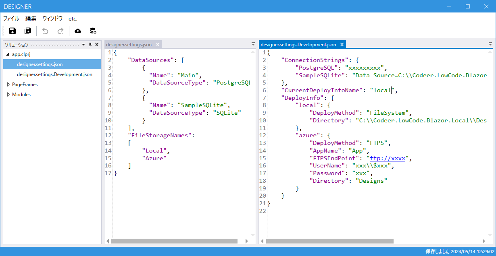

# designer.settings

デザイナの動作に関する設定を管理するファイルです。DB 接続情報やデプロイ先など、プロジェクト固有かつマシン依存の可能性がある設定をまとめます。



## 2 つのファイルに分けて管理

| ファイル | 用途 | Git 管理 |
|---|---|---|
| **designer.settings.json** | チームで共有する設定（DataSource 名など） | **する** |
| **designer.settings.Development.json** | マシン固有・機密情報（接続文字列・パスワード） | **しない**（.gitignore 推奨） |

両方のファイルは起動時に読み込まれ**マージ**されます。機密情報を `Development.json` に逃がすことで、設定構造だけをリポジトリで共有できます。

---

## 設定項目

### DesignerSettings 全体

```csharp
public class DesignerSettings
{
    public string CurrentDeployInfoName { get; set; } = string.Empty;
    public Dictionary<string, string> ConnectionStrings { get; set; } = new();
    public Dictionary<string, DeployInfo> DeployInfo { get; set; } = new();
    public DataSource[] DataSources { get; set; } = [];
    public string[] FileStorageNames { get; set; } = [];
}
```

| 項目 | 内容 |
|---|---|
| **CurrentDeployInfoName** | 現在有効なデプロイ先の名前（`DeployInfo` のキー） |
| **ConnectionStrings** | DB 接続文字列（`DataSource.Name` をキーに） |
| **DeployInfo** | デプロイ先の一覧 |
| **DataSources** | DB データソースの一覧 |
| **FileStorageNames** | ファイルストレージ名の一覧 |

### DeployInfo

```csharp
public class DeployInfo
{
    public DeployMethodType DeployMethod { get; set; }
    public string AppName { get; set; } = string.Empty;
    public string Directory { get; set; } = string.Empty;
    public string FTPSEndPoint { get; set; } = string.Empty;
    public string UserName { get; set; } = string.Empty;
    public string Password { get; set; } = string.Empty;
}
```

| プロパティ | 内容 |
|---|---|
| **DeployMethod** | `FileSystem` / `FTPS` |
| **Directory** | 保存先ディレクトリ（FileSystem 時） |
| **FTPSEndPoint** | FTPS エンドポイント（FTPS 時） |
| **UserName** / **Password** | FTPS 認証情報 |

### DataSource

```csharp
public class DataSource
{
    public string Name { get; set; } = string.Empty;
    public DataSourceType DataSourceType { get; set; }
    public string ConnectionString { get; set; } = string.Empty;
}
```

| プロパティ | 内容 |
|---|---|
| **Name** | 参照用の名前 |
| **DataSourceType** | `SQLServer` / `PostgreSQL` / `Oracle` / `MySQL` / `SQLite` |
| **ConnectionString** | 接続文字列（`ConnectionStrings` で別出しにすることが多い） |

---

## ファイル例

### designer.settings.json（共有・Git 管理）

```json
{
    "DataSources": [
        {
          "Name": "Main",
          "DataSourceType": "PostgreSQL"
        },
        {
          "Name": "SampleSQLite",
          "DataSourceType": "SQLite"
        }
    ],
    "FileStorageNames": [
        "Local",
        "Azure"
    ]
}
```

### designer.settings.Development.json（個人・Git 管理外）

```json
{
    "ConnectionStrings": {
        "Main": "Host=localhost;Database=sample;Username=xxx;Password=xxx",
        "SampleSQLite": "Data Source=C:\\Data\\sqlite_sample.db;Version=3;"
    },
    "CurrentDeployInfoName": "local",
    "DeployInfo": {
        "local": {
            "DeployMethod": "FileSystem",
            "Directory": "C:\\Codeer.LowCode.Blazor.Local\\Designs"
        }
    }
}
```

> **重要**: 接続文字列・パスワードなどの機密情報は `designer.settings.Development.json` 側に書き、`.gitignore` で Git 管理外にしてください。

---

## 動画ガイド

- [DB 設定の追加方法](https://youtu.be/9NhVhUG57Wk?si=MZC6qBU_I8NOufqd)

---

## 関連項目

- [デザイナ概要](designer.md)
- [デプロイフォルダ](../overview/deploy_folder.md)
- [Visual Studio ソリューション構成](../overview/vs_projects.md)
