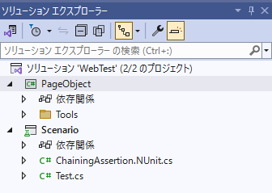
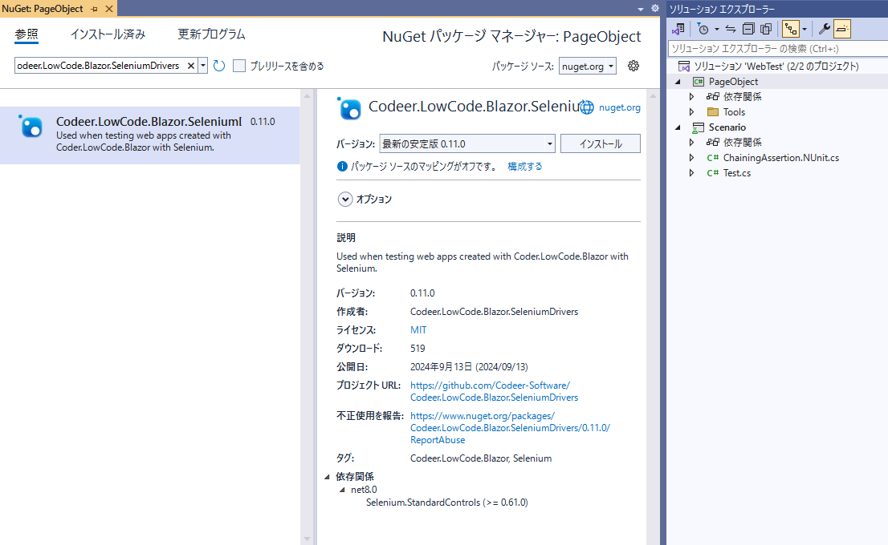
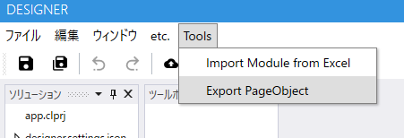
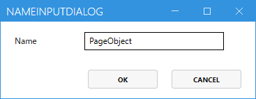
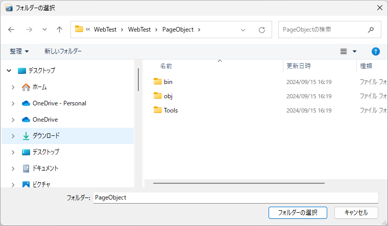
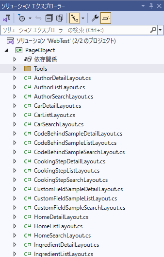
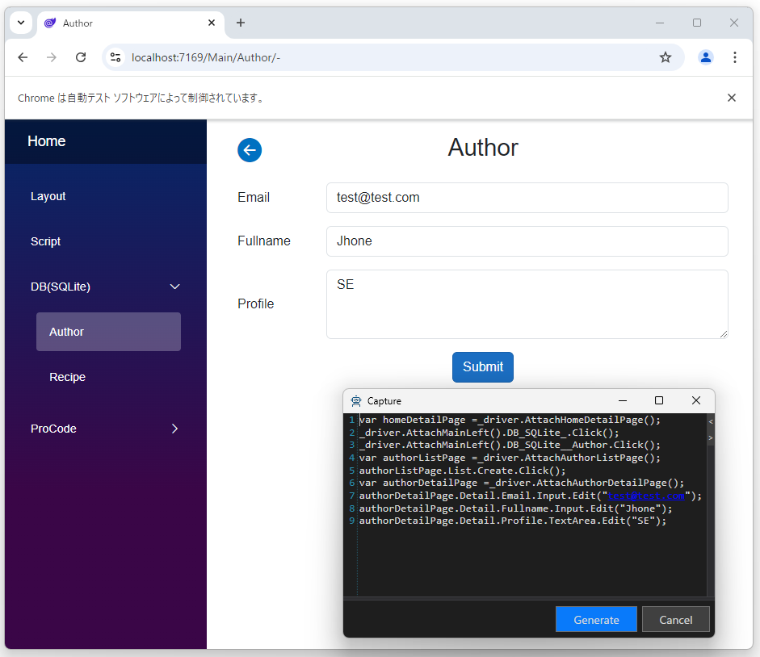

# Export PageObject

現在開いているプロジェクトをSeleniumでテストするためのPageObjectを生成します。
TestAssistantProと合わせて利用することでより簡単に自動テストを作成できます。
ソースコードは [Codeer.LowCode.Blazor.Templates](https://marketplace.visualstudio.com/items?itemName=Codeer.LowCodeBlazor) から出力したソリューションに含まれていてコードを書き換えることでカスタマイズできます。ソースコード生成時の仕様を記載します。

※ Common Fields 以外に独自に作成したFieldを利用する場合はそのFieldに対応したDriverを作成する必要があります。

## 1.Selniumでテストを実施するためのプロジェクトを作成する
TestAssistantProで新規作成するのが簡単です。 

## 2.Codeer.LowCode.Blazor.SeleniumDriversをインストールする
https://www.nuget.org/packages/Codeer.LowCode.Blazor.SeleniumDrivers

## 3.メニューを実行

## 4.ネームスペースを入れる

## 5.ページオブジェクトを生成するフォルダを指定

## 6.[Test Assistant Pro](https://www.codeer.co.jp/TestAssistantPro) を使う場合はキャプチャでテストコードを生成できます。

