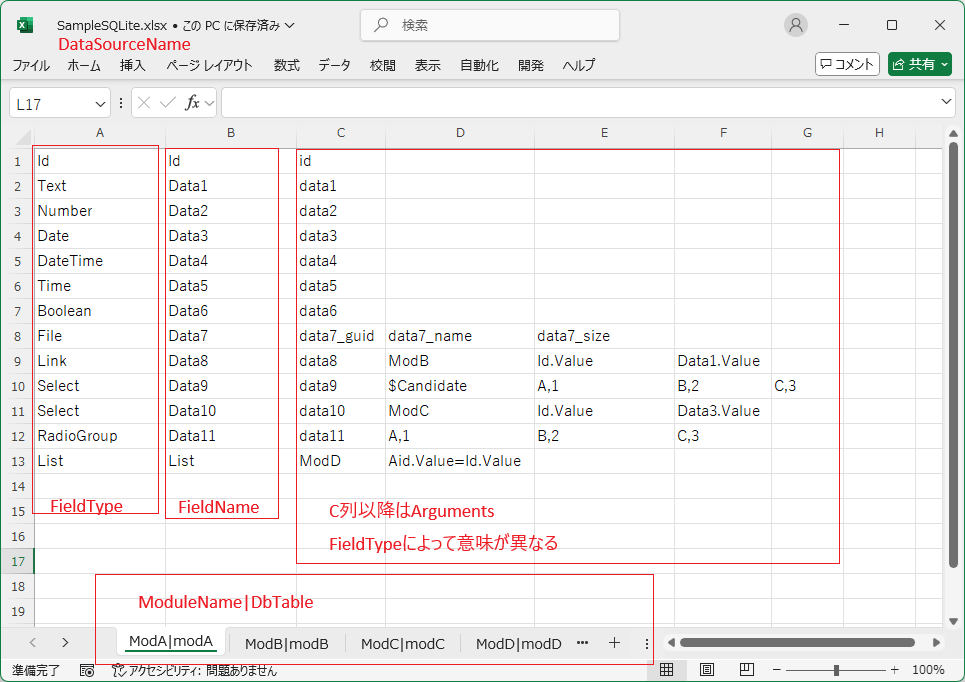
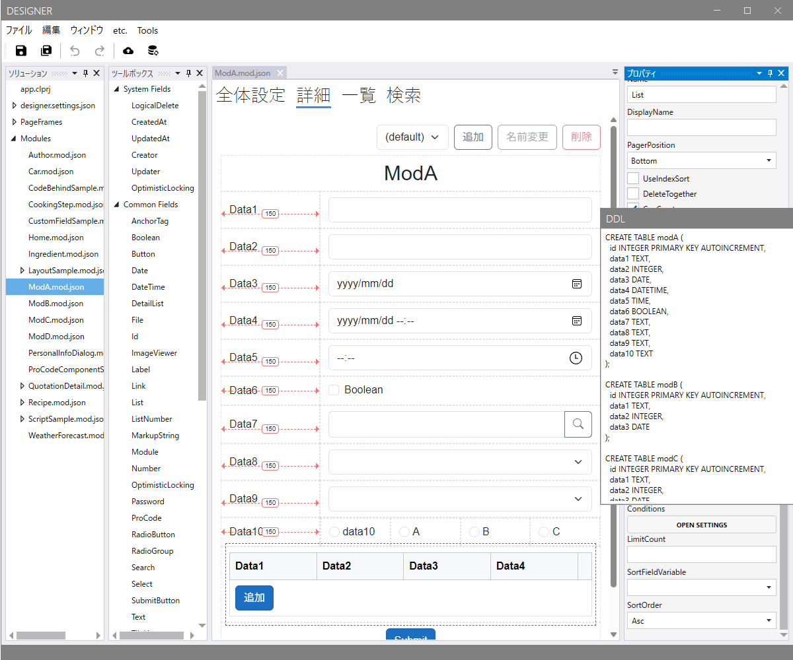

# Import Module from Excel

Excelから画面とDDLを作成します。
ソースコードは [Codeer.LowCode.Blazor.Templates](https://marketplace.visualstudio.com/items?itemName=Codeer.LowCodeBlazor) から出力したソリューションに含まれていてコードを書き換えることでカスタマイズできます。ソースコード生成時の仕様を記載します。

|||
|-----|-----|
|DataSourceName.xlsx|ファイル名はデータソース名を表します|
|ModuleName|DbTable|シート名はモジュール名とDBのテーブル名を表します|
|A列|Fieldのタイプ|
|B列|Fieldの名前|

### Arguments
| FieldType       | 引数1 | 引数2 | 引数3 | 引数4 |
|-----------------|-------|-----|------|-------|
| Text | DbColumn |  |  |  | 
| Number | DbColumn |  |  |  | 
| Date | DbColumn |  |  |  | 
| DateTime | DbColumn |  |  |  | 
| Boolean | DbColumn |  |  |  | 
| File | DbColumnGuid | DbColumnFileName | DbColumnFileSize |  | 
| Link | DbColumn | Module名 | ValueVariable | DisplayTextVariable | 
| Select | DbColumn | Module名 | ValueVariable | DisplayTextVariable | 
| Select | DbColumn | $Candidate | 表示名,値 | ...候補分続く | 
| RadioGroup | DbColumn | 表示名,値 | 表示名,値 | ...候補分続く | 
| List | Module名 | ListのModuleのVariable=自ModuleのVariable |  |  |

