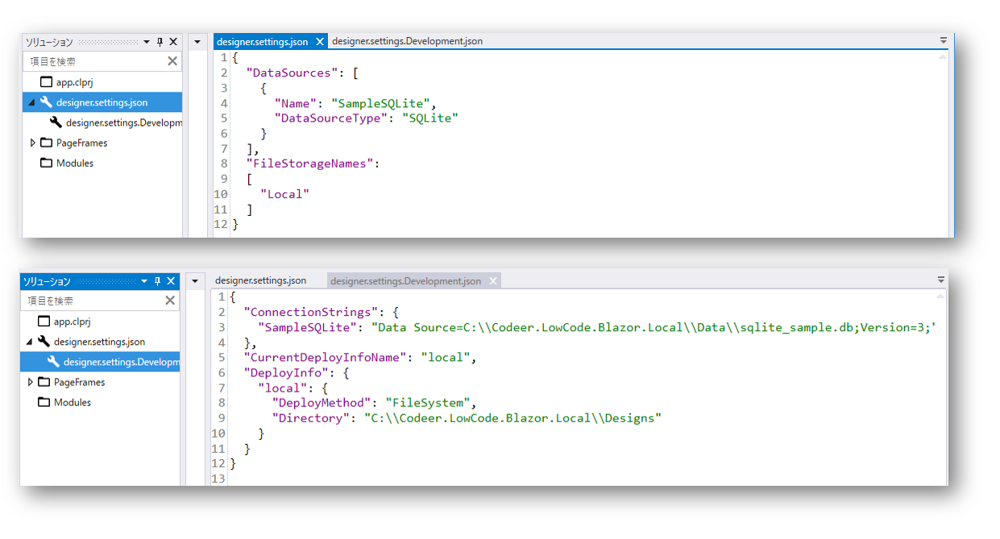
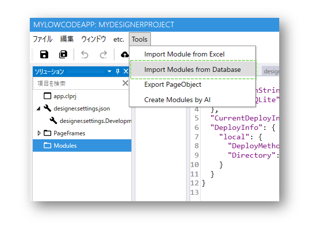
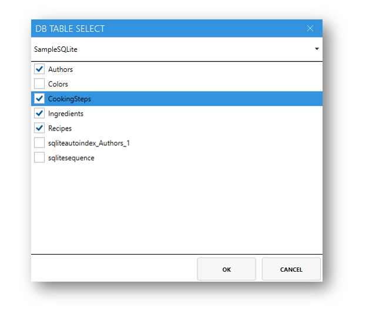
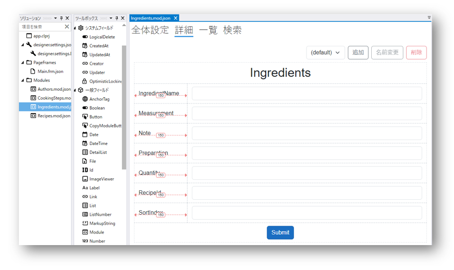

# Databaseからモジュールを作成する

## 使用シーン
すでに既存のデータベースをお持ちで、速やかにCodeer.LowCode.Blazorアプリと連携して使用したい場合は、「Databaseからモジュールを作成」機能をご利用ください。

## 操作方法
### 本チュートリアルは以下のデータベースが存在し、[DesignerSettings](../designer/designer_settings.md)ファイルでDataSources情報が設定完了していることを前提とします。

### Step 1. デザイナの「Tools」メニューを開き、「Import Modules from Database」をクリックします

### Step 2. 出てくる「DB TABLE SELECT」ウィンドウでインポートしたいテーブルを選択して、OKを押します

### Step 3. 選択されたテーブルをベースにモジュールが自動的に作成されます

### Step 4. 自動作成されたモジュールにカスタマイズを加えることでニーズに合うモジュールに仕上げます

## 関連ページ
- [DesignerSettings](../designer/designer_settings.md)
- [Module](module/module.md)