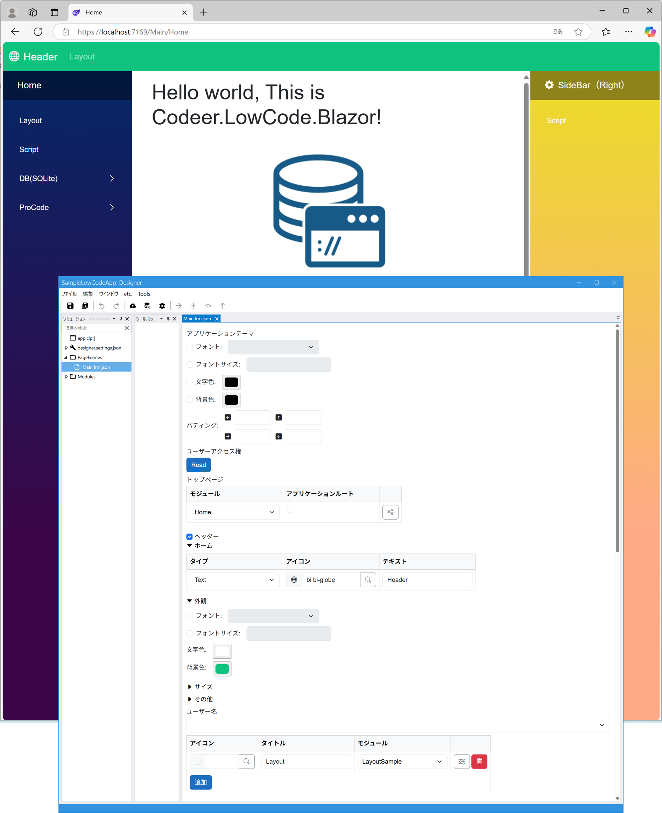

# PageFrame
アプリの外枠の部分です。
またそのPageFrame内で表示可能なModuleを設定します。
表示可能なModuleはTopPage, ヘッダ、サイドバー(Left, Right)に指定されたModuleその他表示可能で指定されたModuleです。

## TopPage
PageFrameは複数作ることができますが、ルートのURLを入力したときにTopPageにモジュールが指定されているPageFrameが選択され、TopPageを表示します。

## Header, SideBar(Left, Right)
### Home
Home(最初の図の例では左のサイドバーの上部に表示されているもの)に表示する内容を決めます。
| フィールド      | 説明                                            |
|------------|-----------------------------------------------|
| Type       | None, Text, Imageから選択する                                 |
| Icon      | アイコン。TypeがTextの場合に使用する       |
| Text      | Text。TypeがTextの場合に使用する       |
| Resource Path     | イメージのResouceフォルダからの相対パス。TypeがImageの場合に使用する                                           |

### Colors
色を決めます。サイドバーはグラデーション表示可能です。

### 表示モジュール
| フィールド      | 説明                                            |
|------------|-----------------------------------------------|
| Icon       | メニューのアイコンを設定                                  |
| Title      | メニューのタイトルを設定`/` で区切ることでメニューを階層にできる       |
| Module     | [Module](../module/module.md) を指定、別のPageFraqmeに移る場合はPageFrame/Moduleのように `/` で区切ることで指定できる                       |

## Other Pages
SideBar、Headerで指定していないモジュールをページとして表示する場合にここに列挙します。SideBar、Header、Other Pages に指定しているもの以外はPageFrame内では表示できません。

## カスタムレイアウト

標準のレイアウトを使わずに、カスタムサイドバーを実装する場合は `MainLayoutCore` 相当のコンポーネントを実装し `MainLayout.razor` 内を置き換えることで実現できます。

詳しくは`Sample/CustomLayoutSample` を参照してください。
