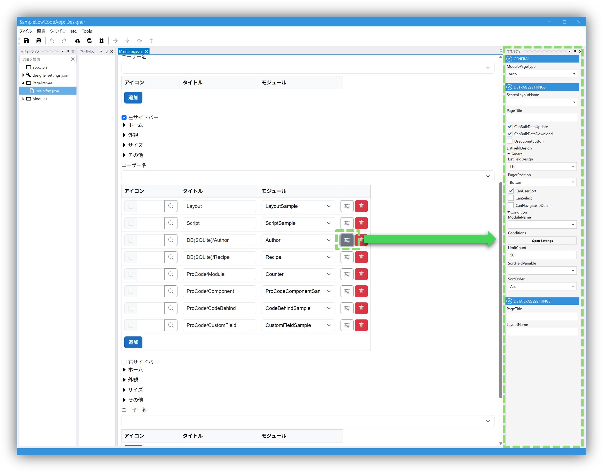
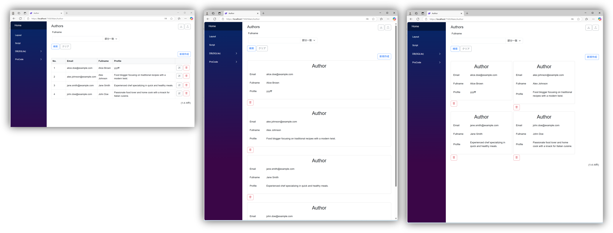

# PageFrame
アプリの外枠の部分です。
またそのPageFrame内で表示可能なModuleを設定します。
表示可能なModuleはTopPage、ヘッダ、サイドバー(Left, Right)に指定されたModule、およびその他表示可能で指定されたModuleです。

## プロパティ
ページ自体の設定を行います。  
TopPage、HeaderやSideBar(Left, Right)、Other Pages それぞれでページの設定を行うことが可能です。

### ModulePageType  
  Auto：一覧または詳細の設定をもとに表示する内容を自動的に反映します。  
　　　例えば詳細に何かしらのFieldが設定されていて、一覧には何も設定されていない場合は、詳細ページのみ表示されます。  
  ListToDetail：一覧ページと詳細ページを表示します。（CanNavigateToDetailの設定も必要です）  
  List：一覧ページのみ表示します。（CanNavigateToDetailを設定しても詳細ページの表示はできません）  
  Detail：詳細ページのみ表示します。

### 一括データ更新、一括データダウンロード、SubmitButton  
  CanBulkDataUpdate：チェックを入れるとアップロードボタンが表示されます。（Moduleの全体設定のOptionsでCanCreateとCanUpdateの設定も必要です）  
  CanBulkDataDownload：チェックを入れるとダウンロードボタンが表示されます。  
  UseSubmitButton：チェックを入れると一覧画面で登録または更新することができます。（Moduleの全体設定のOptionsでCanCreateまたはCanUpdateの設定も必要です）

### ListFieldDesign  
  List：一覧ページに一覧の設定が反映されて表示されます。  
  DetailList：一覧ページに詳細の設定が反映されて表示されます。  
  TileList：一覧ページに詳細の設定が反映されて、TileList形式で表示されます。

  

## TopPage
PageFrameは複数作ることができますが、ルートのURLを入力したときにTopPageにモジュールが指定されているPageFrameが選択され、TopPageを表示します。

## Header, SideBar(Left, Right)
### Home
Home(最初の図の例では左のサイドバーの上部に表示されているもの)に表示する内容を決めます。
| フィールド      | 説明                                            |
|------------|-----------------------------------------------|
| Type       | None, Text, Imageから選択する                                 |
| Icon      | アイコン。TypeがTextの場合に使用する       |
| Text      | Text。TypeがTextの場合に使用する       |
| Resource Path     | イメージのResouceフォルダからの相対パス。TypeがImageの場合に使用する                                           |

### Colors
色を決めます。サイドバーはグラデーション表示可能です。

### 表示モジュール
| フィールド      | 説明                                            |
|------------|-----------------------------------------------|
| Icon       | メニューのアイコンを設定                                  |
| Title      | メニューのタイトルを設定`/` で区切ることでメニューを階層にできる       |
| Module     | [Module](../module/module.md) を指定、別のPageFrameに移る場合はPageFrame/Moduleのように `/` で区切ることで指定できる                       |

## Other Pages
SideBar、Headerで指定していないモジュールをページとして表示する場合にここに列挙します。SideBar、Header、Other Pages に指定しているもの以外はPageFrame内では表示できません。

## カスタムレイアウト

標準のレイアウトを使わずに、カスタムサイドバーを実装する場合は `MainLayoutCore` 相当のコンポーネントを実装し `MainLayout.razor` 内を置き換えることで実現できます。

詳しくは`Sample/CustomLayoutSample` を参照してください。
