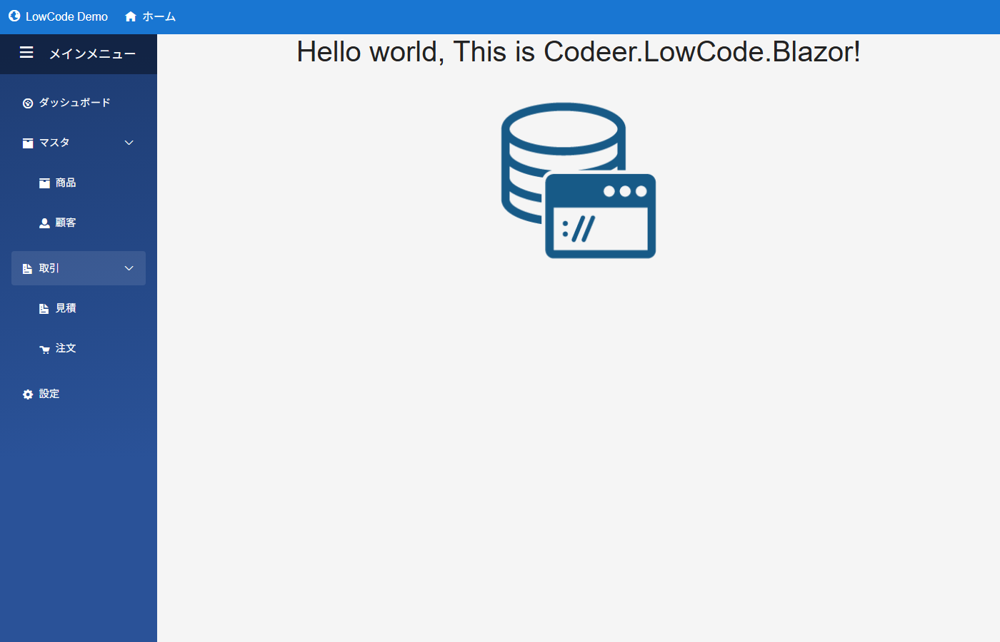
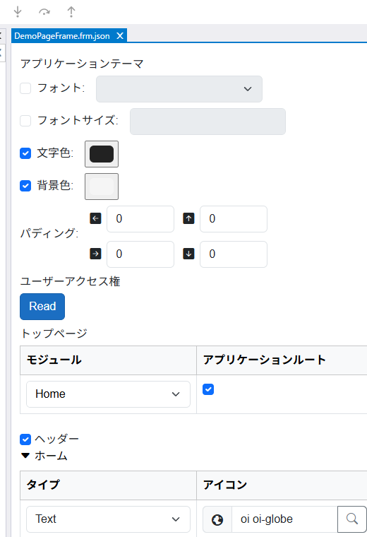
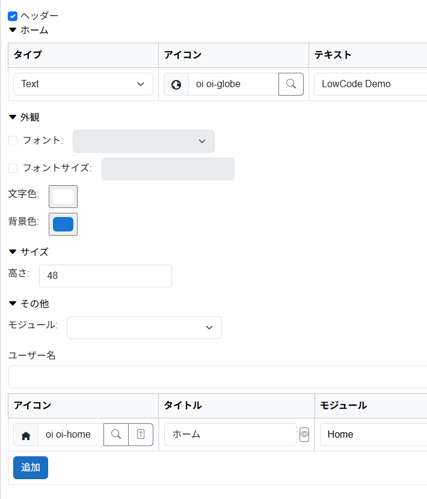
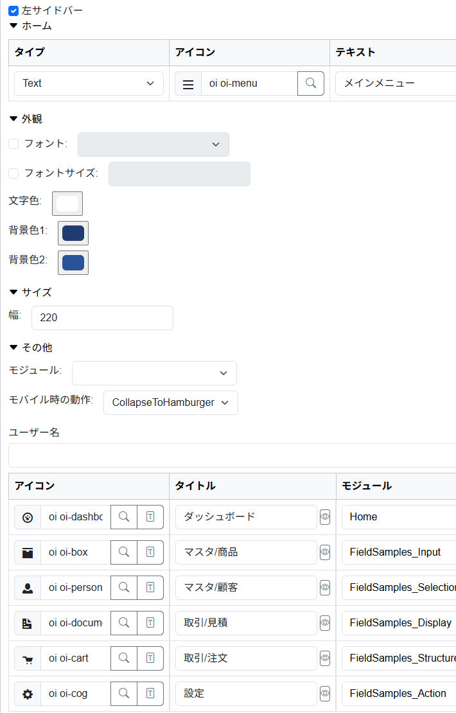
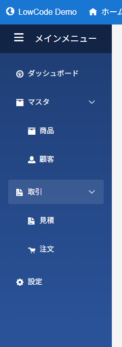
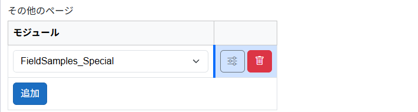
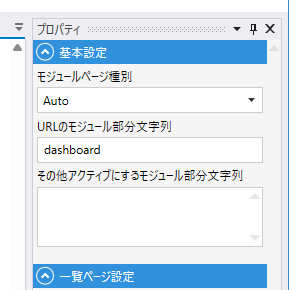
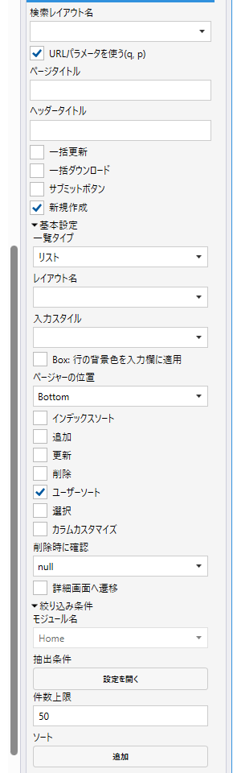
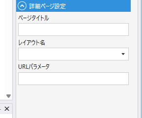

# PageFrame

**PageFrame はアプリの「外枠」です**。画面の上に固定するヘッダー、左右のサイドバー、中央のコンテンツ領域、そしてそこに並ぶメニュー項目（どのモジュールが開けるか）を決めます。

開発するアプリの見た目を決めるとともに、**どのモジュールが画面として開けるか**を登録する場所でもあります。

---

## PageFrame は複数作れる

PageFrame はアプリ内に複数持てます。代表的な使い方:

- **管理者用 / 一般ユーザー用で UI ごと分ける**（サイドバーのメニューを変える・権限で PageFrame 自体の表示/非表示を切り替える）
- **業務領域ごとに PageFrame を分ける**（例: 購買・販売・人事）
- **公開ページと管理ページを分ける**

複数ある時、ユーザーがルート URL（`/`）を開いた時にどの PageFrame が表示されるかは、以下の順で決まります。

1. **`アプリケーションルート` ON** で、`トップページ` にモジュール指定があり、**ユーザーアクセス権にマッチ**する PageFrame
2. 上記がなければ、`トップページ` にモジュール指定のある **最初の PageFrame**

> ⚠ **ハマりどころ**: 複数 PageFrame がある場合、**必ず 1 つに `アプリケーションルート` を設定**してください。未設定のままだと「どれがルートで開かれるかが定義順に依存」します。また、複数に ON しても意味はなく、条件にマッチする最初の 1 つしか使われません。

---

## モジュールは PageFrame に「登録」しないと開けない

> ⚠ **最重要**: PageFrame 内で表示・遷移できるのは、**PageFrame に登録されたモジュールだけ**です。未登録のモジュールは `NavigationService` からも URL 直打ちでも開けません。

登録先は次の 4 種類です:

| 登録先 | 用途 |
|---|---|
| **トップページ** | ルート URL で最初に表示されるモジュール |
| **ヘッダー** の Links | ヘッダーのメニュー項目 |
| **左サイドバー / 右サイドバー** の Links | サイドバーのメニュー項目 |
| **その他のページ** | メニューに出さないが、ボタン等から開きたいモジュール |

たとえば「一覧画面から詳細画面にボタンで遷移する」時、詳細画面のモジュールを **その他のページ** に登録していないと開けません（一覧でリンクになっている場合は対象の Module を **その他のページ** か **Links** に入れておく必要があります）。

> ⚠ **登録時に選んだ「ページ種別」も重要**: モジュールに詳細レイアウトを定義していても、そのリンクの種別が **`List`** だと、そのリンク経由では詳細ページは開けません。同様に、種別が `Detail` だと一覧ページは開けません。**「登録時のページ種別」が、開けるページを決めます**。詳しくは [モジュールページ種別](page_types.md) を参照してください。

---

## PageFrame 全体のプロパティ

### 基本

| 日本語表示名 | 内容 |
|---|---|
| **Name** | PageFrame 名（内部識別子） |
| **Description** | メモ用途の説明文 |
| **アプリケーションルート** | ルート URL で開かれる PageFrame かどうか |

### 外観（子モジュールへカスケード）

以下は PageFrame 全体で設定し、中のモジュール・レイアウトに継承されます。

| 日本語表示名 | 内容 |
|---|---|
| **背景色** | PageFrame の背景色 |
| **文字色** | PageFrame の文字色 |
| **フォント** | フォントファミリ |
| **フォントサイズ** | ベースフォントサイズ（px） |
| **パディング** | メインコンテンツ領域の余白 |

### ユーザーアクセス権

この PageFrame を表示できるユーザーの条件。**ログインユーザーのモジュールデータを対象にフィルタ条件**を書きます。条件にマッチしないユーザーには、この PageFrame は存在しないものとして扱われます（ルート URL で選ばれず、メニューにも出ません）。

---

## Header / 左サイドバー / 右サイドバー の共通設定

### IsVisible

そのバーを表示するかどうか。`false` にすると中身に関わらず非表示になります。

### Home（ロゴ部分）

バーの先頭に出る「ホーム」表示。**Type**（タイプ）で描画内容が変わります。

| Type | 表示される内容 |
|---|---|
| **None** | 非表示 |
| **Text** | `アイコン` + `テキスト` |
| **Image** | `リソースパス` で指定した画像 |

> ⚠ **ハマりどころ**: 初期値は `None` なので、ロゴを表示したければ明示的に `Text` か `Image` に切り替える必要があります。

### Links（メニュー項目）

そのバーに並ぶメニューです。1 行ごとに 1 モジュールを登録します。詳細は [メニュー項目の設定](#メニュー項目の設定-pagelink) を参照。

### UserName

ユーザー名を表示する位置（標準の位置）。

### モジュール（ModuleName）

**このバー全体を独自のモジュールで置き換えたい時に指定**します。標準のバー描画の代わりに、指定したモジュールが丸ごと描画されます。標準のメニュー機能を取り込みたい場合は、そのモジュール内に [HeaderMenuField / SidebarMenuField](../fields/PageFrameMenu.md) を配置してください。

---

## Header 固有の設定

ヘッダーのみ持つプロパティ:

| 日本語表示名 | 内容 |
|---|---|
| **外観 > 背景色** | ヘッダーの背景色（単色） |
| **外観 > 文字色** | ヘッダーの文字色 |
| **サイズ > 高さ** | ヘッダーの高さ（px） |

---

## 左／右サイドバー固有の設定

サイドバーはヘッダーと違い、**グラデーション表示**に対応しています。

| 日本語表示名 | 内容 |
|---|---|
| **外観 > 背景色1** | グラデーション開始色 |
| **外観 > 背景色2** | グラデーション終了色 |
| **外観 > 文字色** | サイドバーの文字色 |
| **サイズ > 幅** | サイドバーの幅（px） |
| **その他 > モバイル時の動作** | `CollapseToHamburger` / `None` |

> ⚠ **ハマりどころ**: サイドバーの背景色は **単色ではなく `背景色1` / `背景色2` の 2 色**です。フラットな単色にしたい場合は両方に同じ色を設定します。

### モバイル時の動作

| 値 | 挙動 |
|---|---|
| **CollapseToHamburger** | 画面幅が狭くなるとサイドバーが折りたたまれ、ハンバーガーメニューで開閉できるようになる |
| **None** | 折りたたまず、常にサイドバーが表示される |

---

## メニュー項目の設定 (PageLink)

Header.Links / Left.Links / Right.Links の 1 行が 1 つの **PageLink** です。

| 日本語表示名 | 内容 |
|---|---|
| **アイコン** | メニューのアイコン |
| **タイトル** | メニュー表示名。`/` で区切ると階層メニューになる |
| **モジュール** | 対象モジュール名（このバーで開きたいモジュール） |

さらに、そのモジュールをどう表示するかの詳細（ページ種別・URL 設定・レイアウト・一覧/詳細オプション）が PageLink ごとに設定できます。これについては [モジュールごとのページ設定](#モジュールごとのページ設定-modulepagedesign) を参照。

### 階層メニュー（タイトルの `/` 区切り）

PageLink のタイトルに `/` を含めると、**同じ先頭パートを共有する PageLink が親メニューの下にグループ化**されます。

例えば次のように 6 リンクを登録すると:

| タイトル | モジュール |
|---|---|
| `ダッシュボード` | Home |
| `マスタ/商品` | Product |
| `マスタ/顧客` | Customer |
| `取引/見積` | Quote |
| `取引/注文` | Order |
| `設定` | Settings |

サイドバーでは `マスタ` と `取引` が親メニューにまとまり、クリックで折りたたみ・展開ができます。

さらに深い階層（`マスタ/商品/カテゴリ` など）も同じルールで作れます。

> **アイコンとタイトル非表示**: タイトルの代わりにアイコンだけ出したい場合は、PageLink の `HideTitle` を `true` にすると、そのリンクはアイコンのみで描画されます。

### 別の PageFrame のモジュールに遷移

メニューから他の PageFrame のページに飛ばすこともできます。PageLink には `PageFrame` と `Module` が別フィールドとしてあり、**別 PageFrame への遷移は `PageFrame` 欄にその PageFrame 名を入れる**と実現できます（空なら現在の PageFrame のモジュールを開く）。

---

## その他のページ (OtherPages)

**メニュー（ヘッダー／サイドバー）には出したくないけれど、この PageFrame の中で開きたいモジュール**を登録する場所です。

典型的には次のようなケースで使います:

- 一覧画面から遷移する **詳細画面** のモジュール（一覧はメニューに出すが、詳細は出さない）
- ダイアログではなく別ページとして開きたい **編集画面**
- スクリプトの `NavigationService` から開きたい **ワーク画面**
- ユーザープロフィール・アカウント設定など、固定メニューに載せるほどではないページ

> ⚠ **ハマりどころ**: PageFrame 内で `NavigationService` から開くモジュール、あるいは URL 直打ちで開きたいモジュールは、**`その他のページ` か Links / TopPage のいずれかに必ず登録**してください。未登録だと「ページが見つかりません」になります。

### Links との違い

| | **Links（Header / Left / Right）** | **その他のページ** |
|---|---|---|
| メニュー表示 | あり（アイコン + タイトル） | なし |
| タイトル・アイコン設定 | あり | なし |
| ModulePageDesign 設定 | あり | あり（同じ） |
| 用途 | 常設メニュー | 裏ページ / 導線経由で開くページ |

Links と `その他のページ` のどちらに入れても **ページとしては同じように動きます**。違いは「メニューに出るかどうか」だけです。

### 設定内容

Links テーブルと違って、`アイコン` / `タイトル` の列はありません。**モジュール**だけを指定して、右の編集ボタン（スライダーアイコン）で [モジュールごとのページ設定 (ModulePageDesign)](#モジュールごとのページ設定-modulepagedesign) と同じ項目（モジュールページ種別・URL 設定・一覧ページ設定・詳細ページ設定）を設定できます。

---

## モジュールごとのページ設定 (ModulePageDesign)

TopPage / OtherPages / 各 Link に登録したモジュールごとに、**そのモジュールを PageFrame 内でどう扱うか**を設定します。設定は、Links テーブルで該当行を選ぶか、右側にある編集ボタン（スライダーアイコン）で開いたときに、右のプロパティパネルに表示されます。

### 基本設定（モジュールページ種別・URL）

#### モジュールページ種別

| 値 | 挙動 |
|---|---|
| **Auto** | ListLayout の有無で自動判定。ListLayout に要素があれば「一覧 → 詳細」、なければ詳細直接 |
| **ListToDetail** | 一覧ページ → 詳細ページの 2 段構成。**リスト中で `CanNavigateToDetail` が true の場合のみ詳細に遷移できる** |
| **List** | 一覧ページのみ。詳細ページは開かない |
| **Detail** | 詳細ページのみ。URL で ID を直接指定して 1 件を開く（一覧を経由しない画面） |

> 各種別の **使い分け・選び方・ハマりどころ・Auto の判定ロジックの詳細**は [モジュールページ種別 (ListToDetail / List / Detail / Auto)](page_types.md) を参照してください。

#### URL 設定

| 日本語表示名 | 内容 |
|---|---|
| **URLのモジュール部分文字列** (ModuleUrlSegment) | URL 内で使う識別子。空ならモジュール名がそのまま使われる |
| **その他アクティブにするモジュール部分文字列** (ActiveModuleSegments) | このリンクをアクティブ表示にしたい他のセグメント一覧 |

- URL 比較は **大文字小文字を区別しません**。
- 同じ PageFrame 内で **ModuleUrlSegment の重複はエラー** になります（デザインチェックで検出）。
- ActiveModuleSegments は、例えば「記事一覧」メニューで、`/article` だけでなく `/article-draft` を開いている間もメニューをアクティブ表示にしたい時に使います。

### 一覧ページ設定（ListPageDesign）

`ModulePageType` が `List` / `ListToDetail` / `Auto` の時に効きます。

| 日本語表示名 | 内容 |
|---|---|
| **検索レイアウト名** | 一覧の上に表示する検索フォームのレイアウト |
| **URLパラメータを使う(q, p)** (UserUrlParameter) | 検索条件とページをクエリ文字列で持つか（デフォルト ON） |
| **ページタイトル** | ブラウザタブ等に出るタイトル |
| **ヘッダータイトル** | 画面内に出すタイトル |
| **一括更新** (CanBulkDataUpdate) | Excel/CSV アップロードボタンの表示（Module 側の CanCreate / CanUpdate 必要） |
| **一括ダウンロード** (CanBulkDataDownload) | ダウンロードボタンの表示 |
| **サブミットボタン** (UseSubmitButton) | 一覧画面でそのまま登録・更新できる（Module 側の CanCreate / CanUpdate 必要） |
| **新規作成** (UseNavigateToCreate) | 新規作成ボタンを表示（デフォルト ON） |
| **一覧タイプ** (ListFieldDesign) | 一覧を [List](../fields/List.md) / [DetailList](../fields/DetailList.md) / [TileList](../fields/TileList.md) のどれで表示するか |

「一覧タイプ」を切り替えると、その種別固有の ListField プロパティ（レイアウト名 / ページャー位置 / 各種フラグ / 絞り込み条件 / 並び順 など）が下に続いて表示されます。詳細は各 Field のドキュメントを参照してください。

一覧の見た目は 3 種類から選べます:

| 値 | 挙動 |
|---|---|
| **List** | テーブル形式 |
| **DetailList** | 詳細レイアウトを縦に並べた一覧 |
| **TileList** | 詳細レイアウトをタイル形式に折り返した一覧 |

### 詳細ページ設定（DetailPageDesign）

`ModulePageType` が `Detail` / `ListToDetail` / `Auto` の時に効きます。

| 日本語表示名 | 内容 |
|---|---|
| **ページタイトル** | ブラウザタブ等に出るタイトル |
| **レイアウト名** | 詳細画面で使う DetailLayout 名（空ならデフォルト） |
| **URLパラメータ** | URL に付加できるパラメータ名 |

---

## カスタムヘッダー / サイドバー

標準のヘッダー・サイドバー UI では物足りない時、**各バーを丸ごと独自のモジュールで置き換えられます**。

1. ヘッダー・サイドバーの **モジュール（ModuleName）** に、代替として使いたいモジュール名を入れる
2. そのモジュール内で、標準のメニュー機能を取り込みたければ [HeaderMenuField / SidebarMenuField](../fields/PageFrameMenu.md) を配置する

> ⚠ **ハマりどころ**: モジュール名を指定しても、**そのモジュールに HeaderMenuField / SidebarMenuField を置かないと標準メニューは一切表示されません**。ロゴだけ残して独自ボタンを付けたつもりが、メニューごと消えた、というパターンに注意。

---

## 権限制御

PageFrame 関連の可視性は **2 層** でチェックされます。

| 層 | プロパティ | 効果 |
|---|---|---|
| PageFrame | `ユーザーアクセス権` (UserReadCondition) | 条件に合わないユーザーには **PageFrame 自体が存在しない** 扱い |
| Module | [Module の UserReadCondition](../module/module.md) | 条件に合わないユーザーには **その Module のリンクがメニューから除外** される |

どちらの条件も、ログインユーザー（`CurrentUser` モジュール）のデータを使って評価します。

### 「メニューが出ない」時のチェック順

1. PageFrame の `ユーザーアクセス権` がログインユーザーで満たされているか
2. 対象 Module の `ユーザーアクセス権` がログインユーザーで満たされているか
3. Link の `モジュール` 欄のモジュール名に typo がないか
4. Link が正しいバー（Header / Left / Right）の Links に入っているか

---

## トラブルシューティング

| 症状 | 原因として多いもの |
|---|---|
| ルート URL で意図しない PageFrame が開く | `アプリケーションルート` が未設定、または複数 ON |
| ボタンから開いたモジュールが「ページが見つかりません」になる | その PageFrame の `その他のページ` か Links に未登録 |
| メニューに出ない | PageFrame または Module の `ユーザーアクセス権` でブロックされている |
| 「詳細画面に遷移しない」 | ListField の `CanNavigateToDetail` が false、または `ModulePageType` が `List` |
| サイドバーが単色にならない | `背景色1` と `背景色2` が違う色になっている |
| ホームロゴが出ない | `ホーム > タイプ` が `None` のまま |
| カスタムヘッダーから標準メニューが消えた | 代替モジュール内に HeaderMenuField / SidebarMenuField を置いていない |
| 同じセグメントで「重複エラー」 | `URLのモジュール部分文字列` が同 PageFrame 内で重複 |

---

## 関連項目

- [app.clprj](app_clprj.md) — アプリ全体設定
- [Module](../module/module.md) — モジュールの CRUD・権限
- [HeaderMenuField / SidebarMenuField](../fields/PageFrameMenu.md) — カスタムバー内で標準メニュー機能を埋め込む
- [認証・認可](../authorization/authorization.md) — CurrentUser・UserReadCondition の書き方
- [ListField](../fields/List.md) / [DetailList](../fields/DetailList.md) / [TileList](../fields/TileList.md) — 一覧表示の見た目
