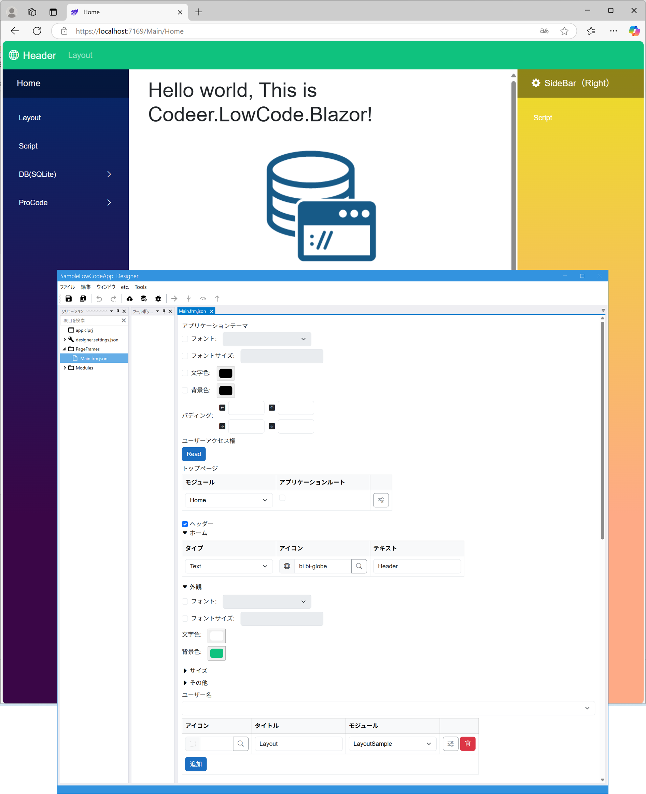
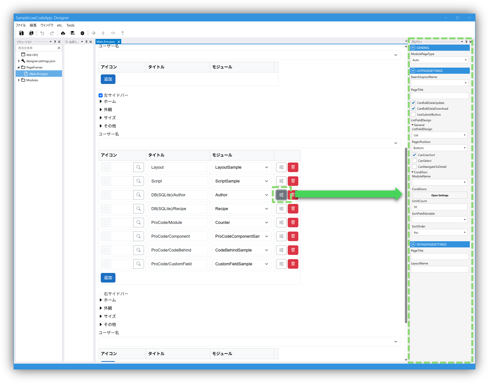
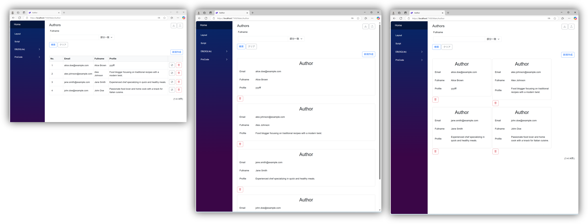

# PageFrame

**PageFrame** はアプリの外枠です。ヘッダー・サイドバー・フッター・中央コンテンツ領域からなる、アプリ全体の枠組みを定義します。

## PageFrame に設定するもの

- **TopPage** — ルート URL で最初に表示するモジュール
- **Header** — 画面上部に固定表示するモジュール
- **SideBar（Left / Right）** — 左右のサイドバーに固定表示するモジュール
- **Other Pages** — サイドバー・ヘッダーには出さないが、アプリ内で開けるモジュール

PageFrame は複数作れます。用途ごとに画面グループを分けて、権限で切り替えることもできます（例: 管理者用 / 一般ユーザー用）。

---

## プロパティ

### ModulePageType — 一覧・詳細の表示モード

| 値 | 挙動 |
|---|---|
| **Auto** | 一覧または詳細の設定に応じて自動判定 |
| **ListToDetail** | 一覧ページ → 詳細ページの遷移（`CanNavigateToDetail` も必要） |
| **List** | 一覧ページのみ |
| **Detail** | 詳細ページのみ |

### 一覧画面のオプション

| プロパティ | 挙動 |
|---|---|
| **CanBulkDataUpdate** | アップロードボタンを表示（Module の Option で `CanCreate`/`CanUpdate` が必要） |
| **CanBulkDataDownload** | ダウンロードボタンを表示 |
| **UseSubmitButton** | 一覧画面で登録・更新できる（Module 側の Option 必要） |

### ListFieldDesign — 一覧表示の見た目

| 値 | 挙動 |
|---|---|
| **List** | 一覧設定をテーブル表示 |
| **DetailList** | 詳細レイアウトを縦に並べて表示 |
| **TileList** | 詳細レイアウトをタイル形式で表示 |

---

## TopPage

PageFrame は複数作れますが、ルート URL（`/`）を開いた時には **TopPage にモジュールが指定されている PageFrame** が選ばれ、そのモジュールが表示されます。

---

## Header / SideBar（Left / Right）の設定

### Home（サイドバー上部 / ヘッダー左端など）

| プロパティ | 説明 |
|---|---|
| **Type** | `None` / `Text` / `Image` |
| **Icon** | アイコン（Type が `Text` の場合） |
| **Text** | 文字（Type が `Text` の場合） |
| **ResourcePath** | 画像の相対パス（Type が `Image` の場合） |

### Colors

色を決めます。サイドバーはグラデーション表示に対応。

### 表示モジュール

ヘッダー／サイドバーに並ぶメニュー項目です。

| プロパティ | 説明 |
|---|---|
| **Icon** | メニューのアイコン |
| **Title** | メニューのタイトル。`/` で区切ると階層メニューになる |
| **Module** | 対象モジュール名。別 PageFrame に移る場合は `PageFrame/Module` 形式 |

---

## Other Pages

サイドバー・ヘッダーには出さないが、アプリ内で開けるモジュールをここに列挙します。
**ここに無いモジュールは PageFrame 内では開けません**（URL 直打ちも不可）。

---

## カスタムレイアウト

標準のサイドバー・ヘッダーでは足りない場合、**カスタムメインレイアウト**を Blazor で書けます。
`MainLayoutCore` 相当のコンポーネントを作り、`MainLayout.razor` 内を置き換えます。

サンプル: `Sample/CustomLayoutSample`

---

## 権限による表示制御

PageFrame には**表示条件**を設定できます。
`CurrentUser` を使って、条件を満たさないユーザーには PageFrame そのものを見せないといった制御が可能です。

詳しくは [認証・認可](../authorization/authorization.md) を参照。

---

## 関連項目

- [app.clprj](app_clprj.md)
- [Module](../module/module.md)
- [Sidebar Menu / Header Menu の仕組み](../module/module.md)
- [認証・認可](../authorization/authorization.md)
