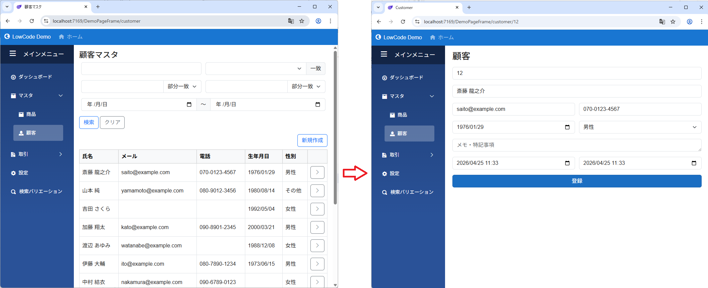
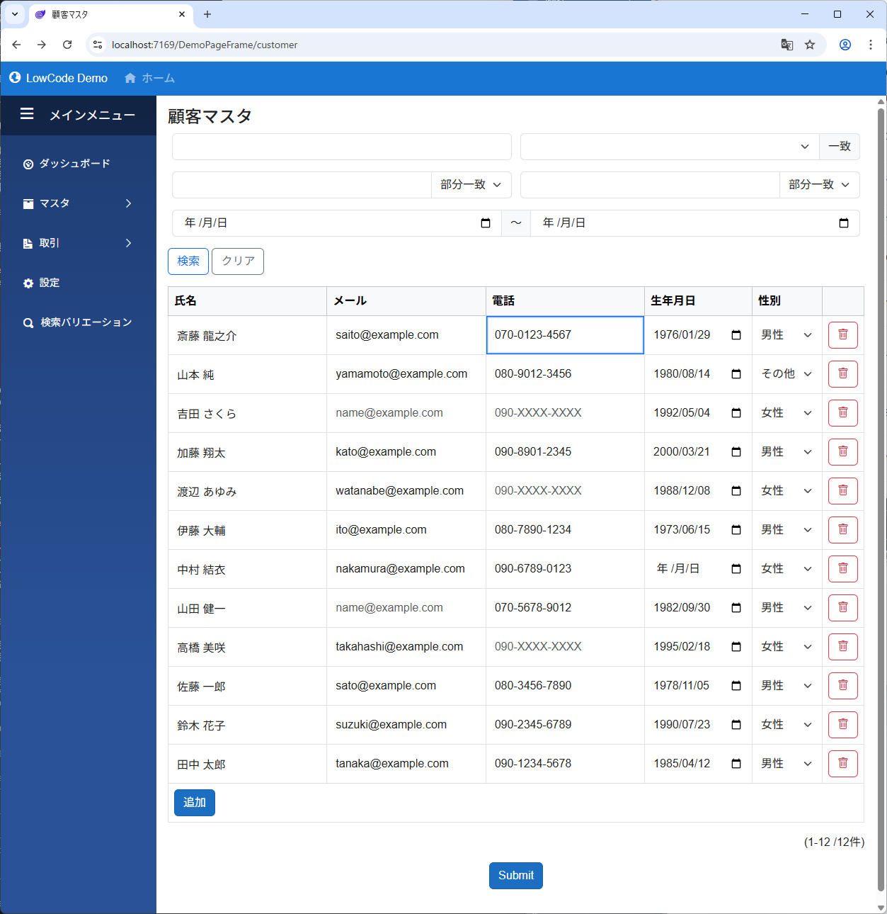
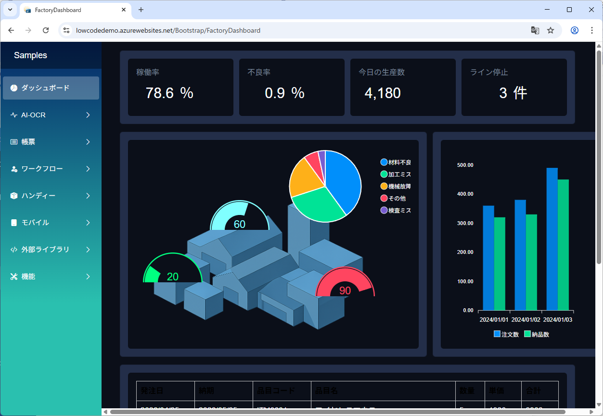
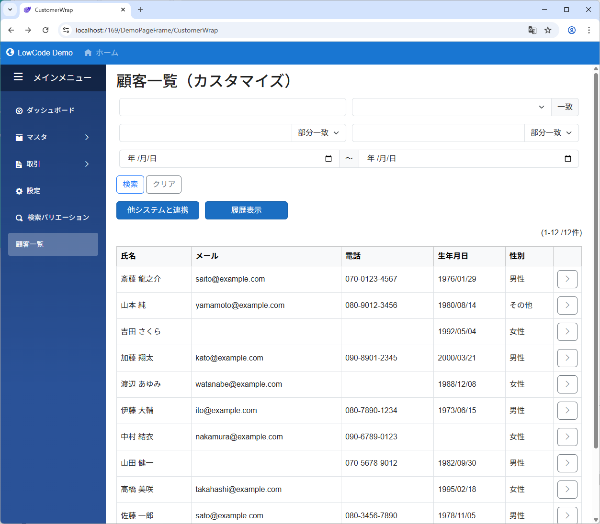
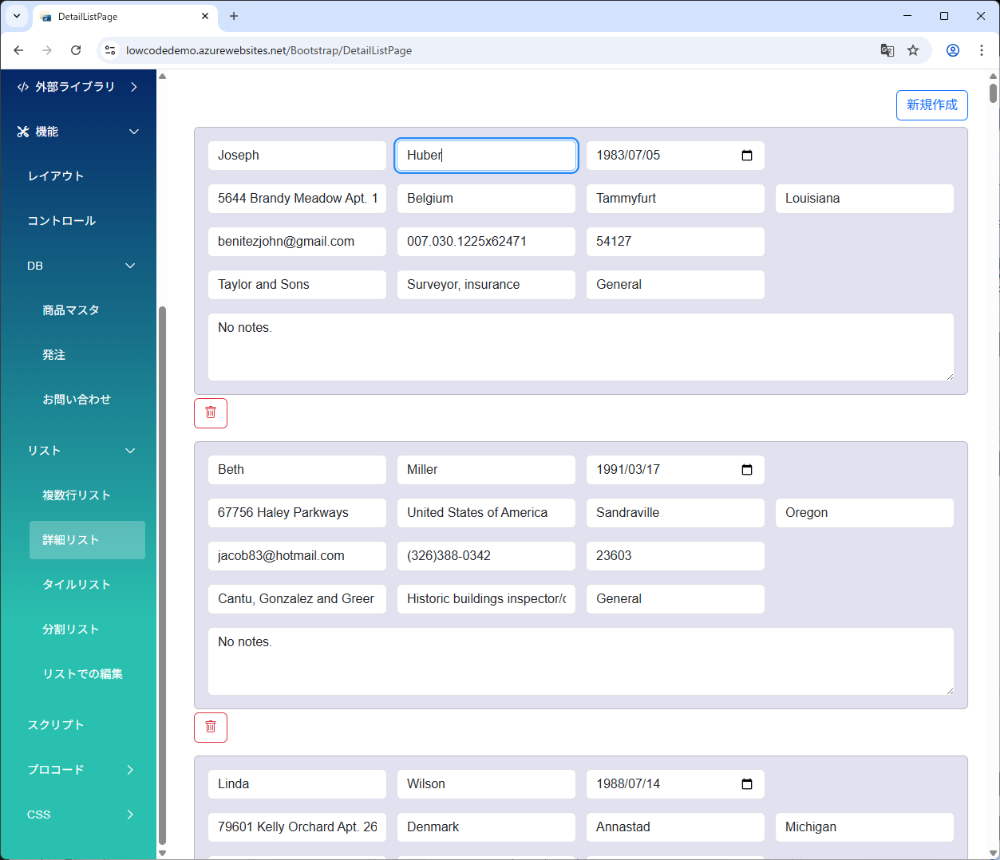

# モジュールページ種別 (ListToDetail / List / Detail / Auto)

[PageFrame](page_frame.md) に登録した各モジュールは、**「ページ種別」**（`ModulePageType`）で表示の仕方を決めます。種別の選び方が画面構成の良し悪しを大きく左右するので、最初に正しく選ぶのが大切です。

> このページは [PageFrame](page_frame.md) の一部ですが、独立して読めるようにまとめてあります。

---

## ページとは

PageFrame に登録された各リンク（[TopPage / Header / Sidebar の Links / OtherPages](page_frame.md#モジュールは-pageframe-に登録しないと開けない)）には、それぞれ **「一覧ページ」** と **「詳細ページ」** という 2 つのページがあります。

| ページ | URL | 用途 |
|---|---|---|
| **一覧ページ（List Page）** | `/PageFrame/segment` | 検索フォーム + 一覧テーブル + 新規作成ボタン |
| **詳細ページ（Detail Page）** | `/PageFrame/segment/{id}` | 1 件のデータの編集フォーム |

ページ種別は、このうち**どちらを使うか**（または両方使うか）を決める設定です。

---

## 4 つのページ種別

| 種別 | 一覧ページ | 詳細ページ | こんな画面に向く |
|---|---|---|---|
| **ListToDetail** | あり | あり | 一般的な **CRUD 画面**（マスタ・トランザクション） |
| **List** | あり | なし | **集計結果の表示**・読み取り専用一覧（ダッシュボード） |
| **Detail** | なし | あり | **一枚もの**画面（設定画面・プロフィール）・ダイアログ・カスタム一覧 |
| **Auto** | 自動判定 | 自動判定 | モジュール設計から自動で決めたい時の既定 |

---

## ListToDetail — 一般的な CRUD

**もっともよく使う種別**です。商品マスタ・顧客マスタ・注文一覧など、一覧から詳細に飛んで編集するアプリの基本パターン。

一覧ページで行を選ぶと、詳細ページに遷移します。

### 使うシーン

- マスタテーブルの管理画面（商品・顧客・社員）
- トランザクションの一覧と詳細（注文・見積・請求書）
- 標準的な「検索 → 一覧 → 行クリック → 詳細」の業務画面

### ページの動き

1. メニューをクリック → 一覧ページが開く（`/PageFrame/segment`）
2. 検索フォームで絞り込み、一覧テーブルから 1 件選択
3. 行の `>` ボタンをクリック → 詳細ページへ遷移（`/PageFrame/segment/{id}`）
4. 編集 → 登録 → 一覧へ戻る

> ⚠ 一覧から詳細への遷移には ListField の `CanNavigateToDetail = true` が必要です。これが false だと、一覧で行をクリックしても詳細に飛べません。

---

## List — 集計表示・読み取り専用一覧

**詳細ページを持たない**種別。クリックして開くものが何もない、見るだけの一覧です。

### 使うシーン

- ダッシュボードに置く **集計結果の表** や **ランキング**
- 月次集計・KPI 表示などの読み取り専用画面
- [QueryField](../db/query_field.md) で組み立てた**カスタム SQL の結果**だけを見せたい
- 新規作成も編集も削除もしない、純粋なビュー

### 注意点

- 行を選択しても詳細には飛びません
- `新規作成` ボタンは `UseNavigateToCreate` を切れば消せますが、編集できないなら最初から `List` 種別を選んだ方が**意図がはっきり**します
- データを「閲覧されたくない」のではなく「クリックしても意味がない」時に使う種別です（権限制御は別途 [認証・認可](../authorization/authorization.md) で）

---

## Detail — 一枚もの・ダイアログ・カスタム一覧

**一覧ページを持たない**種別。リンクをクリックすると、いきなり詳細ページが開きます。

### 使うシーン

#### 1. 一枚もののアプリ画面

- アプリ全体のシングル設定画面（テナント設定・環境設定）
- ログインユーザーの **プロフィール画面** / **アカウント設定**
- ダッシュボード本体（一覧と統計を 1 つの DetailLayout に詰めたもの）
- 「Hello world」的なホーム画面（[DemoPageFrame の TopPage](page_frame.md) など）

集計カード・グラフ・一覧をまとめて 1 画面に並べたダッシュボードの例。

#### 2. ダイアログのような画面

- ボタン押下で開く確認画面・ウィザード
- 1 件の固定レコードを編集する画面（`Id` 固定で運用）

#### 3. CRUD だけど一覧表示を完全にコントロールしたい

これがちょっと玄人向けの使い方です。

「業務上は CRUD だけど、自動生成の一覧画面では足りない」というケース。例えば:

- 一覧の上にダッシュボード的な集計カードを配置したい
- 一覧の隣に検索条件用のサイドフォームを独自に置きたい
- 複数のリストを 1 画面で並べて見せたい
- 検索バーの下にお知らせ・操作ガイドのバナーを出したい

このとき、ページ種別を **`Detail`** にして、そのモジュールの **DetailLayout の中に [ListField](../fields/List.md) や [DetailListField](../fields/DetailList.md) を配置** します。すると、一覧の見せ方も含めて Detail レイアウトとして自由にデザインできます。

検索フォーム・カスタムボタン・一覧を Detail レイアウトに自由配置した例（標準の一覧ページにはないボタン群を上に置いている）。

[DetailListField](../fields/DetailList.md) を使い、1 件分のフォームを縦に並べて見せる例。

> 標準の一覧ページ（ListPage）では、検索フォーム・新規作成ボタン・一覧の配置がフレームワーク既定です。`Detail` で組めばこれらをすべて自分のレイアウトで決められます。

---

## Auto — 既定（モジュール設計から判定）

**設計内容から「一覧を通すか」「詳細直接か」を自動で判定**する種別です。新規モジュールを作るとデフォルトでこれが選ばれます。

### 判定ルール

- **一覧の設定がある** → **ListToDetail** 相当（一覧 → 詳細）
- **一覧の設定がない** → **Detail** 相当（詳細直行）

「一覧の設定がある」の判定基準:

- 一覧レイアウトに **Field が 1 つでも置かれている**
- または、**一覧タイプが標準の `ListField` 以外**（`DetailList` / `TileList` などに変えてある）

つまり「一覧画面を作る気配があれば一覧を通す、何もなければ詳細に直行する」という挙動です。

### 注意点

- 一覧レイアウトに 1 つでも Field を置くと自動で一覧ページが出てきます。**「とりあえず Field 置いただけ」が原因で意図せず一覧画面が表示される**ことがあります
- 一覧画面を絶対に出したくない時は、明示的に `Detail` を選んでください
- 逆に一覧画面を必ず出したい時は `ListToDetail` または `List` を明示してください

> 開発初期はとりあえず Auto でも動きますが、**運用に入るときは明示的な種別に切り替えるのがおすすめ**です（後で読む人にとって意図が伝わるため）。

---

## 種別の選び方（早見表）

| 作りたい画面 | 推奨種別 | 補足 |
|---|---|---|
| 商品マスタ・顧客マスタなどの CRUD | **ListToDetail** | 標準的な業務画面 |
| 注文一覧 → 注文詳細 | **ListToDetail** | 〃 |
| 月次レポート・ダッシュボード（集計表示のみ） | **List** | 編集なし・行クリック不要 |
| ランキング・統計テーブル | **List** | 〃 |
| ログインユーザーのプロフィール / アカウント設定 | **Detail** | 1 件固定の編集画面 |
| 環境設定・アプリ全体設定 | **Detail** | 〃 |
| ダッシュボード（集計 + 複数リストを 1 画面に） | **Detail** | DetailLayout に複数 ListField を配置 |
| ボタンから開く一枚物のフォーム | **Detail** | 〃 |
| CRUD だけど一覧画面を独自設計したい | **Detail** | DetailLayout に ListField を配置（標準一覧 UI を回避） |
| とにかく素早く動かしたい | **Auto** | 一覧レイアウトに置いた Field の有無で自動判定 |

---

## ページ種別と URL の対応

| 種別 | `/PF/segment` | `/PF/segment/new` | `/PF/segment/{id}` |
|---|---|---|---|
| **ListToDetail** | 一覧ページ | 詳細（新規作成） | 詳細（編集） |
| **List** | 一覧ページ | — | — |
| **Detail** | 詳細（新規作成） | 詳細（新規作成） | 詳細（編集） |
| **Auto** (List あり) | 一覧ページ | 詳細（新規作成） | 詳細（編集） |
| **Auto** (List なし) | 詳細（新規作成） | 詳細（新規作成） | 詳細（編集） |

> URL の `/{id}` に値が入っていれば常に詳細ページ、空なら種別に従います。

---

## ハマりどころ

| 症状 | 原因として多いもの |
|---|---|
| 一覧ページが表示されない・空っぽ | `Auto` で一覧レイアウトが未設定。明示的に `List` / `ListToDetail` にするか、一覧レイアウトに Field を配置 |
| 一覧から詳細に飛べない | 種別が `List`、または ListField の `CanNavigateToDetail = false` |
| 詳細しか出ない（一覧を出したい） | 種別が `Detail`、または `Auto` で一覧レイアウト空 |
| 「ページが見つかりません」 | そもそもモジュールが PageFrame に未登録（→ [PageFrame](page_frame.md#モジュールは-pageframe-に登録しないと開けない)） |
| カスタム一覧画面を作ったのに既定のリストUIが出てしまう | 種別を `ListToDetail` のままにしている。`Detail` にして自分の DetailLayout に ListField を入れる |
| 詳細レイアウトを作ったのに詳細画面が開かない | 登録時の種別が `List`。**モジュール側に詳細レイアウトがあっても、登録の種別が `List` だと詳細は開けません**。`ListToDetail` か `Detail` で登録する |
| 一覧レイアウトを作ったのに一覧画面が出ない | 登録時の種別が `Detail`。**一覧を出したいなら `List` か `ListToDetail` で登録**する |

---

## 関連項目

- [PageFrame](page_frame.md#モジュールごとのページ設定-modulepagedesign) — ページ種別はここで設定
- [ListField](../fields/List.md) / [DetailListField](../fields/DetailList.md) / [TileListField](../fields/TileList.md) — 一覧の表示形式
- [SearchField](../fields/Search.md) — 検索フォーム
- [Module 詳細設定](../module/module_detail.md) / [一覧設定](../module/module_list.md) — レイアウト側の設定
- [QueryField](../db/query_field.md) — 集計用カスタム SQL
