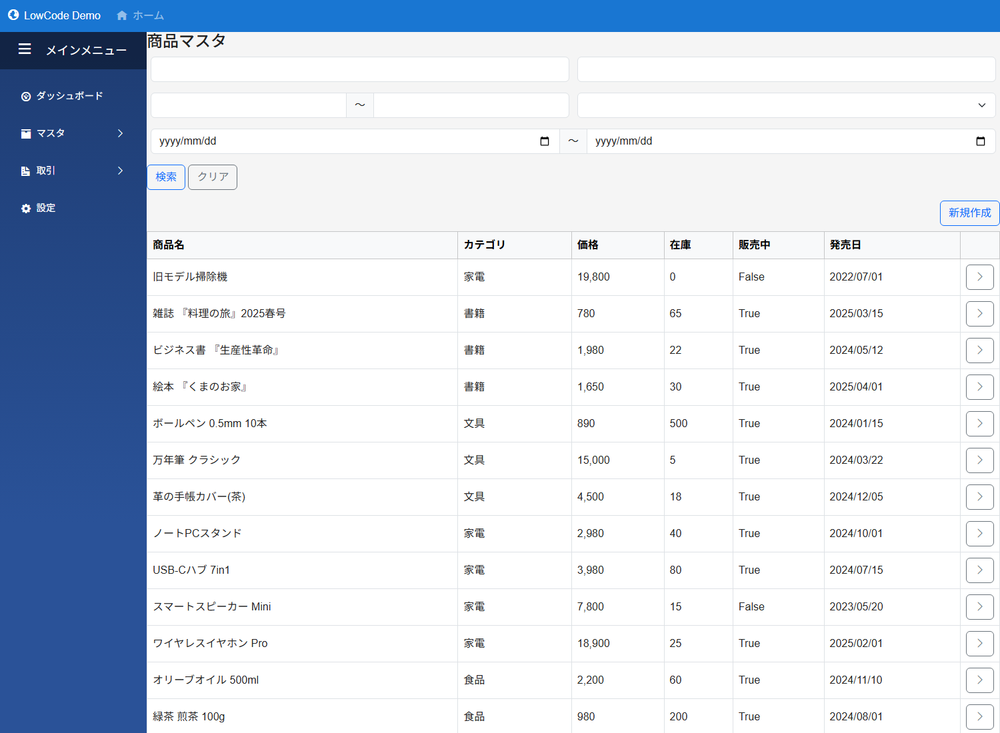
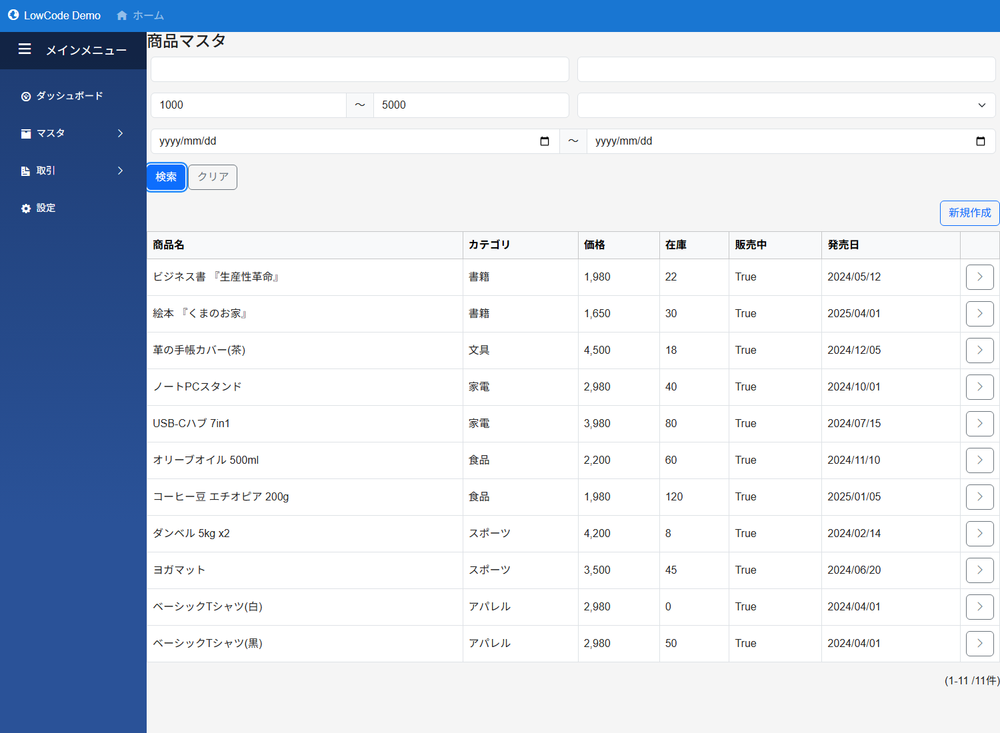
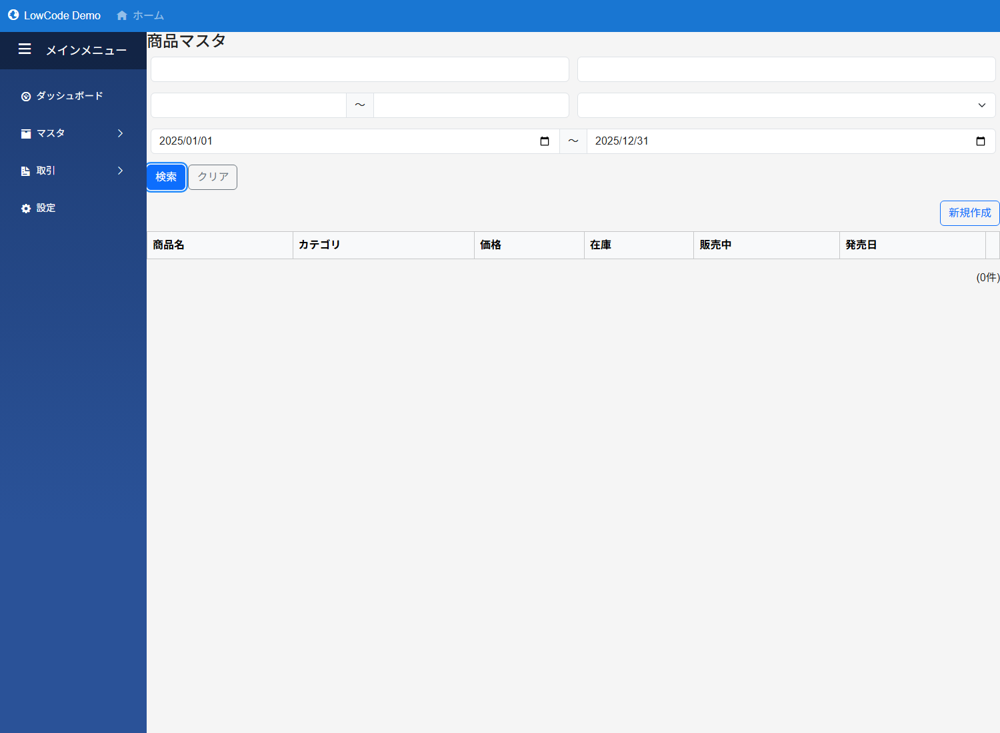
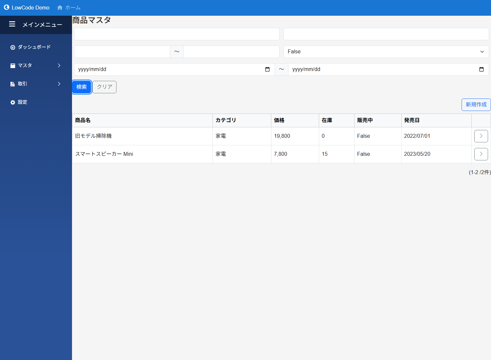

# 検索（Search）

一覧ページ上部に出る検索フォームの仕組みと、Field ごとの検索 UI のふるまいを解説します。

## 全体像

一覧ページ（List Page）には、**検索レイアウト**で配置したフィールドが上に並び、下に検索結果の一覧が出ます。

検索フォーム下の「検索」ボタンを押すと、入力された条件で DB クエリが組み立てられ、結果が一覧に差し替わります。「クリア」ボタンで条件が初期値に戻ります。

---

## 検索レイアウト（Search Layout）

モジュールデザインの **SearchLayouts** に、検索に使うフィールドを並べます。配置した各フィールドが、一覧ページ上部の検索フォームとして描画されます。

### 配置

SearchLayout の中に並べたフィールドが、そのまま**検索フォーム**になります。

- `GridLayout` で置けば 2 列・3 列のグリッド検索フォームに
- `FlowLayout` で置けば横並び／折り返しのコンパクトな検索バーに
- `TabLayout` で置けば タブで切り替える検索パネルに

### AND / OR 切替

SearchLayout の **Operator** プロパティで、入力された全条件を `AND` で結ぶか `OR` で結ぶかを指定します。

- **AND**（デフォルト）: 全条件を満たすデータ
- **OR**: どれか 1 条件でも満たすデータ

---

## Field ごとの検索 UI と挙動

### TextField（テキスト）

| 設定 | UI |
|---|---|
| `IsSimpleSearchParameter=true`（簡易） | 入力欄のみ。**常に部分一致**（LIKE %入力% 相当） |
| `IsSimpleSearchParameter=false`（詳細） | 入力欄 + 比較演算子ドロップダウン（部分一致 / 一致 / \[空白 / 空白でない\]） |

`AllowEmptySearch=true` を入れると、詳細側で「空白」「空白でない」が選べるようになります。

**部分一致の例**（「シャツ」で検索 → ベーシックTシャツ(白)/(黒)がヒット）:

### NumberField（数値）

| 設定 | UI |
|---|---|
| `IsSimpleSearchParameter=true`（簡易） | 入力欄 1 つ。**≥（以上）条件のみ** |
| `IsSimpleSearchParameter=false`（詳細） | 下限 ～ 上限 の 2 入力 + モード切替（範囲 / 空白 / 空白でない） |

**範囲検索の例**（1000 円 ～ 5000 円の商品）:

**下限のみ**（10000 円以上、上限空欄）: Max を空にすると上限なし。

### DateField / DateTimeField / TimeField

NumberField と同じで **範囲検索**です。

| 設定 | UI |
|---|---|
| `IsSimpleSearchParameter=true`（簡易） | 下限の日付（≥） |
| `IsSimpleSearchParameter=false`（詳細） | 開始日 ～ 終了日 + モード切替 |

**発売日 2025 年以降の商品**:

### BooleanField（真偽値）

常に **ドロップダウン** です。

| 設定 | 選択肢 |
|---|---|
| `IsSimpleSearchParameter=true`（簡易） | （未指定）／ True ／ False |
| `IsSimpleSearchParameter=false`（詳細） + `AllowEmptySearch=true` | 上記 + 空白／空白でない |

**販売中 = False の商品**（生産終了・掃除機がヒット）:

### SelectField / RadioGroupField

**候補のドロップダウン／ラジオ** をそのまま検索条件として使います。選んだ値と「一致」で検索されます。

### LinkField

関連モジュールの **検索ダイアログ** で値を選択 → その ID で一致検索。

### IdField

テキスト入力で ID を指定。詳細モードでは Like / Equal を選べます。

---

## 簡易検索 vs 詳細検索 (IsSimpleSearchParameter)

各 Field の `IsSimpleSearchParameter`（簡易検索条件）プロパティで切り替えます。

| プロパティ | 用途 | UI のコンパクト度 |
|---|---|---|
| `true`（簡易） | 比較演算子を固定し、ユーザーには入力欄だけを見せる | ◎ 狭い |
| `false`（詳細） | 比較演算子・空検索モードをユーザーに選ばせる | △ 広くなる |

> ⚠ **ハマりどころ**: 簡易に設定した Field は、**常にその Field 固有のデフォルト演算子（部分一致／以上／True・False）で検索**されます。完全一致で検索させたい TextField を簡易にすると、ユーザーが完全一致を選択できないので、先頭・末尾・途中のどこに入力値が現れても合致してしまいます。

### 検索バーを小さくしたい時

よく検索される **少数の主要条件** だけ `IsSimpleSearchParameter=true` にして SearchLayout に置くと、スリムな検索バーになります。詳細な絞り込みが必要な条件は SearchLayout の別エリアに `IsSimpleSearchParameter=false` で配置すれば、操作モードの切替までユーザーに任せられます。

---

## 空検索 (AllowEmptySearch)

`AllowEmptySearch=true` を指定した Field は、詳細検索のモードドロップダウンに **「空白」「空白でない」** が追加されます。

- **空白**: その列が NULL または空文字のデータ
- **空白でない**: その列に何か値が入っているデータ

> **前提**: `IsSimpleSearchParameter=false`（詳細）でないと空検索モードは出ません。

---

## 複数条件の検索（AND / OR）

検索レイアウトに置いた複数 Field に値を入れると、**SearchLayout の Operator に従って条件が結合**されます。

**例**: カテゴリ=アパレル **AND** 価格 ≥ 5000 円

ユーザーに AND / OR を選ばせたい場合は、**SearchLayout の Operator を "Or"** に切り替えるか、SearchTabLayout で複数の検索パターンをタブで切り替える構成にします。

---

## 検索ボタン・クリアボタン

検索フォームには `検索` と `クリア` の 2 ボタンが自動で描画されます。

- **検索**: 入力されている条件で検索を実行（「URLパラメータを使う」ON の場合、検索条件が URL クエリに反映される）
- **クリア**: すべての入力欄を空に戻す

検索結果ゼロ件／全件は表の下に「(m-n /合計件)」形式で表示されます。

---

## 一覧ページの URL とパラメータ

一覧ページの [UserUrlParameter](page_frame.md#一覧ページ設定listpagedesign)（URLパラメータを使う(q, p)）が `true`（デフォルト）の時、ユーザーが検索した条件とページ番号が URL のクエリ文字列に入ります。

- `?q=...` 検索条件（Base64 エンコード）
- `?p=2` 現在のページ（2 ページ目）

この URL を共有すれば、同じ検索結果を再現できます。`false` にすると URL は変化せず、検索条件は画面内のみに保持されます。

---

## 関連項目

- [TextField](../fields/Text.md) — テキスト検索の詳細
- [NumberField](../fields/Number.md) — 数値検索の詳細
- [DateField](../fields/Date.md) — 日付検索の詳細
- [BooleanField](../fields/Boolean.md) — 真偽値検索の詳細
- [SearchField](../fields/Search.md) — 検索 UI そのもの
- [List](../fields/List.md) / [DetailList](../fields/DetailList.md) / [TileList](../fields/TileList.md) — 検索結果を表示する一覧 Field
- [PageFrame](page_frame.md) — 一覧ページ全体の構成
