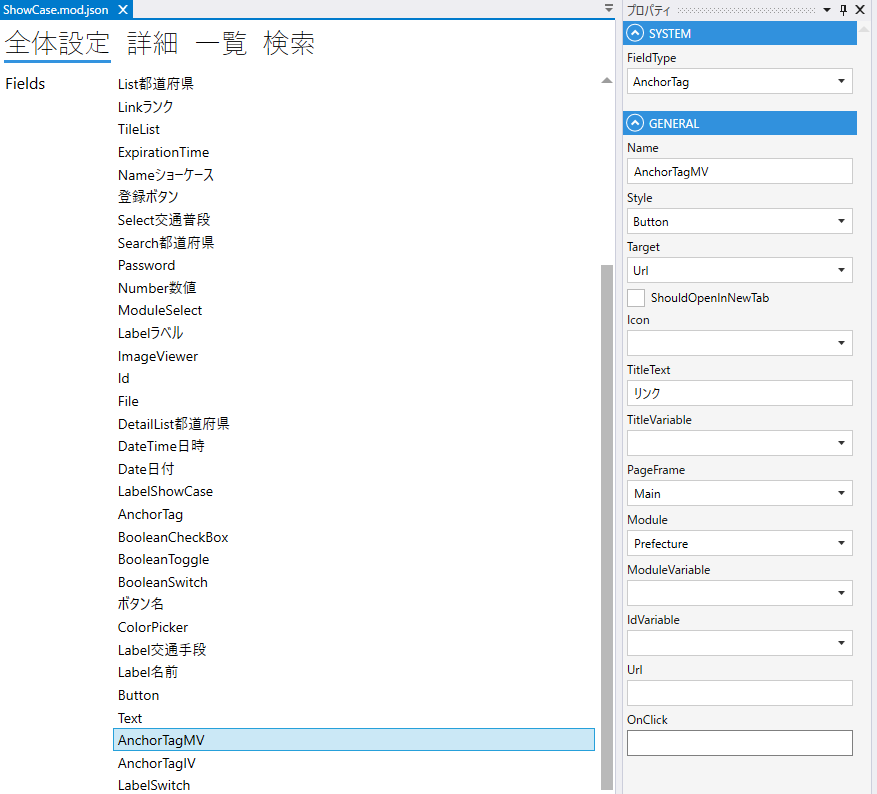

# AnchorTag

リンクのフィールド

## プロパティ
| プロパティ名           | 説明                                            |
|------------------|-----------------------------------------------| 
| FieldType        | AnchorTagを設定する                                |
| Name             | フィールド名を設定する                                   |
| Style            | `Text`, `Button` から選択する                       |
| Target           | `Url`, `HistoryBack`, `HistoryForward` から選択する |
| ShouldOpenNewTab | 新しいタブでリンク先を開く                                 |
| Icon             | アイコン                                          |
| TitleText        | リンクの文字列                                       |
| TitleVariable    |                                               |
| PageFrame        |                                               |
| Module           | リンク先のModuleを指定する                              |
| IdVariable       |                                               |
| Url              | リンク先のUrlを設定する                                 |
| OnClick          | OnClick時のスクリプトを設定する                           |

## スクリプト
| プロパティ名          | 型               | 説明                                            |
|-----------------|-----------------|-----------------------------------------------|
| BackgroundColor | string?         | Fieldの背景色                                     | 
| Color           | string?         | Fieldの色                                       |
| IsEnabled       | bool            | Fieldの有効/無効                                   |
| IsVisible       | bool            | Fieldの表示/非表示                                  |
| IsViewOnly      | bool            | Fieldの編集可/編集不可                                |

| メソッド名      | 戻り値     | 説明        |
|------------|---------|-----------|
| GetTitle() | string  | タイトルを取得する |
| GetUrl()   | string  | URLを取得する  |
