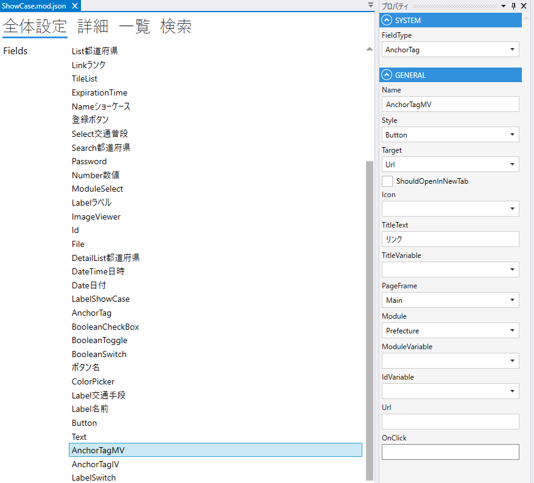

# AnchorTagField

## これは何か

**ハイパーリンク（HTML の `<a>` タグ相当）を表示するフィールド**。画面遷移や外部 URL へのリンクを作れます。



## いつ使うか

- 外部サイトへのリンク
- アプリ内の別モジュールへのナビゲーション
- 一覧画面で行からリンクで遷移する

---

## デザイナでの設定

### 固有プロパティ

| プロパティ | 型 | 既定値 | 説明 |
|---|---|---|---|
| **TitleText** | string | `"Anchor Tag"` | 表示文字 |
| **Style** | enum | - | 見た目（`Text` / `Button` 等） |
| **TitleVariable** | string | `""` | 表示文字を Field の値から動的に取る場合の Field 名 |
| **Icon** | string | `""` | アイコン |
| **ImageResourcePath** | string | `""` | 画像を使う場合のパス |
| **Target** | enum | - | `Url` / `HistoryBack` / `HistoryForward` |
| **ShouldOpenInNewTab** | bool | `false` | 新しいタブで開く |
| **Url** | string | `""` | 直接指定の URL |
| **PageFrame** | string | `""` | 遷移先 PageFrame |
| **Module** | string | `""` | 遷移先モジュール |
| **ModuleVariable** | string | `""` | 遷移先モジュールの決定に使う Field 名 |
| **IdVariable** | string | `""` | 遷移先で参照する Id の Field 名 |
| **OnClick** | string | `""` | クリック時のスクリプト |

共通プロパティは [Field 共通プロパティ](common_properties.md) を参照。

---

## 3 つのリンク先指定方法

用途に応じて以下のいずれかで指定します:

| パターン | 使うプロパティ | 用途 |
|---|---|---|
| **外部 URL** | `Url` | 外部サイト |
| **アプリ内モジュール** | `PageFrame` + `Module` + `IdVariable` | 同じアプリ内の別画面 |
| **動的決定** | `ModuleVariable` / `TitleVariable` | Field の値に応じて遷移先を変える |

---

## スクリプトから

### メソッド

| 名前 | 戻り値 | 説明 |
|---|---|---|
| `SetUrl(string)` | void | URL を設定 |
| `GetUrl()` | string | 現在の URL を取得 |
| `SetTitle(string)` | void | 表示文字を設定 |
| `GetTitle()` | string | 現在の表示文字を取得 |

共通プロパティは [Field 共通プロパティ](common_properties.md) を参照。

### よく使う例

```csharp
// 動的に URL を設定
HomeLink.SetUrl($"https://example.com/user/{UserId.Value}");

// 表示文字も動的に
HomeLink.SetTitle($"{Name.Value}さんのページ");
```

---

## 関連項目

- [Field 共通プロパティ](common_properties.md)
- [Label](Label.md) — クリック不要の単純な文字表示
- [Button](Button.md) — ボタン形式
