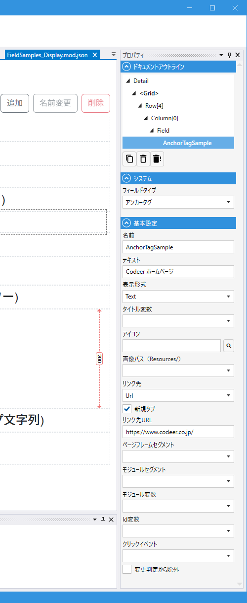

# AnchorTagField (アンカータグ)

## これは何か

**ハイパーリンク（HTML の `<a>` タグ相当）を表示するフィールド**。画面遷移や外部 URL へのリンクを作れます。

## いつ使うか

- 外部サイトへのリンク
- アプリ内の別モジュールへのナビゲーション
- 一覧画面で行からリンクで遷移する

---

## デザイナでの設定



### プロパティ一覧

#### システム

| C#名 | 日本語表示名 | 説明 |
|---|---|---|
| - | フィールドタイプ | `アンカータグ` 固定 |

#### 基本設定

| C#名 | 日本語表示名 | 型 | 既定値 | 説明 |
|---|---|---|---|---|
| **Name** | 名前 | string | `""` | フィールド識別子 |
| **TitleText** | テキスト | string | `"Anchor Tag"` | 表示文字 |
| **Style** | 表示形式 | enum | `Text` | `Text`（テキストリンク）/ `Button`（ボタン） |
| **TitleVariable** | タイトル変数 | string | `""` | 表示文字を Field の値から動的に取る場合の Field 名 |
| **Icon** | アイコン | string | `""` | アイコン |
| **ImageResourcePath** | 画像パス（Resources/） | string | `""` | 画像を使う場合のリソースパス |
| **Target** | リンク先 | enum | `Url` | `Url`（URLへ遷移）/ `HistoryBack`（戻る）/ `HistoryForward`（進む） |
| **ShouldOpenInNewTab** | 新規タブ | bool | `false` | 新しいタブで開く |
| **Url** | リンク先URL | string | `""` | 直接指定の URL |
| **PageFrame** | ページフレームセグメント | string | `""` | 遷移先 PageFrame |
| **Module** | モジュールセグメント | string | `""` | 遷移先モジュール |
| **ModuleVariable** | モジュール変数 | string | `""` | 遷移先モジュールの決定に使う Field 名 |
| **IdVariable** | Id変数 | string | `""` | 遷移先で参照する Id の Field 名 |
| **OnClick** | クリックイベント | string | `""` | クリック時のスクリプト |
| **IgnoreModification** | 変更判定から除外 | bool | `false` | 変更検知（IsModified）から除外 |

---

## 3 つのリンク先指定方法

用途に応じて以下のいずれかで指定します:

| パターン | 使うプロパティ | 用途 |
|---|---|---|
| **外部 URL** | `リンク先URL` (Url) | 外部サイトへ遷移 |
| **アプリ内モジュール** | `ページフレームセグメント` + `モジュールセグメント` + `Id変数` | 同じアプリ内の別画面 |
| **動的決定** | `モジュール変数` / `タイトル変数` | Field の値に応じて遷移先を変える |

---

## Target（リンク先）の種類

| 値 | 挙動 |
|---|---|
| **Url** | `Url` プロパティで指定した URL に遷移 |
| **HistoryBack** | ブラウザ戻る（`Url` は不要） |
| **HistoryForward** | ブラウザ進む（`Url` は不要） |

---

## Style（表示形式）の種類

| 値 | 見た目 |
|---|---|
| **Text** | 下線付きのテキストリンク |
| **Button** | ボタン形状 |

---

## スクリプトから

### メソッド

| 名前 | 戻り値 | 説明 |
|---|---|---|
| `SetUrl(string)` | void | URL を設定 |
| `GetUrl()` | string | 現在の URL を取得 |
| `SetTitle(string)` | void | 表示文字を設定 |
| `GetTitle()` | string | 現在の表示文字を取得 |

共通プロパティは [Field 共通プロパティ](common_properties.md) を参照。

### よく使う例

```csharp
// 動的に URL を設定
HomeLink.SetUrl($"https://example.com/user/{UserId.Value}");

// 表示文字も動的に
HomeLink.SetTitle($"{Name.Value}さんのページ");
```

---

## 関連項目

- [Field 共通プロパティ](common_properties.md)
- [Label](Label.md) — クリック不要の単純な文字表示
- [Button](Button.md) — ボタン形式
